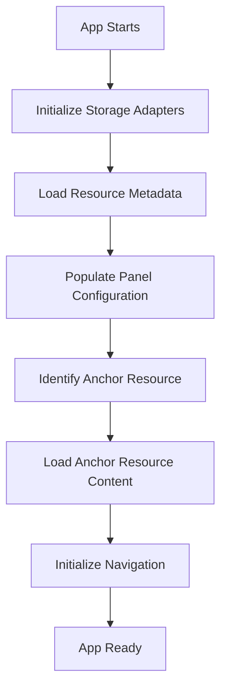
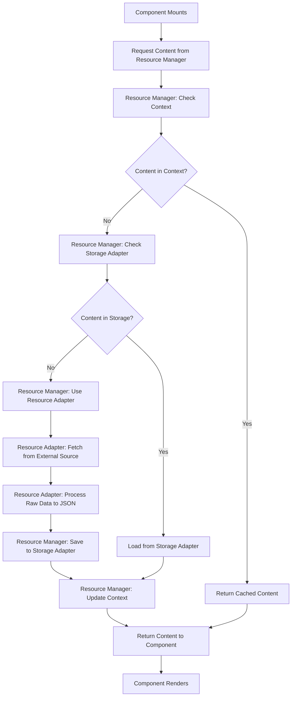

# Resource Storage Architecture

## Overview

The bt-studio app implements a sophisticated two-layer storage system designed to enable offline functionality while providing efficient on-demand content loading. This architecture separates resource metadata from actual content, allowing for fast boot times and selective content fetching.

## Core Concepts

### 1. Two-Layer Storage System

The storage system consists of two distinct layers:

#### **Layer 1: Resource Metadata (General Layer)**

- **Purpose**: Store resource definitions and metadata
- **Content**: Resource titles, descriptions, names, Table of Contents (TOC)
- **Loading**: Loaded at application boot time
- **Source**: Remote server or filesystem adapter
- **Usage**: Populates initial panel configuration

#### **Layer 2: Resource Content (Entry Layer)**

- **Purpose**: Store actual resource content/entries
- **Content**: Books, notes, articles, translation content
- **Loading**: On-demand when requested by user or component
- **Source**: Fetched from storage or remote server as needed
- **Usage**: Displayed in resource components

### 2. Three-Layer Architecture

The system uses three distinct layers for data management:

#### **Resource Adapters** (External Data Sources)
Fetch and process data from external sources, converting raw data to standardized JSON:

- **Door43LiteralTextAdapter**: Fetches ULT (or fallback to GLT) scripture content, processes USFM using `@usfm-processor.ts`
- **Door43SimplifiedTextAdapter**: Fetches UST (or fallback to GST) scripture content with USFM processing
- **Door43TranslationNotesAdapter**: Fetches and processes TN markdown content
- **Door43TranslationWordsAdapter**: Fetches and processes TW markdown content  
- **Door43TranslationAcademyAdapter**: Fetches and processes TA markdown articles
- **Door43AudioBibleAdapter**: Fetches audio Bible metadata and file references
- **Door43VideoBibleAdapter**: Fetches video Bible metadata and file references

#### **Storage Adapters** (Offline Storage)
Handle saving and retrieving processed data to/from local storage:

- **IndexedDBStorageAdapter**: Browser-based structured storage (primary)
- **LocalStorageAdapter**: Simple key-value browser storage (fallback)
- **SQLiteStorageAdapter**: File-based relational database (desktop)
- **MongoDBStorageAdapter**: Document-based database (server)
- **FilesystemStorageAdapter**: Direct file system access (desktop/mobile)

#### **Resource Manager** (Orchestration Layer)
The middle-man that coordinates between storage and resource adapters:

- **Checks storage first** for cached content
- **Falls back to resource adapters** when content not in storage
- **Saves fetched content** to storage for offline use
- **Manages cache expiration** and cleanup
- **Handles fallback logic** between different resource types

### 4. Resource Organization Types

Resources are organized into two distinct types based on their structure:

#### **Book-Organized Resources**
Resources with content organized by biblical books (one entry per book):

- **Bible Translations**: ULT/GLT, UST/GST - USFM processing, organized by book
- **Translation Notes**: TN - Markdown processing, organized by book  
- **Translation Words**: TW - Markdown processing, organized by book
- **Audio Bible**: Audio recordings - Metadata and files, organized by book
- **Video Bible**: Video content - Metadata and files, organized by book

#### **Entry-Organized Resources**
Resources with content organized by individual entries (articles, topics, etc.):

- **Translation Academy**: TA - Markdown articles, organized by topic/article ID
- **Translation Questions**: TQ - Questions organized by topic/category
- **Biblical Terms**: Glossary entries organized by term ID
- **Study Notes**: Commentary organized by topic/passage ID

## Detailed Architecture

### Resource Identification System

Resources use different identifier structures based on their organization type:

#### **Book-Organized Resource Keys**
```
{server}/{owner}/{language}/{resource_type}/{book_code}
```

**Examples:**
- Scripture Book: `door43/unfoldingword/en/ult/gen`
- Translation Notes: `door43/unfoldingword/en/tn/gen`
- Translation Words: `door43/unfoldingword/en/tw/gen`
- Audio Bible: `door43/unfoldingword/en/audio/gen`

#### **Entry-Organized Resource Keys**
```
{server}/{owner}/{language}/{resource_type}/{entry_id}
```

**Examples:**
- Translation Academy: `door43/unfoldingword/en/ta/translate/figs-metaphor`
- Translation Questions: `door43/unfoldingword/en/tq/checking/accuracy`
- Biblical Terms: `door43/unfoldingword/en/terms/covenant`
- Study Notes: `door43/unfoldingword/en/notes/genesis/creation-account`

### Storage Schema

#### Metadata Table/Collection

```typescript
interface ResourceMetadata {
  id: string;                    // Resource identifier (ult, ust, tn, ta, etc.)
  server: string;               // Source server (door43.org)
  owner: string;                // Resource owner (unfoldingword)
  language: string;             // Language code (en, es, fr)
  type: ResourceType;           // Category (scripture, notes, words, academy)
  title: string;                // Display title
  description: string;          // Resource description
  name: string;                 // Internal name (used as panel resource ID)
  version: string;              // Resource version
  lastUpdated: Date;            // Last modification date
  available: boolean;           // Availability status
  toc: TableOfContents;         // Structure/navigation data
  isAnchor: boolean;            // Whether this is the anchor resource
}

interface TableOfContents {
  books?: BookInfo[];           // For scripture resources
  articles?: ArticleInfo[];     // For academy resources
  entries?: EntryInfo[];        // For other resource types
}
```

#### Content Table/Collection

```typescript
interface ResourceContent {
  key: string;                  // Unique identifier (full path)
  resourceId: string;           // Reference to metadata
  server: string;               // Source server
  owner: string;                // Resource owner
  language: string;             // Language code
  type: ResourceType;           // Resource category
  bookCode?: string;            // Book code (for scripture/notes)
  articleId?: string;           // Article ID (for academy)
  content: ProcessedContent;    // Actual content data
  lastFetched: Date;            // When content was last retrieved
  cachedUntil?: Date;           // Cache expiration
  checksum?: string;            // Content integrity hash
  size: number;                 // Content size in bytes
}

interface ProcessedContent {
  // Content structure varies by resource type
  chapters?: ProcessedChapter[];     // For scripture
  notes?: TranslationNote[];         // For translation notes
  words?: TranslationWord[];         // For translation words
  article?: AcademyArticle;          // For academy articles
}

// USFM Processor Interfaces (from @usfm-processor.ts)
interface ProcessedVerse {
  number: number;
  text: string;
  reference: string;
  paragraphId?: string;
  hasSectionMarker?: boolean;
  sectionMarkers?: number;
  alignments?: WordAlignment[];
  // Verse span support
  isSpan?: boolean;
  spanStart?: number;
  spanEnd?: number;
  originalVerseString?: string; // e.g., "1-2", "3", "4-6"
}

interface ProcessedParagraph {
  id: string;
  type: 'paragraph' | 'quote';
  style: 'p' | 'q' | 'q1' | 'q2' | 'm' | 'mi' | 'pc' | 'pr' | 'cls';
  indentLevel: number;
  startVerse: number;
  endVerse: number;
  verseCount: number;
  verseNumbers: number[];
  combinedText: string;
  verses: ProcessedVerse[];
}

interface ProcessedChapter {
  number: number;
  verseCount: number;
  paragraphCount: number;
  verses: ProcessedVerse[];
  paragraphs: ProcessedParagraph[];
}

interface TranslatorSection {
  start: {
    chapter: number;
    verse: number;
    reference: { chapter: string; verse: string };
  };
  end: {
    chapter: number;
    verse: number;
    reference: { chapter: string; verse: string };
  };
}

interface WordAlignment {
  verseRef: string;
  sourceWords: string[];
  targetWords: string[];
  alignmentData: {
    strong: string;
    lemma: string;
    morph: string;
    occurrence: string;
    occurrences: string;
  }[];
}
```

## Application Flow

### 1. Boot Time Initialization



**Process:**

1. **Storage Initialization**: Initialize configured storage adapters
2. **Metadata Loading**: Fetch all resource metadata for current server/owner/language
3. **Panel Setup**: Use metadata to create LinkedPanels configuration
4. **Anchor Identification**: Determine primary scripture resource (ULT or fallback toGLT)
5. **Initial Content**: Load first book of anchor resource for navigation
6. **Navigation Setup**: Configure chapter/verse navigation based on anchor content

### 2. On-Demand Content Loading



**Process:**

1. **Component Request**: Component requests content from Resource Manager
2. **Context Check**: Resource Manager checks if content exists in application context
3. **Storage Check**: If not in context, Resource Manager checks Storage Adapter
4. **Resource Adapter**: If not in storage, Resource Manager uses appropriate Resource Adapter
5. **External Fetch**: Resource Adapter fetches raw data from external source (Door43, etc.)
6. **Data Processing**: Resource Adapter processes raw data (USFM, Markdown) to standardized JSON
7. **Storage Save**: Resource Manager saves processed data via Storage Adapter
8. **Context Update**: Resource Manager updates application context
9. **Component Render**: Component receives processed content and renders

## Interface Design

### Resource Manager Interface

The Resource Manager orchestrates between Storage and Resource Adapters:

```typescript
interface ResourceManager {
  // Initialization
  initialize(storageAdapter: StorageAdapter, resourceAdapters: ResourceAdapter[]): Promise<void>;
  
  // Metadata operations
  getResourceMetadata(server: string, owner: string, language: string): Promise<ResourceMetadata[]>;
  
  // Content operations (main orchestration method)
  getOrFetchContent(key: string, resourceType: ResourceType): Promise<ProcessedContent | null>;
  
  // Batch operations
  preloadContent(keys: string[], resourceType: ResourceType): Promise<void>;
  
  // Cache management
  clearExpiredContent(): Promise<void>;
  invalidateCache(key: string): Promise<void>;
  
  // Storage info
  getStorageInfo(): Promise<StorageInfo>;
}

class ResourceManagerImpl implements ResourceManager {
  private storageAdapter: StorageAdapter;
  private resourceAdapters: Map<ResourceType, ResourceAdapter>;
  
  async getOrFetchContent(key: string, resourceType: ResourceType): Promise<ProcessedContent | null> {
    try {
      // 1. Check if content exists in storage
      const cachedContent = await this.storageAdapter.getResourceContent(key);
      if (cachedContent && !this.isExpired(cachedContent)) {
        return cachedContent.content;
      }
      
      // 2. Use appropriate resource adapter to fetch from external source
      const resourceAdapter = this.resourceAdapters.get(resourceType);
      if (!resourceAdapter) {
        throw new ResourceError(`No adapter found for resource type: ${resourceType}`, 'ADAPTER_NOT_FOUND');
      }
      
      // 3. Fetch and process content with retry logic
      const processedContent = await this.fetchWithRetry(resourceAdapter, key);
      
      // 4. Validate content if enabled
      if (this.shouldValidateContent(resourceAdapter)) {
        this.validateContent(processedContent, key);
      }
      
      // 5. Save to storage for offline use
      await this.storageAdapter.saveResourceContent({
        key,
        resourceId: resourceAdapter.resourceId,
        content: processedContent,
        lastFetched: new Date(),
        cachedUntil: this.calculateCacheExpiry(),
        checksum: this.calculateChecksum(processedContent)
      });
      
      return processedContent;
      
    } catch (error) {
      // Fallback to cached content if available, even if expired
      const cachedContent = await this.storageAdapter.getResourceContent(key);
      if (cachedContent) {
        console.warn(`Using expired cache for ${key} due to error:`, error);
        return cachedContent.content;
      }
      
      throw error;
    }
  }
  
  private async fetchWithRetry(adapter: ResourceAdapter, key: string): Promise<ProcessedContent> {
    const config = this.getAdapterConfig(adapter);
    let lastError: Error;
    
    for (let attempt = 1; attempt <= config.retryAttempts; attempt++) {
      try {
        const { server, owner, language, contentId } = this.parseKey(key);
        
        // Use appropriate method based on organization type
        if (adapter.organizationType === 'book') {
          const bookAdapter = adapter as BookOrganizedAdapter;
          return await this.timeoutPromise(
            bookAdapter.getBookContent(server, owner, language, contentId),
            config.timeout
          );
        } else {
          const entryAdapter = adapter as EntryOrganizedAdapter;
          return await this.timeoutPromise(
            entryAdapter.getEntryContent(server, owner, language, contentId),
            config.timeout
          );
        }
      } catch (error) {
        lastError = error as Error;
        if (attempt < config.retryAttempts) {
          await this.delay(config.retryDelay * attempt); // Exponential backoff
        }
      }
    }
    
    throw new ResourceError(`Failed to fetch ${key} after ${config.retryAttempts} attempts: ${lastError.message}`, 'FETCH_FAILED');
  }
}

class ResourceError extends Error {
  constructor(message: string, public code: string) {
    super(message);
    this.name = 'ResourceError';
  }
}
```

### Storage Adapter Interface

Handles saving and retrieving processed data to/from offline storage:

```typescript
interface StorageAdapter {
  // Metadata operations
  getResourceMetadata(server: string, owner: string, language: string): Promise<ResourceMetadata[]>;
  saveResourceMetadata(metadata: ResourceMetadata[]): Promise<void>;
  
  // Content operations
  getResourceContent(key: string): Promise<ResourceContent | null>;
  saveResourceContent(content: ResourceContent): Promise<void>;
  
  // Batch operations (with transaction support)
  getMultipleContent(keys: string[]): Promise<ResourceContent[]>;
  saveMultipleContent(contents: ResourceContent[]): Promise<void>;
  
  // Transaction support
  beginTransaction(): Promise<StorageTransaction>;
  
  // Cache management
  clearExpiredContent(): Promise<void>;
  clearAllContent(): Promise<void>;
  
  // Storage info and quotas
  getStorageInfo(): Promise<StorageInfo>;
  checkQuota(): Promise<QuotaInfo>;
}

interface StorageTransaction {
  save(content: ResourceContent): Promise<void>;
  delete(key: string): Promise<void>;
  commit(): Promise<void>;
  rollback(): Promise<void>;
}

interface QuotaInfo {
  used: number;
  available: number;
  total: number;
  nearLimit: boolean;  // true when >80% used
}

interface StorageInfo {
  totalSize: number;
  availableSpace: number;
  itemCount: number;
  lastCleanup: Date;
}
```

### Base Resource Adapter Interface

Base interface for all resource adapters:

```typescript
interface BaseResourceAdapter {
  // Resource identification
  resourceType: ResourceType;
  organizationType: 'book' | 'entry';
  serverId: string;
  resourceId: string;
  
  // Metadata operations
  getResourceMetadata(server: string, owner: string, language: string): Promise<ResourceMetadata>;
  
  // Availability check
  isResourceAvailable(server: string, owner: string, language: string): Promise<boolean>;
  
  // Resource-specific info
  getResourceInfo(): ResourceAdapterInfo;
  
  // Configuration
  configure(config: AdapterConfig): void;
}
```

### Book-Organized Resource Adapter

For resources organized by biblical books:

```typescript
interface BookOrganizedAdapter extends BaseResourceAdapter {
  organizationType: 'book';
  
  // Get content for a specific book
  getBookContent(server: string, owner: string, language: string, 
                bookCode: string): Promise<ProcessedContent>;
  
  // Get list of available books
  getAvailableBooks(server: string, owner: string, language: string): Promise<BookInfo[]>;
  
  // Check if specific book is available
  isBookAvailable(server: string, owner: string, language: string, 
                 bookCode: string): Promise<boolean>;
}
```

### Entry-Organized Resource Adapter

For resources organized by individual entries:

```typescript
interface EntryOrganizedAdapter extends BaseResourceAdapter {
  organizationType: 'entry';
  
  // Get content for a specific entry
  getEntryContent(server: string, owner: string, language: string, 
                 entryId: string): Promise<ProcessedContent>;
  
  // Get list of available entries
  getAvailableEntries(server: string, owner: string, language: string): Promise<EntryInfo[]>;
  
  // Get entries by category/topic
  getEntriesByCategory(server: string, owner: string, language: string,
                      category: string): Promise<EntryInfo[]>;
  
  // Check if specific entry is available
  isEntryAvailable(server: string, owner: string, language: string, 
                  entryId: string): Promise<boolean>;
}

interface EntryInfo {
  id: string;
  title: string;
  category: string;
  description?: string;
  tags?: string[];
  dependencies?: string[];  // Other entries this entry references
}
```

### Unified Resource Adapter Type

```typescript
type ResourceAdapter = BookOrganizedAdapter | EntryOrganizedAdapter;
```

```typescript
interface AdapterConfig {
  timeout?: number;           // Request timeout in ms (default: 30000)
  retryAttempts?: number;     // Max retry attempts (default: 3)
  retryDelay?: number;        // Delay between retries in ms (default: 1000)
  fallbackEnabled?: boolean;  // Enable fallback resources (default: true)
  validateContent?: boolean;  // Validate content integrity (default: true)
}

interface ResourceAdapterInfo {
  name: string;
  description: string;
  supportedServers: string[];
  fallbackOptions?: string[];
  processingCapabilities: string[];
}
```

### Book-Organized Adapter Examples

#### Scripture Adapter (Book-Organized)

```typescript
interface ScriptureAdapter extends BookOrganizedAdapter {
  resourceType: ResourceType.SCRIPTURE;
  
  // Scripture-specific metadata with book list and USFM processing info
  getResourceMetadata(server: string, owner: string, language: string): Promise<ScriptureMetadata>;
  
  // Book content with USFM processing (chapters, verses, sections, alignments)
  getBookContent(server: string, owner: string, language: string, 
                bookCode: string): Promise<ProcessedScripture>;
  
  // Fallback logic (ULT -> GLT)
  getFallbackResource(server: string, owner: string, language: string): Promise<string | null>;
}

interface ScriptureMetadata extends ResourceMetadata {
  books: BookInfo[];
  hasAlignments: boolean;
  hasSections: boolean;
  usfmVersion: string;
  processingVersion: string;
}

interface ProcessedScripture extends ProcessedContent {
  book: string;
  bookCode: string;
  metadata: {
    bookCode: string;
    bookName: string;
    processingDate: string;
    processingDuration: number;
    version: string;
    hasAlignments: boolean;
    hasSections: boolean;
    totalChapters: number;
    totalVerses: number;
    totalParagraphs: number;
    statistics: {
      totalChapters: number;
      totalVerses: number;
      totalParagraphs: number;
      totalSections: number;
      totalAlignments: number;
    };
  };
  chapters: ProcessedChapter[];
  translatorSections?: TranslatorSection[];
  alignments?: WordAlignment[];
}
```

#### Translation Notes Adapter (Book-Organized)

```typescript
interface TranslationNotesAdapter extends BookOrganizedAdapter {
  resourceType: ResourceType.NOTES;
  
  // Notes metadata with book coverage
  getResourceMetadata(server: string, owner: string, language: string): Promise<NotesMetadata>;
  
  // Book notes content (processed markdown)
  getBookContent(server: string, owner: string, language: string, 
                bookCode: string): Promise<ProcessedNotes>;
}

interface NotesMetadata extends ResourceMetadata {
  books: BookInfo[];
  notesVersion: string;
  markdownVersion: string;
}

interface ProcessedNotes extends ProcessedContent {
  bookCode: string;
  notes: TranslationNote[];
  statistics: {
    totalNotes: number;
    notesPerChapter: Record<number, number>;
  };
}
```

### Entry-Organized Adapter Examples

#### Translation Academy Adapter (Entry-Organized)

```typescript
interface TranslationAcademyAdapter extends EntryOrganizedAdapter {
  resourceType: ResourceType.ACADEMY;
  
  // Academy metadata with article categories
  getResourceMetadata(server: string, owner: string, language: string): Promise<AcademyMetadata>;
  
  // Individual article content
  getEntryContent(server: string, owner: string, language: string, 
                 entryId: string): Promise<ProcessedArticle>;
}

interface AcademyMetadata extends ResourceMetadata {
  categories: CategoryInfo[];
  entries: EntryInfo[];
  academyVersion: string;
}

interface ProcessedArticle extends ProcessedContent {
  id: string;
  title: string;
  category: string;
  content: string; // Processed markdown as HTML
  dependencies: string[]; // Other articles referenced
  tags: string[];
}

interface CategoryInfo {
  id: string;
  name: string;
  description: string;
  entryCount: number;
}
```

### Door43 Adapter Implementations

#### Door43LiteralTextAdapter (Book-Organized)

Handles ULT (Unfoldingword Literal Text) with fallback to GLT (Gateway Language Translation):

```typescript
class Door43LiteralTextAdapter implements ScriptureAdapter {
  resourceType = ResourceType.SCRIPTURE;
  organizationType = 'book' as const;
  serverId = 'door43.org';
  resourceId = 'ult';
  
  async getResourceMetadata(server: string, owner: string, language: string): Promise<ScriptureMetadata> {
    // 1. Try to fetch ULT metadata from Door43 API
    // 2. If not available, fallback to GLT
    // 3. Process manifest.yaml to get book list and resource info
    // 4. Return structured metadata with book information
  }
  
  async getBookContent(server: string, owner: string, language: string, 
                      bookCode: string): Promise<ProcessedScripture> {
    // 1. Fetch raw USFM content from Door43 API
    // 2. Use usfmProcessor.processUSFM() to convert to structured JSON
    // 3. Extract chapters, verses, sections, and alignments
    // 4. Return ProcessedScripture with all USFM processing results
  }
  
  async getAvailableBooks(server: string, owner: string, language: string): Promise<BookInfo[]> {
    // Fetch book list from Door43 API manifest
  }
  
  async isBookAvailable(server: string, owner: string, language: string, 
                       bookCode: string): Promise<boolean> {
    // Check if specific book exists in Door43 repository
  }
  
  async getFallbackResource(server: string, owner: string, language: string): Promise<string | null> {
    return 'glt'; // Gateway Language Text fallback
  }
  
  getResourceInfo(): ResourceAdapterInfo {
    return {
      name: 'Door43 Literal Text',
      description: 'Unfoldingword Literal Text with GLT fallback',
      supportedServers: ['door43.org'],
      fallbackOptions: ['glt'],
      processingCapabilities: ['usfm', 'sections', 'alignments', 'paragraphs']
    };
  }
}
```

#### Door43TranslationAcademyAdapter (Entry-Organized)

Handles TA (Translation Academy) articles organized by topic/article ID:

```typescript
class Door43TranslationAcademyAdapter implements TranslationAcademyAdapter {
  resourceType = ResourceType.ACADEMY;
  organizationType = 'entry' as const;
  serverId = 'door43.org';
  resourceId = 'ta';
  
  async getResourceMetadata(server: string, owner: string, language: string): Promise<AcademyMetadata> {
    // 1. Fetch TA metadata from Door43 API
    // 2. Process manifest.yaml to get article categories and entries
    // 3. Return structured metadata with article information
  }
  
  async getEntryContent(server: string, owner: string, language: string, 
                       entryId: string): Promise<ProcessedArticle> {
    // 1. Fetch raw markdown content from Door43 API
    // 2. Process markdown to HTML
    // 3. Extract dependencies and tags
    // 4. Return ProcessedArticle with processed content
  }
  
  async getAvailableEntries(server: string, owner: string, language: string): Promise<EntryInfo[]> {
    // Fetch complete article list from Door43 API manifest
  }
  
  async getEntriesByCategory(server: string, owner: string, language: string,
                            category: string): Promise<EntryInfo[]> {
    // Filter articles by category (translate, checking, etc.)
  }
  
  async isEntryAvailable(server: string, owner: string, language: string, 
                        entryId: string): Promise<boolean> {
    // Check if specific article exists in Door43 repository
  }
  
  getResourceInfo(): ResourceAdapterInfo {
    return {
      name: 'Door43 Translation Academy',
      description: 'Translation Academy articles and training materials',
      supportedServers: ['door43.org'],
      fallbackOptions: [],
      processingCapabilities: ['markdown', 'html', 'dependencies']
    };
  }
}
```

#### USFM Processing Integration

All scripture adapters use the existing `@usfm-processor.ts` for content processing:

```typescript
// From @usfm-processor.ts
interface ProcessingResult {
  structuredText: ProcessedScripture;
  translatorSections: TranslatorSection[];
  alignments: WordAlignment[];
  metadata: ProcessedScripture['metadata'];
}

class USFMProcessor {
  async processUSFM(
    usfmContent: string,
    bookCode: string,
    bookName: string
  ): Promise<ProcessingResult>;
}

// Usage in Scripture Adapters:
const processingResult = await usfmProcessor.processUSFM(usfmContent, bookCode, bookName);
return processingResult.structuredText; // This is ProcessedScripture
```

```typescript
// Example usage in adapter
import { usfmProcessor } from '../services/usfm-processor';

async getBookContent(server: string, owner: string, language: string, 
                    bookCode: string): Promise<ProcessedScripture> {
  // 1. Fetch raw USFM from Door43 API
  const usfmContent = await this.fetchUSFMFromDoor43(server, owner, language, bookCode);
  
  // 2. Process using existing USFM processor
  const processingResult = await usfmProcessor.processUSFM(
    usfmContent, 
    bookCode, 
    this.getBookName(bookCode)
  );
  
  // 3. Transform to adapter format
  return {
    bookCode,
    bookName: processingResult.structuredText.book,
    chapters: processingResult.structuredText.chapters,
    sections: processingResult.translatorSections,
    alignments: processingResult.alignments,
    statistics: processingResult.metadata.statistics
  };
}
```

## Error Handling & Performance

### Error Handling Strategy

```typescript
enum ResourceErrorCode {
  ADAPTER_NOT_FOUND = 'ADAPTER_NOT_FOUND',
  FETCH_FAILED = 'FETCH_FAILED',
  VALIDATION_FAILED = 'VALIDATION_FAILED',
  STORAGE_FULL = 'STORAGE_FULL',
  NETWORK_ERROR = 'NETWORK_ERROR',
  TIMEOUT = 'TIMEOUT',
  CORRUPTED_DATA = 'CORRUPTED_DATA'
}

interface ErrorRecoveryStrategy {
  useExpiredCache: boolean;     // Use expired cache as fallback
  tryFallbackResource: boolean; // Try fallback resource (ULT->GLT)
  retryWithBackoff: boolean;    // Retry with exponential backoff
  notifyUser: boolean;          // Show user notification
}
```

### Performance Optimizations

#### Memory Management
- **Lazy loading**: Content loaded only when requested
- **Memory limits**: Automatic cleanup when memory usage exceeds thresholds
- **Compression**: Large content compressed in storage
- **Streaming**: Large resources processed in chunks

#### Cache Strategy
- **LRU eviction**: Least recently used content removed first
- **Predictive loading**: Preload likely-needed content (next chapter, related notes)
- **Background sync**: Update content during idle time
- **Differential updates**: Only sync changed portions

#### Network Optimization
- **Request batching**: Combine multiple requests when possible
- **Compression**: Use gzip/brotli for network transfers
- **CDN support**: Leverage content delivery networks
- **Offline detection**: Graceful degradation when offline

### Security Considerations

#### Data Validation
- **Input sanitization**: All external content sanitized before processing
- **Schema validation**: Content validated against expected structure
- **Checksum verification**: Content integrity verified using checksums
- **Size limits**: Maximum content size enforced to prevent DoS

#### Access Control
- **Resource permissions**: Check user permissions for resource access
- **Rate limiting**: Prevent excessive API requests
- **Secure storage**: Sensitive data encrypted in local storage
- **Content filtering**: Filter potentially harmful content

## Context Integration

### Workspace Context Updates

The WorkspaceContext will be enhanced to use the Resource Manager:

```typescript
interface WorkspaceStore extends WorkspaceState, WorkspaceActions {
  // Resource Manager (the orchestrator)
  resourceManager: ResourceManager;
  initializeResourceManager: (
    storageAdapter: StorageAdapter, 
    resourceAdapters: ResourceAdapter[]
  ) => Promise<void>;
  
  // Resource metadata (loaded at boot time)
  resourceMetadata: Record<string, ResourceMetadata>;
  loadResourceMetadata: () => Promise<void>;
  
  // Content management (delegates to Resource Manager)
  getOrFetchContent: (key: string, resourceType: ResourceType) => Promise<ProcessedContent | null>;
  preloadContent: (keys: string[], resourceType: ResourceType) => Promise<void>;
  
  // Anchor resource (primary scripture for navigation)
  anchorResource: ResourceMetadata | null;
  setAnchorResource: (resource: ResourceMetadata) => void;
  
  // Cache management
  clearCache: () => Promise<void>;
  getStorageInfo: () => Promise<StorageInfo>;
}

// Example WorkspaceContext implementation
const useWorkspaceStore = create<WorkspaceStore>()(
  devtools(
    immer((set, get) => ({
      // ... existing state ...
      resourceManager: null as ResourceManager | null,
      
      initializeResourceManager: async (storageAdapter, resourceAdapters) => {
        const manager = new ResourceManagerImpl();
        await manager.initialize(storageAdapter, resourceAdapters);
        
        set((state) => {
          state.resourceManager = manager;
        });
        
        // Load metadata for all resources
        await get().loadResourceMetadata();
      },
      
      getOrFetchContent: async (key: string, resourceType: ResourceType) => {
        const manager = get().resourceManager;
        if (!manager) {
          throw new Error('Resource Manager not initialized');
        }
        
        return await manager.getOrFetchContent(key, resourceType);
      },
      
      loadResourceMetadata: async () => {
        const manager = get().resourceManager;
        if (!manager) return;
        
        const { owner, language, server } = get();
        const metadata = await manager.getResourceMetadata(server, owner, language);
        
        set((state) => {
          state.resourceMetadata = metadata.reduce((acc, meta) => {
            acc[meta.id] = meta;
            return acc;
          }, {} as Record<string, ResourceMetadata>);
        });
      }
    }))
  )
);
```

### Panel Configuration Enhancement

```typescript
interface EnhancedLinkedPanelsConfig extends LinkedPanelsConfig {
  resources: EnhancedResourceConfig[];
}

interface EnhancedResourceConfig {
  id: string;
  component: React.ComponentType<ResourceComponentProps>;
  title: string;
  category: string;
  description: string;
  metadata: ResourceMetadata;
  storageInterface: StorageAdapter;
}

interface ResourceComponentProps {
  metadata: ResourceMetadata;
  onContentRequest: (key: string) => Promise<ResourceContent | null>;
  currentReference: NavigationReference;
}
```

## Implementation Strategy

### Phase 1: Foundation & Core Adapters

1. **Create base interfaces** - ResourceAdapter, StorageAdapter, ResourceManager
2. **Implement IndexedDBStorageAdapter** - Primary storage with transaction support
3. **Implement Door43LiteralTextAdapter** - ULT/GLT scripture with USFM processing
4. **Implement Door43SimplifiedTextAdapter** - UST/GST scripture with USFM processing  
5. **Create ResourceManager** - Basic orchestration with error handling
6. **Update WorkspaceContext** - Integrate Resource Manager

### Phase 2: Reliability & Performance

1. **Add retry logic** - Exponential backoff and timeout handling
2. **Implement content validation** - Checksum verification and schema validation
3. **Add fallback strategies** - Expired cache fallback, resource fallbacks
4. **Implement quota management** - Storage limits and cleanup
5. **Add performance monitoring** - Track fetch times and cache hit rates

### Phase 3: Additional Resources & Features

1. **Door43TranslationNotesAdapter** - TN markdown processing
2. **Door43TranslationWordsAdapter** - TW markdown processing
3. **Door43TranslationAcademyAdapter** - TA article processing
4. **Background sync** - Update content during idle time
5. **Predictive loading** - Preload likely-needed content

### Phase 4: Advanced Optimizations

1. **Memory management** - LRU cache and memory limits
2. **Network optimizations** - Request batching and compression
3. **Security enhancements** - Content filtering and access control
4. **Cross-platform storage** - SQLite for desktop, additional backends

## Benefits

### Performance

- **Fast Boot**: Only metadata loaded initially
- **On-Demand Loading**: Content fetched when needed
- **Efficient Caching**: Avoid redundant network requests

### Offline Support

- **Full Offline Mode**: Work without internet connection
- **Selective Sync**: Update only changed content
- **Storage Management**: Automatic cleanup of old content

### Scalability

- **Modular Design**: Easy to add new resource types
- **Adapter Pattern**: Support multiple storage backends
- **Lazy Loading**: Handle large resource collections efficiently

### User Experience

- **Instant Startup**: App ready immediately
- **Progressive Loading**: Content appears as requested
- **Reliable Access**: Always available content once cached

## Future Enhancements

1. **Compression**: Reduce storage space usage
2. **Background Sync**: Update content in background
