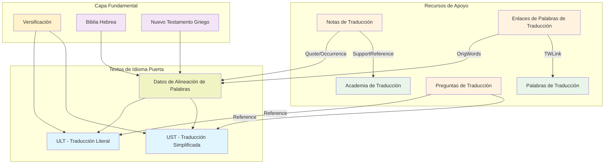
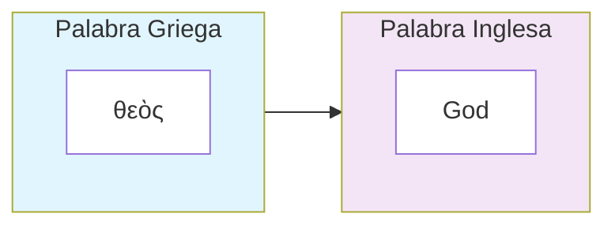

# Recursos de Traducción de unfoldingWord: Guía para Desarrolladores

Este documento proporciona documentación técnica integral para desarrolladores que construyen herramientas de revisión de traducción que funcionan con los recursos de traducción bíblica de unfoldingWord. Estos recursos forman un ecosistema interconectado diseñado para apoyar la traducción bíblica precisa, clara y natural en todo el mundo.

## Resumen Ejecutivo

### Lo que Cubre este Documento

Esta guía proporciona especificaciones técnicas completas para el ecosistema de recursos de traducción de unfoldingWord, incluyendo:

- **Recursos de Traducción Centrales**: ULT, UST y datos de alineación de palabras
- **Recursos de Apoyo**: Notas de Traducción, Palabras, Preguntas y Academia
- **Arquitectura Técnica**: Especificaciones de Resource Container y sistemas de enlace
- **Patrones de Integración**: Cómo los recursos se interconectan y funcionan juntos
- **Pautas de Implementación**: Orientación práctica para desarrolladores
- **Marco de Extensibilidad**: Cómo crear nuevos recursos compatibles

### Audiencia Objetivo

- **Desarrolladores de Software** construyendo herramientas de traducción bíblica
- **Arquitectos Técnicos** diseñando plataformas de traducción
- **Organizaciones de Idiomas Puerta** creando nuevos recursos
- **Mantenedores de Herramientas de Traducción** integrando recursos de unfoldingWord

### Beneficios Clave

- **Cobertura Integral**: Documentación completa del ecosistema en un lugar
- **Precisión Técnica**: Especificaciones exactas para todos los formatos y mecanismos de enlace
- **Listo para Implementación**: Ejemplos de código y orientación práctica
- **Cumplimiento de Estándares**: Cumplimiento completo de Resource Container y Dublin Core
- **Diseño Extensible**: Marco para crear nuevos recursos compatibles

## Tabla de Contenidos

1. [Descripción General](#descripción-general)
2. [Tipos y Propósitos de Recursos](#tipos-y-propósitos-de-recursos)
3. [Infraestructura y Organización de Recursos](#infraestructura-y-organización-de-recursos)
4. [Recursos de Traducción Centrales](#recursos-de-traducción-centrales)
5. [Recursos de Apoyo](#recursos-de-apoyo)
6. [Arquitectura Resource Container](#arquitectura-resource-container)
7. [Sistema de Enlaces de Recursos](#sistema-de-enlaces-de-recursos)
8. [Patrones de Integración](#patrones-de-integración)
9. [Marco de Extensibilidad](#marco-de-extensibilidad)
10. [Pautas de Implementación](#pautas-de-implementación)

## Descripción General

### Misión y Filosofía

Los recursos de traducción de unfoldingWord se desarrollan bajo licencias Creative Commons Attribution-ShareAlike 4.0 para proporcionar a la iglesia global herramientas de traducción bíblica interconectadas de alta calidad. El ecosistema sirve a **Traductores de Lengua Materna (MTT)** que usan idiomas puerta como su puente para traducir las Escrituras a sus idiomas del corazón.

### Arquitectura del Ecosistema de Recursos

El ecosistema de recursos de traducción consiste en tres capas fundamentales:

1. **Textos Fuente**: Textos de idiomas originales (hebreo, griego, arameo) con traducciones modernas de idiomas puerta
2. **Capa de Alineación**: Conexiones precisas a nivel de palabra entre idiomas originales y de puerta
3. **Recursos de Apoyo**: Orientación contextual, definiciones, metodología y herramientas de aseguramiento de calidad

### Principios de Diseño Clave

- **Interconexión**: Todos los recursos se enlazan a través de sistemas de referencia estandarizados
- **Precisión**: La alineación a nivel de palabra permite el targeting exacto de la orientación de traducción
- **Extensibilidad**: La especificación Resource Container permite la creación de nuevos recursos
- **Multilingüe**: Las organizaciones de idiomas puerta pueden crear conjuntos de recursos paralelos
- **Acceso Abierto**: Las licencias Creative Commons aseguran la accesibilidad global

### Descripción General de Relaciones de Recursos



## Tipos y Propósitos de Recursos

### Recursos Fundamentales

Estos recursos proporcionan el marco estructural para todo el trabajo de traducción:

#### **Versificación**
**Lo que contiene**: La estructura canónica de capítulos y versículos para todos los 66 libros del canon bíblico protestante.

**Propósito**: Establece un sistema de referencia consistente que todos los otros recursos usan para coordinarse entre sí. Cuando miras Génesis 1:1, cada recurso sabe exactamente a qué versículo te refieres.

**Por qué lo necesitan los traductores**: Permite navegación precisa y asegura que las notas, definiciones de palabras y preguntas se alineen con los pasajes bíblicos correctos.

#### **Textos de Idiomas Originales**
**Lo que contienen**:
- **Biblia Hebrea (UHB)**: El Antiguo Testamento completo en hebreo y arameo
- **Nuevo Testamento Griego (UGNT)**: El Nuevo Testamento completo en griego koiné

**Propósito**: Proporcionar los textos fuente autoritativos de los cuales todas las traducciones deben derivarse en última instancia.

**Por qué los necesitan los traductores**: Estos son la "vara de medir" contra la cual todas las traducciones se evalúan por precisión y fidelidad.

### Textos de Traducción de Idiomas Puerta

Estas son traducciones bíblicas completas en idiomas puerta (como inglés, español, francés) que sirven como puentes para traductores de lengua materna:

#### **Traducción Literal (ULT)**
**Lo que contiene**: Una traducción bíblica completa que se mantiene lo más cerca posible del orden de palabras, gramática y estructura del idioma original mientras permanece comprensible.

**Propósito**: Muestra a los traductores exactamente lo que dice el texto original, preservando patrones gramaticales hebreos y griegos.

**Por qué lo necesitan los traductores**: Ayuda a los traductores a entender el significado preciso y la estructura del original, especialmente para pasajes complejos donde el orden de palabras o la gramática afecta el significado.

#### **Traducción Simplificada (UST)**
**Lo que contiene**: Una traducción bíblica completa que prioriza la comunicación clara y natural del significado original usando lenguaje cotidiano y adaptaciones culturales.

**Propósito**: Demuestra cómo expresar conceptos bíblicos en lenguaje claro y contemporáneo que la gente ordinaria pueda entender.

**Por qué lo necesitan los traductores**: Proporciona un modelo para traducción de equivalencia dinámica, mostrando cómo hacer accesibles los conceptos antiguos para lectores modernos.

#### **Datos de Alineación de Palabras**
**Lo que contiene**: Conexiones precisas mostrando exactamente qué palabras en el idioma puerta traducen qué palabras en hebreo/griego.

**Propósito**: Crea un puente entre los idiomas originales y las traducciones de idiomas puerta a nivel de palabra individual.

**Por qué lo necesitan los traductores**: Permite a las herramientas de traducción mostrar exactamente en qué palabra hebrea o griega está trabajando un traductor, y resaltar notas y definiciones relevantes para esa palabra específica.

### Recursos de Orientación de Apoyo

Estos recursos proporcionan ayuda contextual y entrenamiento para traductores:

#### **Notas de Traducción (TN)**
**Lo que contienen**: Explicaciones versículo por versículo para pasajes difíciles, ambiguos o culturalmente complejos a través de la Biblia.

**Propósito**: Proporcionar orientación específica para traducir pasajes desafiantes, incluyendo opciones de traducción alternativas, trasfondo cultural y clarificaciones teológicas.

**Por qué las necesitan los traductores**: Muchos pasajes en las Escrituras requieren conocimiento especializado para traducir con precisión - estas notas proporcionan esa experiencia en un formato específico y práctico.

**Ejemplo**: Para una metáfora como "Dios es mi roca," una nota explicaría que esto se refiere a Dios como fuente de protección y estabilidad, no una piedra literal.

#### **Palabras de Traducción (TW)**
**Lo que contienen**: Definiciones y explicaciones integrales de términos bíblicos, teológicos y culturales clave que aparecen a través de las Escrituras.

**Propósito**: Asegurar que los traductores entiendan conceptos importantes consistentemente a través de toda la Biblia.

**Por qué las necesitan los traductores**: Términos como "pacto," "justicia," o "Sabbat" llevan significados específicos que deben traducirse consistentemente a través de las Escrituras.

**Ejemplo**: La entrada para "pacto" explicaría el concepto bíblico de acuerdos formales entre Dios y las personas, con ejemplos de toda la Escritura.

#### **Enlaces de Palabras de Traducción (TWL)**
**Lo que contienen**: Conexiones mostrando exactamente qué ocurrencias de palabras del idioma original deben enlazarse a definiciones de Palabras de Traducción.

**Propósito**: Conectar instancias específicas de palabras en el texto a sus definiciones y explicaciones correspondientes.

**Por qué los necesitan los traductores**: Cuando un traductor encuentra la palabra hebrea "hesed" en el Salmo 23, este recurso los dirige a la entrada de Palabras de Traducción explicando "amor constante" o "misericordia."

#### **Preguntas de Traducción (TQ)**
**Lo que contienen**: Preguntas de comprensión con respuestas que prueban si una traducción comunica exitosamente el significado deseado.

**Propósito**: Proporcionar un método de aseguramiento de calidad para que los traductores verifiquen que su traducción es clara y precisa.

**Por qué las necesitan los traductores**: Después de traducir un pasaje, los traductores pueden usar estas preguntas para probar si su audiencia objetivo entendería el significado deseado.

**Ejemplo**: Para el pasaje "Pablo, un siervo de Cristo Jesús," una pregunta podría ser "¿Cómo se llama Pablo a sí mismo?" con la respuesta "Pablo se llama a sí mismo un siervo."

#### **Academia de Traducción (TA)**
**Lo que contiene**: Materiales de entrenamiento integrales cubriendo teoría de traducción, metodología, asuntos culturales y estándares de calidad.

**Propósito**: Proporcionar la base teórica y orientación práctica necesaria para trabajo de traducción bíblica de alta calidad.

**Por qué los necesitan los traductores**: La traducción es una habilidad compleja que requiere conocimiento de lingüística, cultura, teología y comunicación - estos materiales proporcionan entrenamiento estructurado en todas estas áreas.

**Ejemplo**: Un artículo sobre "Traducir Metáforas" explicaría qué son las metáforas, por qué son desafiantes de traducir, y proporcionaría estrategias específicas para manejarlas efectivamente.

### Cómo Funcionan Juntos los Recursos

Estos recursos forman un ecosistema interconectado donde cada uno mejora a los otros:

- **Alineación de Palabras** conecta traducciones de idiomas puerta a idiomas originales
- **Notas de Traducción** referencian palabras alineadas específicas para proporcionar orientación dirigida
- **Enlaces de Palabras de Traducción** apuntan desde palabras alineadas a definiciones integrales
- **Artículos de Academia de Traducción** explican la metodología detrás de decisiones de traducción
- **Preguntas de Traducción** verifican que la traducción final comunique efectivamente

**Ejemplo de flujo de trabajo**: Un traductor trabajando en Romanos 1:1 encuentra la palabra "siervo." Los datos de alineación muestran que esto traduce el griego "doulos." Enlaces de Palabras de Traducción apunta a una definición integral de "doulos" explicando la esclavitud en el mundo antiguo. Las Notas de Traducción proporcionan orientación específica sobre cómo traducir este concepto en diferentes contextos culturales. Los artículos de Academia de Traducción explican principios generales para traducir términos culturales. Las Preguntas de Traducción ayudan a verificar que la traducción final comunique el significado deseado de Pablo.

Esta base conceptual permite el ecosistema de recursos preciso e interconectado detallado en las siguientes secciones.

## Infraestructura y Organización de Recursos

### Dónde se Hospedan los Recursos

Todos los recursos de traducción de unfoldingWord se hospedan en **Door43 Content Service (DCS)**, una plataforma especializada basada en Git diseñada específicamente para la gestión de contenido de traducción bíblica.

#### Plataforma Principal de Hosting: Door43 Content Service
- **URL de Plataforma**: `https://git.door43.org/`
- **Tecnología**: Plataforma Git basada en Gitea con extensiones específicas de Door43
- **Organización**: Los recursos están organizados bajo la organización `unfoldingWord`
- **Métodos de Acceso**: Interfaz web, protocolos Git y API REST
- **Control de Versiones**: Seguimiento completo del historial Git para todos los cambios de recursos
- **Colaboración**: Edición multiusuario con flujos de trabajo de rama/fusión

#### Patrón de Organización de Repositorios
```
https://git.door43.org/unfoldingWord/
├── en_ult/          # Traducción Literal en Inglés
├── en_ust/          # Traducción Simplificada en Inglés
├── en_tn/           # Notas de Traducción en Inglés
├── en_tw/           # Palabras de Traducción en Inglés
├── en_twl/          # Enlaces de Palabras de Traducción en Inglés
├── en_ta/           # Academia de Traducción en Inglés
├── hbo_uhb/         # Biblia Hebrea (idioma original)
├── el-x-koine_ugnt/ # Nuevo Testamento Griego (idioma original)
└── [otros idiomas y recursos...]
```

### ¿Por Qué Estas Estructuras Específicas?

#### Cumplimiento de Especificación Resource Container (RC)

Todos los recursos de unfoldingWord siguen la **especificación Resource Container (RC)**, un estándar abierto diseñado específicamente para contenido de traducción bíblica. Esto asegura:

1. **Metadatos Estandarizados**: Cada recurso incluye metadatos compatibles con Dublin Core en `manifest.yaml`
2. **Estructura Consistente**: Organización de archivos predecible a través de todos los tipos de recursos
3. **Interoperabilidad**: Los recursos de diferentes organizaciones pueden trabajar juntos
4. **Capacidad de Enlaces**: Formato URI estandarizado para referencias entre recursos
5. **Compatibilidad de Herramientas**: El software de traducción puede fácilmente parsear e integrar recursos

#### Beneficios del Hosting Basado en Git

**Control de Versiones**: Historial completo de cada cambio a los recursos de traducción
```bash
# Ejemplo: Ver el historial de cambios de traducción de Génesis
git log --oneline 01-GEN.usfm
```

**Ramificación y Colaboración**: Múltiples equipos pueden trabajar en recursos simultáneamente
```bash
# Ejemplo: Crear rama de característica para mejoras de traducción
git checkout -b improve-genesis-notes
```

**Acceso Distribuido**: Los recursos pueden ser clonados, espejados y usados offline
```bash
# Ejemplo: Clonar repositorio ULT completo localmente
git clone https://git.door43.org/unfoldingWord/en_ult.git
```

**Control de Calidad**: Pull requests y flujos de trabajo de revisión aseguran precisión de recursos

### Estrategia de Soporte Multi-Plataforma

Aunque Door43 es la plataforma principal, la especificación Resource Container permite hosting en múltiples plataformas:

#### Opciones de Hosting Soportadas
- **Instancias Door43**: Servidores Door43 principales y espejo
- **Plataformas Git Genéricas**: GitHub, GitLab, Bitbucket
- **Soluciones Auto-Hospedadas**: Servidores Gitea, GitLab u otros servidores Git privados
- **Repositorios Locales**: Entornos offline o aislados de red
- **Redes de Distribución de Contenido**: Distribución en caché para rendimiento

#### Detección y Adaptación de Plataforma
Las herramientas de traducción deben detectar la plataforma de hosting y adaptarse en consecuencia:

```javascript
function detectarTipoPlataforma(urlRepositorio) {
  if (urlRepositorio.includes('git.door43.org')) return 'door43';
  if (urlRepositorio.includes('github.com')) return 'github';
  if (urlRepositorio.includes('gitlab.com')) return 'gitlab';
  return 'git-genérico';
}
```

### Descubrimiento y Acceso de Recursos

#### API de Catálogo Door43
Door43 proporciona descubrimiento mejorado de recursos a través de una API de catálogo especializada:

```javascript
// Descubrir todos los recursos en inglés disponibles
GET https://git.door43.org/api/v1/catalog/list?lang=en&stage=prod

// Encontrar tipo específico de recurso a través de idiomas
GET https://git.door43.org/api/v1/catalog/list?resource=ult
```

#### Patrones de Acceso Git Estándar
```javascript
// Acceso directo a repositorio
GET https://git.door43.org/api/v1/repos/unfoldingWord/en_ult

// Acceso a contenido de archivo
GET https://git.door43.org/api/v1/repos/unfoldingWord/en_ult/contents/01-GEN.usfm

// Información de release
GET https://git.door43.org/api/v1/repos/unfoldingWord/en_ult/releases/latest
```

### Aseguramiento de Calidad y Gestión de Releases

#### Proceso de Calidad de Tres Etapas
1. **Etapa Borrador**: Desarrollo inicial y pruebas
2. **Pre-Producción**: Revisión y validación por expertos en la materia
3. **Producción**: Recursos aprobados listos para equipos de traducción

#### Versionado de Releases
Los recursos usan versionado semántico alineado con actualizaciones de contenido:
```yaml
# Ejemplo de manifest.yaml
dublin_core:
  version: '85'  # Incrementado con cada release de contenido
  issued: '2024-01-15'
  modified: '2024-01-15T14:30:00Z'
```

#### Niveles de Verificación
Los recursos incluyen indicadores de calidad:
- **Nivel 1**: Revisado por la comunidad
- **Nivel 2**: Revisado por expertos
- **Nivel 3**: Verificado exhaustivamente por el equipo unfoldingWord

### Estrategia del Ecosistema de Idiomas Puerta

#### Inglés como Idioma Puerta Principal
unfoldingWord proporciona la implementación de referencia en inglés, sirviendo como modelo para otras organizaciones de idiomas puerta.

#### Implementaciones Paralelas de Idiomas Puerta
Otras organizaciones crean conjuntos completos de recursos en idiomas estratégicos:
- **Español**: organización `es-419_gl`
- **Francés**: organización `fr_gl`
- **Portugués**: organización `pt-br_gl`
- **Hindi**: organización `hi_gl`

Cada una mantiene los mismos patrones estructurales mientras adapta el contenido para su contexto lingüístico y cultural.

Esta base de infraestructura permite el ecosistema de recursos preciso e interconectado detallado en las siguientes secciones.

## Recursos de Traducción Centrales

Los recursos de traducción centrales forman la base del ecosistema de unfoldingWord, proporcionando textos fuente y datos de alineación que permiten trabajo de traducción preciso.

### 1. Traducción Literal (ULT)

**unfoldingWord® Literal Text** - Una traducción centrada en la forma que mantiene adherencia cercana a las estructuras del idioma original mientras permanece comprensible en el idioma puerta.

#### Especificaciones Técnicas
- **Formato**: USFM 3.0 con datos de alineación de palabras incrustados
- **Base**: Derivado de la Versión Estándar Americana de 1901 con actualizaciones modernas
- **Filosofía**: Centrada en la forma, preservando el orden de palabras original y estructuras gramaticales
- **Alineación**: Cada palabra alineada a fuentes hebreas (UHB) y griegas (UGNT)
- **Repositorio**: [unfoldingWord Literal Text](https://git.door43.org/unfoldingWord/en_ult)
- **Licencia**: Creative Commons Attribution-ShareAlike 4.0

#### Estructura de Archivos
```
en_ult/
├── manifest.yaml               # Manifiesto Resource Container
├── LICENSE.md                 # Licencia CC BY-SA 4.0
├── 01-GEN.usfm               # Génesis con datos de alineación
├── 02-EXO.usfm               # Éxodo con datos de alineación
├── 40-MAT.usfm               # Mateo con datos de alineación
└── 66-REV.usfm               # Apocalipsis con datos de alineación
```

#### Elementos de Estructura USFM
- **Encabezados de Libro**: Marcadores `\id`, `\usfm`, `\ide`, `\h`, `\toc1-3`, `\mt`
- **Capítulo/Versículo**: Marcadores `\c` y `\v` para estructura de escritura
- **Datos de Alineación**: Marcadores `\zaln-s`/`\zaln-e` y `\w` para conexiones a nivel de palabra
- **Formato**: `\p`, `\m`, `\q1-4` para diseño de texto y poesía
- **Referencias Cruzadas**: Marcadores `\x` para referencias cruzadas de escritura

#### Propósito e Integración
- **Base de Traducción**: Proporciona renderizado literal para entender el significado original
- **Referencia Estructural**: Muestra patrones gramaticales del idioma original
- **Ancla de Alineación**: Sirve como conexión del idioma puerta al hebreo/griego
- **Estándar de Calidad**: Mantiene alta precisión a los textos del idioma original

### 2. Traducción Simplificada (UST)

**unfoldingWord® Simplified Text** - Una traducción enfocada en el significado que prioriza la comunicación clara de conceptos bíblicos usando principios de equivalencia dinámica.

#### Especificaciones Técnicas
- **Formato**: USFM 3.0 con datos de alineación de palabras incrustados
- **Filosofía**: Enfocada en el significado, priorizando claridad y expresión natural
- **Enfoque**: Renderizado de equivalencia dinámica de pensamientos y conceptos
- **Alineación**: Cada palabra alineada a fuentes hebreas (UHB) y griegas (UGNT)
- **Repositorio**: [unfoldingWord Simplified Text](https://git.door43.org/unfoldingWord/en_ust)
- **Licencia**: Creative Commons Attribution-ShareAlike 4.0

#### Propósito e Integración
- **Claridad de Significado**: Proporciona renderizado claro y natural de conceptos bíblicos
- **Puente Cultural**: Explica conceptos antiguos en términos modernos y comprensibles
- **Traducción Complementaria**: Funciona junto con ULT para comprensión integral
- **Modelo de Traducción**: Demuestra principios de equivalencia dinámica

### 3. Datos de Alineación de Palabras

**Alineación Incrustada USFM 3.0** - Conexiones precisas a nivel de palabra entre traducciones de idiomas puerta y textos hebreos, griegos y arameos originales.

#### Estructura de Sintaxis de Alineación
```usfm
\zaln-s |x-strong="G35880" x-lemma="ὁ" x-morph="Gr,EA,,,,NMS," x-occurrence="1" x-occurrences="1" x-content="ὁ"\*\w The|x-occurrence="1" x-occurrences="1"\w*\zaln-e\*
```

#### Atributos de Alineación
- **x-strong**: Número de concordancia de Strong (G35880, H01234)
- **x-lemma**: Forma de diccionario de la palabra original (ὁ, אֱלֹהִים)
- **x-morph**: Análisis morfológico (Gr,EA,,,,NMS,)
- **x-occurrence**: Qué ocurrencia en el versículo (1, 2, 3...)
- **x-occurrences**: Total de ocurrencias en el versículo
- **x-content**: Texto real del idioma original siendo alineado

#### Tipos de Relación de Alineación

**1. Uno-a-Uno**: Palabra original única ↔ palabra puerta única
```usfm
\zaln-s |x-strong="G2316" x-lemma="θεός" x-morph="Gr,N,,,,,NMS," x-occurrence="1" x-occurrences="1" x-content="θεὸς"\*\w God|x-occurrence="1" x-occurrences="1"\w*\zaln-e\*
```



**2. Uno-a-Muchos**: Palabra original única ↔ múltiples palabras puerta (estructura anidada)
```usfm
\zaln-s |x-strong="G2980" x-lemma="λαλέω" x-morph="Gr,V,IFA1,,P," x-occurrence="1" x-occurrences="1" x-content="λαλήσομεν"\*\w we|x-occurrence="1" x-occurrences="1"\w* \w will|x-occurrence="1" x-occurrences="1"\w* \w speak|x-occurrence="1" x-occurrences="1"\w*\zaln-e\*
```

*Aquí, el verbo griego único "λαλήσομεν" (hablaremos) requiere tres palabras inglesas para expresar el mismo significado. Las tres palabras puerta están contenidas dentro de un par de alineación porque todas traducen la palabra original única.*

**3. Muchos-a-Uno**: Múltiples palabras originales ↔ palabra puerta única (alineaciones superpuestas)
```usfm
\zaln-s |x-strong="G1223" x-lemma="διά" x-morph="Gr,P,,,,,G,,," x-occurrence="1" x-occurrences="1" x-content="διὰ"\*\zaln-s |x-strong="G5124" x-lemma="οὗτος" x-morph="Gr,RD,,,,ANS," x-occurrence="1" x-occurrences="1" x-content="τοῦτο"\*\w therefore|x-occurrence="1" x-occurrences="1"\w*\zaln-e\*\zaln-e\*
```

*Este ejemplo muestra dos palabras griegas "διὰ τοῦτο" (literalmente "a través de esto") siendo traducidas como la palabra inglesa única "therefore". Los marcadores de alineación están anidados, con ambas palabras originales envolviendo la palabra puerta única que captura su significado combinado.*

### 4. Versificación

**Estructura de Capítulo y Versículo** - Marco de referencia estandarizado que define la estructura canónica para coordinación precisa de recursos.

#### Propósito
- **Marco de Referencia**: Permite referencias de escritura consistentes a través de todos los recursos
- **Carga de Contexto**: Las herramientas saben qué recursos cargar para el versículo actual
- **Navegación**: Sistema de referencia uniforme para coordinación de interfaz de usuario
- **Validación**: Asegura que todas las referencias de recursos apunten a ubicaciones de escritura válidas

#### Implementación Técnica
- **Formato**: JSON o datos estructurados definiendo límites de capítulo/versículo
- **Alcance**: Cubre todos los 66 libros del canon protestante
- **Estándares**: Sigue sistemas de versificación establecidos (KJV, etc.)
- **Integración**: Referenciado por todos los otros recursos para validación de coordenadas 

## Recursos de Apoyo

Los recursos de apoyo proporcionan orientación contextual, definiciones, metodología y herramientas de aseguramiento de calidad que funcionan junto con los textos de traducción centrales.

### 5. Notas de Traducción (TN)

**unfoldingWord® Translation Notes** - Orientación integral versículo por versículo proporcionando ayuda específica para traducir pasajes difíciles, complejos o ambiguos.

#### Especificaciones Técnicas
- **Formato**: Archivos TSV (Valores Separados por Tabulaciones), uno por libro
- **Estructura**: Estructura de directorio plano (archivos en directorio raíz)
- **Nomenclatura**: `tn_[LIBRO].tsv` (ej., `tn_GEN.tsv`, `tn_MAT.tsv`)
- **Repositorio**: [unfoldingWord Translation Notes](https://git.door43.org/unfoldingWord/en_tn)
- **Licencia**: Creative Commons Attribution-ShareAlike 4.0

#### Estructura de Columnas TSV

| Reference | ID   | Tags     | SupportReference                          | Quote      | Occurrence | Note                                    |
|-----------|------|----------|-------------------------------------------|------------|------------|-----------------------------------------|
| 1:3       | abc1 | gramática| rc://en/ta/man/translate/figs-metaphor    | בְּרֵאשִׁית | 1          | La palabra hebrea para "principio"...   |

**Definiciones de Columnas**:
- **Reference**: Capítulo:versículo (ej., "1:3") o rango ("1:3-5")
- **ID**: Identificador único de cuatro caracteres (ej., "abc1")
- **Tags**: Categorización (gramática, cultura, traducir)
- **SupportReference**: Enlaces a Academia de Traducción (`rc://*/ta/man/translate/...`)
- **Quote**: Texto del idioma original que la nota aborda
- **Occurrence**: Qué ocurrencia (-1=todas, 0=ninguna, 1,2,3...=específica)
- **Note**: Explicación y orientación formateada en Markdown

#### Categorías de Notas
- **Alternativas de Traducción**: Diferentes formas de renderizar términos difíciles
- **Contexto Cultural**: Trasfondo para entender costumbres antiguas
- **Orientación Gramatical**: Explicaciones de estructura sintáctica compleja
- **Clarificación Teológica**: Explicaciones doctrinales o conceptuales
- **Figuras del Habla**: Metáforas, modismos y dispositivos retóricos

#### Puntos de Integración
- **Quote + Occurrence**: Enlaces a datos de alineación ULT/UST para resaltado
- **SupportReference**: Enlaces a metodología de Academia de Traducción
- **Reference**: Coordina con sistema de versificación

### 6. Palabras de Traducción (TW)

**unfoldingWord® Translation Words** - Definiciones integrales de términos bíblicos, teológicos y culturales clave a través de las Escrituras.

#### Especificaciones Técnicas
- **Formato**: Artículos Markdown en directorios jerárquicos
- **Organización**: `/bible/kt/`, `/bible/names/`, `/bible/other/`
- **Repositorio**: [unfoldingWord Translation Words](https://git.door43.org/unfoldingWord/en_tw)
- **Licencia**: Creative Commons Attribution-ShareAlike 4.0

#### Categorías de Contenido
- **Términos Clave (`/kt/`)**: Conceptos teológicos centrales (Dios, salvación, pacto)
- **Nombres (`/names/`)**: Personas, lugares y nombres propios
- **Otros Términos (`/other/`)**: Conceptos culturales, históricos y generales

#### Estructura de Artículo
```markdown
# Aaron

## Datos de Palabra:
* Strongs: H0175
* Parte del habla: Nombre Propio

## Hechos:
Aarón era el hermano mayor de Moisés. Dios eligió a Aarón para ser el primer sumo sacerdote...

## Referencias Bíblicas:
* [1 Crónicas 23:12-14](rc://en/tn/help/1ch/23/12)
* [Hechos 07:38-40](rc://en/tn/help/act/07/38)

## Ejemplos de Historias Bíblicas:
* [09:15](rc://en/obs/help/obs/09/15) Dios advirtió a Moisés y Aarón...
```

### 7. Enlaces de Palabras de Traducción (TWL)

**unfoldingWord® Translation Words Links** - Mapeo preciso conectando ocurrencias específicas de palabras del idioma original a definiciones de Palabras de Traducción.

#### Especificaciones Técnicas
- **Formato**: Archivos TSV, uno por libro
- **Nomenclatura**: `twl_[LIBRO].tsv` (ej., `twl_GEN.tsv`)
- **Repositorio**: [unfoldingWord Translation Words Links](https://git.door43.org/unfoldingWord/en_twl)
- **Licencia**: Creative Commons Attribution-ShareAlike 4.0

#### Estructura de Columnas TSV

| Reference | ID   | Tags | OrigWords | Occurrence | TWLink                           |
|-----------|------|------|-----------|------------|----------------------------------|
| 1:3       | xyz9 | kt   | אֱלֹהִים    | 1          | rc://en/tw/dict/bible/kt/god     |

**Definiciones de Columnas**:
- **Reference**: Capítulo:versículo donde ocurre el término
- **ID**: Identificador único de cuatro caracteres
- **Tags**: Categoría del término (kt, names, other)
- **OrigWords**: Palabra(s) del idioma original
- **Occurrence**: Qué ocurrencia de la palabra original
- **TWLink**: Enlace al artículo de Palabras de Traducción

### 8. Preguntas de Traducción (TQ)

**unfoldingWord® Translation Questions** - Preguntas integrales permitiendo a los traductores verificar que su traducción comunica el significado deseado claramente.

#### Especificaciones Técnicas
- **Formato**: Archivos TSV, uno por libro
- **Nomenclatura**: `tq_[LIBRO].tsv` (ej., `tq_GEN.tsv`)
- **Repositorio**: [unfoldingWord Translation Questions](https://git.door43.org/unfoldingword/en_tq)
- **Licencia**: Creative Commons Attribution-ShareAlike 4.0

#### Estructura de Columnas TSV

| Reference | ID   | Tags | Quote  | Occurrence | Question                             | Response                              |
|-----------|------|------|--------|------------|--------------------------------------|---------------------------------------|
| 1:3       | swi9 |      | δοῦλος | 1          | ¿Cómo se llama Pablo a sí mismo?    | Pablo se llama a sí mismo un siervo  |

#### Propósito y Uso
- **Verificación de Traducción**: Confirmar que el significado traducido coincide con la intención original
- **Prueba de Comprensión**: Verificar que los hablantes del idioma objetivo entienden la traducción
- **Aseguramiento de Calidad**: Verificación sistemática de la precisión de la traducción
- **Herramienta de Entrenamiento**: Ayudar a los traductores a entender conceptos clave

### 9. Academia de Traducción (TA)

**unfoldingWord® Translation Academy** - Materiales de entrenamiento integrales proporcionando base teórica y orientación práctica para traducción bíblica.

#### Especificaciones Técnicas
- **Formato**: Artículos Markdown en estructura jerárquica
- **Organización**: Categorías `/translate/`, `/checking/`, `/process/`
- **Repositorio**: [unfoldingWord Translation Academy](https://git.door43.org/unfoldingWord/en_ta)
- **Licencia**: Creative Commons Attribution-ShareAlike 4.0

#### Categorías de Contenido
- **Principios de Traducción**: Conceptos de teoría de traducción fundamental
- **Métodos de Traducción**: Técnicas específicas para diferentes tipos de texto
- **Asuntos Culturales**: Orientación de comunicación transcultural
- **Aseguramiento de Calidad**: Estándares y procesos de verificación

#### Estructura de Artículo
```markdown
# Traducir Desconocidos

## Descripción
Esta página responde la pregunta: ¿Cómo traduzco palabras que no entiendo?

## Principios de Traducción
Cuando los traductores encuentran palabras desconocidas...

## Ejemplos
Aquí hay ejemplos de cómo manejar palabras desconocidas...

## Estrategias de Traducción
Si la palabra no es conocida, aquí hay estrategias...
```

## Arquitectura Resource Container

### Base Técnica

Todos los recursos de unfoldingWord siguen la [especificación Resource Container (RC)](https://resource-container.readthedocs.io/en/latest/index.html), proporcionando estructura estandarizada, metadatos y mecanismos de enlace.

### Estructura de Directorio RC
```
en_resource_name/
├── .apps/                      # Metadatos de aplicación
├── LICENSE.md                  # Información de licencia
├── manifest.yaml              # Archivo manifiesto RC
├── media.yaml                 # Definiciones de medios (opcional)
└── content/                   # Directorio de contenido del proyecto
    ├── config.yaml            # Configuración del proyecto
    ├── 01-GEN.usfm           # Contenido de Génesis
    └── 40-MAT.usfm           # Contenido de Mateo
```

### Tipos de Container RC

#### 1. Bundle (`bundle`)
Estructura de directorio plano para colecciones USFM:
```
en_ult/
├── manifest.yaml
├── 01-GEN.usfm               # Acceso directo a archivo
└── 40-MAT.usfm
```

#### 2. Help (`help`)
Contenido suplementario como Notas de Traducción (estructura plana):
```
en_tn/
├── manifest.yaml
├── tn_GEN.tsv
├── tn_EXO.tsv
├── tn_MAT.tsv
└── tn_REV.tsv
```

#### 3. Dictionary (`dict`)
Definiciones de términos como Palabras de Traducción:
```
en_tw/
├── manifest.yaml
└── content/
    ├── aaron.md
    ├── god.md
    └── moses.md
```

#### 4. Manual (`man`)
Contenido instruccional como Academia de Traducción:
```
en_ta/
├── manifest.yaml
└── content/
    ├── translate-unknowns/
    │   └── 01.md
    └── checking-level-one/
        └── 01.md
```

#### 5. Book (`book`)
Contenido estructurado por capítulo/fragmento:
```
en_obs/
├── manifest.yaml
└── content/
    ├── 01/                   # Directorios de capítulo
    │   ├── 01.md            # Archivos de fragmento
    │   └── 02.md
    └── 02/
        └── 01.md
```

### Estructura del Archivo Manifiesto

Cada RC incluye un `manifest.yaml` siguiendo [estándares Dublin Core](https://www.dublincore.org/specifications/dublin-core/dcmi-terms/):

```yaml
dublin_core:
  conformsto: 'rc0.2'
  contributor: []
  creator: 'unfoldingWord'
  description: 'Traducción literal para traductores bíblicos'
  format: 'text/usfm'
  identifier: 'ult'
  issued: '2024-01-01'
  language:
    identifier: 'en'
    title: 'English'
    direction: 'ltr'
  modified: '2024-01-01T12:00:00-00:00'
  publisher: 'unfoldingWord'
  relation: 
    - 'en/tn'
    - 'en/tw'
    - 'hbo/uhb'
    - 'el-x-koine/ugnt'
  rights: 'CC BY-SA 4.0'
  source:
    - identifier: 'uhb'
      language: 'hbo'
      version: '2.1.30'
  subject: 'Bible'
  title: 'unfoldingWord Literal Text'
  type: 'bundle'
  version: '85'

checking:
  checking_entity: ['unfoldingWord']
  checking_level: '3'

projects:
  - categories: ['bible-ot']
    identifier: 'gen'
    path: './01-GEN.usfm'
    sort: 1
    title: 'Genesis'
    versification: 'kjv'
```

## Sistema de Enlaces de Recursos

### Estructura de Enlaces RC

La [especificación de Enlaces RC](https://resource-container.readthedocs.io/en/latest/linking.html) define URIs estandarizados para navegación entre recursos:

```
rc://idioma/recurso/tipo/proyecto/capítulo/fragmento
```

### Ejemplos de Enlaces por Tipo de Recurso

```
# Textos de traducción
rc://en/ult/book/gen/01/02        # ULT Génesis 1:2
rc://en/ust/book/mat/05/01        # UST Mateo 5:1

# Notas de Traducción
rc://en/tn/help/gen/01/02         # Nota de Traducción para Génesis 1:2

# Palabras de Traducción
rc://en/tw/dict/bible/kt/god      # Entrada de Palabras de Traducción para "god"

# Academia de Traducción
rc://en/ta/man/translate/translate-unknowns    # Módulo TA
```

### Soporte de Comodines
```
rc://en/ult/book/*                # Cualquier libro en ULT inglés
rc://*/ult/book/gen               # Génesis en ULT en cualquier idioma
rc://en/*/book/gen/01/01          # Génesis 1:1 en cualquier traducción inglesa
```

### Proceso de Resolución de Enlaces

1. **Localizar Resource Container**: Encontrar directorio RC que coincida con idioma/recurso
2. **Navegar al Proyecto**: Usar manifiesto para localizar contenido del proyecto
3. **Resolver Capítulo/Fragmento**: Navegar a ubicación específica de contenido

### Ejemplos de Uso Práctico

#### TSV de Notas de Traducción
```tsv
Reference	ID	SupportReference	Quote	Note
1:1	tn001	rc://en/ta/man/translate/translate-names	Παῦλος	Ver cómo traducir nombres
1:1	tn002	rc://en/tw/dict/bible/other/servant	δοῦλος	Pablo se llama a sí mismo un siervo
```

#### Referencias Cruzadas de Academia de Traducción
```markdown
Para más información, ver [Traducir Nombres](rc://en/ta/man/translate/translate-names).
```

## Marco de Extensibilidad

### Creando Nuevos Recursos

Las organizaciones de idiomas puerta pueden crear recursos adicionales siguiendo especificaciones RC:

#### Componentes Requeridos
1. **Estructura de Directorio RC**: Seguir diseño estándar con manifiesto
2. **Cumplimiento de Manifiesto**: Usar estándares de metadatos Dublin Core
3. **Compatibilidad de Enlaces**: Soportar resolución de enlaces RC
4. **Estándares de Formato**: Usar formatos de archivo establecidos (USFM, TSV, Markdown)

#### Ejemplo: Nuevo Recurso de Comentario

**Estructura de Directorio**:
```
es_comentario-biblico/
├── .apps/
├── LICENSE.md
├── manifest.yaml
├── bc_GEN.tsv
├── bc_EXO.tsv
└── bc_MAT.tsv
```

**Manifiesto**:
```yaml
dublin_core:
  conformsto: 'rc0.2'
  creator: 'Organización de Idioma Puerta'
  description: 'Comentario bíblico para equipos de traducción'
  format: 'text/tab-separated-values'
  identifier: 'comentario-biblico'
  language:
    identifier: 'es'
    title: 'Español'
  relation:
    - 'es/glt'
    - 'es/gst'
  title: 'Comentario Bíblico'
  type: 'help'
  version: '1'

projects:
  - identifier: 'gen'
    path: './bc_GEN.tsv'
    title: 'Génesis'
```

**Contenido TSV**:

| Reference | ID    | Tags     | Quote      | Occurrence | Note                                        |
|-----------|-------|----------|------------|------------|---------------------------------------------|
| 1:1       | bc001 | creación | בְּרֵאשִׁית | 1          | La palabra hebrea para "principio" implica... |
| 1:2       | bc002 | espíritu | רוּחַ       | 1          | El Espíritu de Dios moviéndose sugiere...     |

### Requisitos de Integración

#### Para Herramientas de Traducción
1. **Descubrimiento de Recursos**: Escanear archivos manifiesto RC
2. **Reconocimiento de Tipos**: Manejar todos los tipos de container RC
3. **Procesamiento de Formatos**: Parsear contenido USFM, TSV y Markdown
4. **Resolución de Enlaces**: Soportar navegación de enlaces RC

#### Para Creadores de Recursos
1. **Formato de Referencias**: Usar formato estándar capítulo:versículo
2. **Coincidencia de Citas**: Incluir texto exacto del idioma original para alineación
3. **Seguimiento de Ocurrencias**: Numerar múltiples instancias correctamente
4. **Referencias Cruzadas**: Usar formato de enlaces RC para referencias

## Pautas de Implementación

### Ejemplos de Uso: Enlazando Recursos para Características Prácticas

Esta sección demuestra cómo las aplicaciones pueden combinar múltiples recursos para crear características poderosas de revisión de traducción.

#### 1. Resaltado de Notas de Traducción

**Escenario**: Resaltar texto de idioma puerta que corresponde a Notas de Traducción

**Recursos Usados**: Notas de Traducción (TN) + Datos de Alineación de Palabras + ULT/UST

**Ejemplo: Nota de Traducción Romanos 1:1**

| Reference | ID   | Quote  | Occurrence | Note                                           |
|-----------|------|--------|------------|------------------------------------------------|
| 1:1       | abc1 | δοῦλος | 1          | Pablo se llama a sí mismo un siervo de Jesucristo... |

**Datos de Alineación en ULT**:
```usfm
\zaln-s |x-strong="G14010" x-lemma="δοῦλος" x-occurrence="1" x-content="δοῦλος"\*\w a servant\w*\zaln-e\*
```

**Proceso de Implementación**:
1. Parsear Nota de Traducción: Quote = "δοῦλος", Occurrence = 1
2. Buscar alineación para `x-content="δοῦλος"` con `x-occurrence="1"`
3. Extraer texto puerta: "a servant"
4. Resaltar "a servant" en texto ULT mostrado

**Resultado Visual**:
```
ULT Romanos 1:1: Pablo **[un siervo]** de Jesucristo...
                        ↑ resaltado porque se alinea con δοῦλος
```

#### 2. Análisis Integral de Versículo

**Escenario**: Mostrar todos los recursos disponibles para un versículo específico en una interfaz

**Recursos Usados**: ULT + UST + TN + TW + TWL + TQ + Datos de Alineación

**Implementación**:
```javascript
async function construirAnalisisVersiculo(referencia) {
  // Cargar todos los recursos en paralelo
  const [ult, ust, tn, tw, twl, tq] = await Promise.all([
    cargarULT(referencia),
    cargarUST(referencia), 
    cargarTN(referencia),
    cargarTW(),
    cargarTWL(referencia),
    cargarTQ(referencia)
  ]);
  
  // Construir interconexiones
  const analisis = {
    textos: { ult, ust },
    notas: enlazarNotasAAlineacion(tn, ult.alineacion),
    palabras: enlazarPalabrasAAlineacion(twl, tw, ult.alineacion),
    preguntas: tq,
    alineacion: ult.alineacion
  };
  
  return analisis;
}
```

### Estrategia de Carga de Recursos

Las aplicaciones deben soportar fuentes de recursos configurables:

```javascript
// Carga de recursos dirigida por configuración
const configRecursos = {
  urlBase: process.env.RESOURCE_BASE_URL || 'https://git.door43.org',
  organizacion: process.env.RESOURCE_ORG || 'unfoldingWord',
  endpointApi: process.env.RESOURCE_API || '/api/v1',
  usarApiCatalogo: process.env.USE_CATALOG_API !== 'false'
};

async function cargarRecurso(idioma, tipoRecurso, idLibro) {
  // Intentar API de Catálogo primero (si está disponible)
  if (configRecursos.usarApiCatalogo) {
    try {
      return await cargarViaApiCatalogo(idioma, tipoRecurso, idLibro);
    } catch (errorCatalogo) {
      console.warn('API de Catálogo falló, intentando acceso directo');
    }
  }
  
  // Fallback a acceso directo de repositorio
  const urlRepo = `${configRecursos.urlBase}/${configRecursos.organizacion}/${idioma}_${tipoRecurso}`;
  return await cargarViaAPI(urlRepo, configRecursos.endpointApi, idLibro);
}
```

### Integración de Interfaz de Usuario

#### Navegación Unificada
- **Preservación de Contexto**: Mantener referencia al cambiar recursos
- **Conexiones Visuales**: Resaltar relaciones entre palabras alineadas y notas
- **Movimiento Fluido**: Permitir salto entre recursos interconectados

#### Características de Verificación de Calidad

##### Validación Automatizada
- **Validación de Enlaces**: Verificar que enlaces RC se resuelvan correctamente
- **Validación de Referencias**: Verificar que referencias de escritura sean válidas
- **Completitud de Alineación**: Asegurar que todas las palabras originales estén alineadas
- **Consistencia Entre Recursos**: Validar interconexiones de recursos

### Optimización de Rendimiento

#### Estrategia de Caché
- **Caché de Recursos**: Cachear manifiestos RC parseados y contenido
- **Resolución de Enlaces**: Cachear enlaces RC resueltos
- **Datos de Alineación**: Pre-procesar alineación para resaltado rápido

#### Carga Perezosa
- **A Demanda**: Cargar recursos solo cuando sea necesario
- **Progresiva**: Cargar recursos centrales primero, luego materiales de apoyo
- **En Segundo Plano**: Pre-cargar recursos que probablemente se necesiten

## Conclusión

El ecosistema de recursos de traducción de unfoldingWord proporciona una base integral e interconectada para construir herramientas sofisticadas de traducción bíblica. Al seguir la especificación Resource Container e implementar mecanismos de enlace apropiados, los desarrolladores pueden crear aplicaciones que aprovechen todo el poder de este sistema de recursos integrado.

### Factores Clave de Éxito

1. **Entender el Ecosistema**: Comprender cómo los recursos se interconectan y dependen entre sí
2. **Seguir Estándares**: Implementar especificaciones RC y protocolos de enlace correctamente
3. **Aprovechar la Alineación**: Usar alineación a nivel de palabra para targeting preciso de recursos
4. **Planificar para Extensibilidad**: Diseñar sistemas que puedan acomodar nuevos recursos
5. **Optimizar Rendimiento**: Implementar estrategias eficientes de carga y caché

### Beneficios para Equipos de Traducción

- **Precisión**: La alineación a nivel de palabra permite targeting exacto de orientación de traducción
- **Integralidad**: El ecosistema completo cubre todos los aspectos del trabajo de traducción
- **Aseguramiento de Calidad**: Múltiples capas de validación aseguran precisión de traducción
- **Eficiencia**: Los recursos interconectados reducen tiempo de búsqueda y mejoran flujo de trabajo
- **Extensibilidad**: El marco soporta creación de recursos especializados

### Beneficios para Desarrolladores

- **Basado en Estándares**: La especificación RC proporciona pautas claras de implementación
- **Bien Documentado**: Especificaciones técnicas completas con ejemplos de código
- **Arquitectura Probada**: Probada en batalla por múltiples organizaciones de traducción
- **Código Abierto**: Las licencias Creative Commons permiten adopción amplia
- **Soporte Comunitario**: Comunidad activa de desarrolladores y mantenimiento continuo

Esta documentación proporciona la base para construir herramientas de traducción que sirven a la misión de la iglesia global de hacer las Escrituras accesibles en cada idioma. El ecosistema unfoldingWord representa años de desarrollo colaborativo por expertos en traducción, lingüistas y desarrolladores de software trabajando juntos para crear el sistema de recursos de traducción bíblica más integral disponible hoy. 