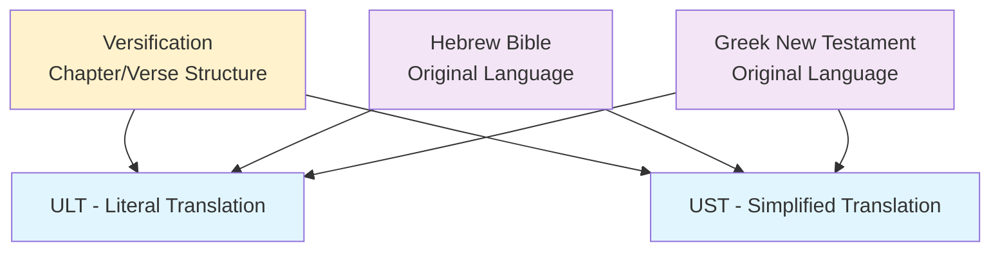
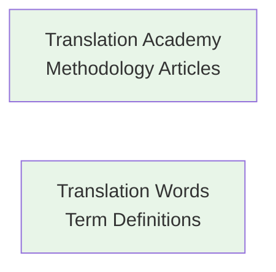
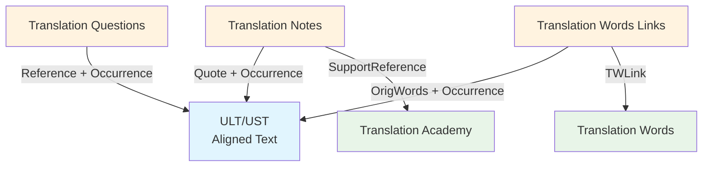
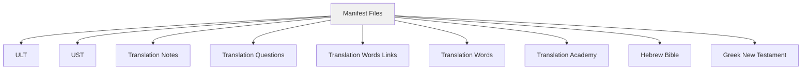

# Book Translation Resources

Book Translation Resources are comprehensive documents in multiple formats designed to help translators translate a Book of the Bible accurately and effectively. These resources are developed by unfoldingWord under Creative Commons Attribution-ShareAlike 4.0 licenses, making them freely available to the global church.

## Core Translation Resources

### 1. Literal Translation of the Book (ULT)
**unfoldingWord® Literal Text** - A form-centric literal translation based on the 1901 American Standard Version, designed specifically for Bible translators to understand original language structures. The ULT maintains close adherence to Hebrew, Aramaic, and Greek grammatical structures while remaining understandable in English.

**Format**: USFM 3.0 with embedded word alignment data
**License**: Creative Commons Attribution-ShareAlike 4.0
**Repository**: [unfoldingWord Literal Text](https://git.door43.org/unfoldingWord/en_ult)
**Documentation**: [ULT Translation Guidelines](https://www.unfoldingword.org/ult/)

#### File Structure
ULT files are organized as individual USFM files per book:
- **Naming Pattern**: `[##]-[BOOK].usfm` (e.g., `01-GEN.usfm`, `40-MAT.usfm`, `56-TIT.usfm`)
- **Format**: USFM 3.0 with embedded alignment markers
- **Encoding**: UTF-8 text files with USFM markup

#### Technical Specifications
- **Translation Philosophy**: Form-centric, maintaining original language word order and structure
- **Base Text**: Derived from 1901 American Standard Version with modern updates
- **Alignment Integration**: Every word aligned to Hebrew (UHB) and Greek (UGNT) sources
- **Markup Standards**: Full USFM 3.0 compliance with alignment extensions
- **Version Control**: Currently at version 85+ with ongoing refinements

#### USFM Structure Elements
- **Book Headers**: `\id`, `\usfm`, `\ide`, `\h`, `\toc1-3`, `\mt` markers
- **Chapter Markers**: `\c` for chapter divisions
- **Verse Markers**: `\v` for verse divisions  
- **Paragraph Markers**: `\p`, `\m`, `\q1-4` for text formatting
- **Alignment Data**: `\zaln-s`/`\zaln-e` and `\w` markers for word-level connections
- **Cross-References**: `\x` markers for scripture cross-references

#### Purpose and Usage
- **Translation Foundation**: Provides literal rendering for understanding original meaning
- **Structural Reference**: Shows original language grammatical patterns
- **Alignment Anchor**: Serves as gateway language connection to Hebrew/Greek
- **Complementary Resource**: Works alongside UST for comprehensive translation approach
- **Quality Standard**: Maintains high accuracy to original language texts

#### Integration with Other Resources
- **Word Alignment**: Contains embedded alignment data linking to UHB/UGNT
- **Translation Notes**: TN references quote ULT text and alignment data
- **Translation Words**: TWL links ULT words to theological definitions
- **Translation Questions**: TQ tests comprehension of ULT meaning
- **Versification**: Follows standard chapter/verse structure for coordination

### 2. Simplified Translation of the Book (UST)
**unfoldingWord® Simplified Text** - A meaning-focused, functional translation that prioritizes clear communication of biblical meaning over literal word-for-word correspondence. The UST uses dynamic equivalence principles to render complex biblical concepts in clear, natural English.

**Format**: USFM 3.0 with embedded word alignment data
**License**: Creative Commons Attribution-ShareAlike 4.0
**Repository**: [unfoldingWord Simplified Text](https://git.door43.org/unfoldingWord/en_ust)
**Documentation**: [UST Translation Guidelines](https://www.unfoldingword.org/ust/)

#### File Structure
UST files are organized as individual USFM files per book:
- **Naming Pattern**: `[##]-[BOOK].usfm` (e.g., `01-GEN.usfm`, `40-MAT.usfm`, `56-TIT.usfm`)
- **Format**: USFM 3.0 with embedded alignment markers
- **Encoding**: UTF-8 text files with USFM markup

#### Technical Specifications
- **Translation Philosophy**: Meaning-focused, prioritizing clarity and natural expression
- **Dynamic Equivalence**: Renders thoughts and concepts rather than word-for-word translation
- **Alignment Integration**: Every word aligned to Hebrew (UHB) and Greek (UGNT) sources
- **Markup Standards**: Full USFM 3.0 compliance with alignment extensions
- **Version Control**: Currently at version 85+ with ongoing refinements

#### USFM Structure Elements
- **Book Headers**: `\id`, `\usfm`, `\ide`, `\h`, `\toc1-3`, `\mt` markers
- **Chapter Markers**: `\c` for chapter divisions
- **Verse Markers**: `\v` for verse divisions
- **Paragraph Markers**: `\p`, `\m`, `\q1-4` for text formatting
- **Alignment Data**: `\zaln-s`/`\zaln-e` and `\w` markers for word-level connections
- **Cross-References**: `\x` markers for scripture cross-references

#### Purpose and Usage
- **Meaning Clarity**: Provides clear, natural rendering of biblical concepts
- **Cultural Bridge**: Explains ancient concepts in modern, understandable terms
- **Complementary Translation**: Works alongside ULT for comprehensive understanding
- **Accessibility**: Makes complex biblical language accessible to broader audiences
- **Translation Model**: Demonstrates dynamic equivalence translation principles

#### Integration with Other Resources
- **Word Alignment**: Contains embedded alignment data linking to UHB/UGNT
- **Translation Notes**: TN references quote UST text for meaning-based guidance
- **Translation Words**: TWL links UST words to theological definitions
- **Translation Questions**: TQ tests comprehension of UST meaning
- **Versification**: Follows standard chapter/verse structure for coordination

### 3. Translation Academy (TA)
**unfoldingWord® Translation Academy** - Comprehensive training materials that provide theoretical foundation and practical guidance for Bible translation. The TA covers translation principles, methodologies, and best practices for producing accurate, clear, and natural translations.

**Format**: Markdown articles organized in hierarchical structure
**License**: Creative Commons Attribution-ShareAlike 4.0
**Repository**: [unfoldingWord Translation Academy](https://git.door43.org/unfoldingWord/en_ta)
**Documentation**: [Translation Academy Manual](https://www.unfoldingword.org/uta/)

#### File Structure
Translation Academy articles are organized in a hierarchical directory structure:
- **Directory Organization**: `/translate/`, `/checking/`, `/process/` main categories
- **Naming Pattern**: Descriptive folder names with `01.md` article files
- **Article Format**: Markdown files with YAML front matter
- **Media Integration**: Images and diagrams in `/media/` directories

#### Content Categories
- **Translation Principles**: Fundamental concepts of Bible translation theory
- **Translation Methods**: Specific techniques for handling different text types
- **Cultural Issues**: Guidance for cross-cultural communication challenges
- **Linguistic Challenges**: Solutions for complex grammatical and lexical issues
- **Quality Assurance**: Standards and processes for translation checking
- **Project Management**: Workflow and coordination guidance

#### Article Structure Elements
- **YAML Front Matter**: Metadata including title, question, dependencies
- **Learning Objectives**: Clear goals for each training module
- **Content Sections**: Structured explanations with examples
- **Practical Applications**: Real-world translation scenarios
- **Assessment Questions**: Knowledge verification components
- **Cross-References**: Links to related articles and resources

#### Purpose and Usage
- **Translator Training**: Systematic education in translation principles
- **Methodology Reference**: Guidance for specific translation challenges
- **Quality Standards**: Defines best practices for translation accuracy
- **Problem Resolution**: Solutions for common translation difficulties
- **Team Coordination**: Frameworks for collaborative translation work

#### Integration with Other Resources
- **Translation Notes**: TN SupportReference column links to specific TA articles
- **Methodology Foundation**: Provides theoretical basis for ULT/UST approaches
- **Quality Framework**: Establishes standards referenced by other resources
- **Training Integration**: Supports translator education using all resources
- **Cross-Resource Linking**: `rc://*/ta/man/translate/...` reference system

### 4. Translation Notes (TN)
**unfoldingWord® Translation Notes** - Comprehensive verse-by-verse guidance that provides specific help for translating difficult, complex, or ambiguous passages. Translation Notes offer alternative translation suggestions, cultural explanations, and linguistic guidance to ensure accurate and clear translation.

**Format**: TSV (Tab-Separated Values) files, one per book
**License**: Creative Commons Attribution-ShareAlike 4.0
**Repository**: [unfoldingWord Translation Notes](https://git.door43.org/unfoldingWord/en_tn)
**Documentation**: [Translation Notes Manual](https://www.unfoldingword.org/utn/)

#### File Structure
Translation Notes are organized as individual TSV files per book:
- **Naming Pattern**: `tn_[BOOK].tsv` (e.g., `tn_GEN.tsv`, `tn_MAT.tsv`, `tn_TIT.tsv`)
- **Column Structure**: `Reference`, `ID`, `Tags`, `SupportReference`, `Quote`, `Occurrence`, `Note`
- **Encoding**: UTF-8 tab-separated values

#### TSV Column Definitions
- **`Reference`**: Chapter and verse reference (e.g., `1:3`) or verse range (e.g., `1:3-5`)
- **`ID`**: Four-character alphanumeric identifier unique within the verse (e.g., `abc1`)
- **`Tags`**: Categorization tags for note types (e.g., `grammar`, `culture`, `translate`)
- **`SupportReference`**: Links to Translation Academy articles (`rc://*/ta/man/translate/...`)
- **`Quote`**: Original language text (Hebrew/Greek) that the note addresses
- **`Occurrence`**: Specifies which occurrence of the quote within the verse
  - `-1`: Applies to every occurrence in the verse
  - `0`: Does not occur in original language (e.g., connecting statements)
  - `1`, `2`, etc.: Applies to specific occurrence number
- **`Note`**: Markdown-formatted explanation, guidance, or alternative translation

#### Note Categories and Types
- **Translation Alternatives**: Different ways to render difficult terms or phrases
- **Cultural Context**: Background information for understanding ancient customs
- **Grammatical Guidance**: Explanations of complex syntactic structures
- **Theological Clarification**: Doctrinal or conceptual explanations
- **Connecting Statements**: Discourse markers and transitional guidance
- **Figures of Speech**: Metaphors, idioms, and rhetorical devices

#### Purpose and Usage
- **Translation Guidance**: Specific help for challenging passages
- **Alternative Suggestions**: Multiple translation options for difficult terms
- **Cultural Bridge**: Explanations of ancient contexts for modern audiences
- **Quality Assurance**: Ensures accurate understanding of original meaning
- **Consistency Support**: Promotes consistent translation of recurring concepts

#### Integration with Other Resources
- **Quote + Occurrence**: Direct links to ULT/UST alignment data
- **SupportReference**: Links to Translation Academy methodology articles
- **Reference Coordination**: Uses versification system for precise targeting
- **Translation Words**: Complements TW definitions with contextual guidance
- **Translation Questions**: Provides background for TQ comprehension testing

### 5. Translation Words (TW)
**unfoldingWord® Translation Words** - Comprehensive definitions and explanations of key biblical, theological, and cultural terms that appear throughout Scripture. These articles provide essential background knowledge for understanding and accurately translating important concepts.

**Format**: Markdown articles organized in hierarchical directories
**License**: Creative Commons Attribution-ShareAlike 4.0
**Repository**: [unfoldingWord Translation Words](https://git.door43.org/unfoldingWord/en_tw)
**Documentation**: [Translation Words Manual](https://www.unfoldingword.org/utw/)

#### File Structure
Translation Words are organized in a hierarchical directory structure by category:
- **Directory Organization**: `/bible/kt/`, `/bible/names/`, `/bible/other/` main categories
- **Naming Pattern**: Individual markdown files named by term (e.g., `god.md`, `moses.md`)
- **Article Format**: Markdown files with YAML front matter
- **Media Integration**: Images and diagrams in related directories

#### Content Categories
- **Key Terms (`/kt/`)**: Central theological concepts (God, salvation, covenant, etc.)
- **Names (`/names/`)**: People, places, and proper nouns from Scripture
- **Other Terms (`/other/`)**: Cultural, historical, and general biblical concepts
- **Cross-References**: Extensive linking between related terms

#### Article Structure Elements
- **YAML Front Matter**: Metadata including aliases, related terms, examples
- **Definition Section**: Clear, concise explanation of the term's meaning
- **Facts About**: Detailed information and characteristics
- **Bible References**: Key passages where the term appears
- **Examples from Bible Stories**: Narrative contexts illustrating usage
- **Word Data**: Original language information and etymology
- **Translation Suggestions**: Guidance for rendering in target languages

#### Term Types and Scope
- **Theological Concepts**: Doctrinal terms requiring careful translation
- **Cultural Practices**: Ancient customs and social structures
- **Historical Context**: Events, periods, and background information
- **Geographic References**: Places, regions, and locations
- **Religious Practices**: Worship, rituals, and ceremonial elements
- **Social Structures**: Roles, relationships, and community organization

#### Purpose and Usage
- **Conceptual Understanding**: Deep knowledge of biblical terms and concepts
- **Translation Consistency**: Standardized definitions for recurring terms
- **Cultural Bridge**: Explanations of ancient concepts for modern contexts
- **Theological Accuracy**: Ensures proper understanding of doctrinal terms
- **Cross-Reference Network**: Comprehensive linking of related concepts

#### Integration with Other Resources
- **Translation Words Links**: TWL files connect specific scripture occurrences to TW articles
- **Translation Notes**: TN references TW articles for additional context
- **ULT/UST Alignment**: Terms are linked through TWL to specific aligned words
- **Translation Questions**: TQ often tests understanding of key TW concepts
- **Reference System**: `rc://*/tw/dict/bible/...` linking format

### 6. Translation Words Links (TWL)
**unfoldingWord® Translation Words Links** - Precise mapping files that connect specific occurrences of original language words in Scripture to their corresponding Translation Words definitions. TWL creates a comprehensive cross-reference system linking every significant biblical term to its explanatory article.

**Format**: TSV (Tab-Separated Values) files, one per book
**License**: Creative Commons Attribution-ShareAlike 4.0
**Repository**: [unfoldingWord Translation Words Links](https://git.door43.org/unfoldingWord/en_twl)
**Documentation**: [Translation Words Links Repository](https://git.door43.org/unfoldingWord/en_twl/src/branch/master/README.md)

#### File Structure
Translation Words Links are organized as individual TSV files per book:
- **Naming Pattern**: `twl_[BOOK].tsv` (e.g., `twl_GEN.tsv`, `twl_MAT.tsv`, `twl_TIT.tsv`)
- **Column Structure**: `Reference`, `ID`, `Tags`, `OrigWords`, `Occurrence`, `TWLink`
- **Encoding**: UTF-8 tab-separated values

#### TSV Column Definitions
- **`Reference`**: Chapter and verse reference (e.g., `1:3`) where the term occurs
- **`ID`**: Four-character alphanumeric identifier unique within the verse (e.g., `xyz9`)
- **`Tags`**: Categorization tags indicating term type (e.g., `kt`, `names`, `other`)
- **`OrigWords`**: Original language word(s) from Hebrew/Greek text
- **`Occurrence`**: Specifies which occurrence of the original word within the verse
- **`TWLink`**: Link identifier pointing to the corresponding Translation Words article

#### Linking Categories and Scope
- **Key Terms**: Central theological concepts requiring careful translation
- **Proper Names**: People, places, and specific biblical references
- **Cultural Terms**: Ancient practices, customs, and social structures
- **Religious Concepts**: Worship, ritual, and ceremonial terminology
- **Historical References**: Events, periods, and contextual information
- **Geographic Terms**: Locations, regions, and place names

#### Purpose and Usage
- **Term Discovery**: Systematic identification of important biblical concepts
- **Definition Access**: Direct linking from scripture text to explanatory articles
- **Translation Consistency**: Ensures consistent handling of recurring terms
- **Comprehensive Coverage**: Maps all significant terms across entire Bible
- **Quality Assurance**: Validates that important concepts are properly defined

#### Integration with Other Resources
- **OrigWords + Occurrence**: Direct links to ULT/UST alignment data
- **TWLink**: Points to specific Translation Words markdown articles
- **Reference Coordination**: Uses versification system for precise targeting
- **Translation Notes**: Complements TN contextual guidance with term definitions
- **Cross-Resource Navigation**: Enables seamless movement between aligned text and definitions

### 7. Translation Questions (TQ)
**unfoldingWord® Translation Questions** - Comprehensive questions and answers for each chapter of the Bible that enable translators and translation checkers to confirm that the intended meaning of their translations is clearly communicated to the speakers of that language.

**Format**: TSV (Tab-Separated Values) files, one per book
**License**: Creative Commons Attribution-ShareAlike 4.0
**Repository**: [unfoldingWord Translation Questions](https://git.door43.org/unfoldingword/en_tq)
**Documentation**: [Translation Questions Manual](https://www.unfoldingword.org/utq/)

#### File Structure
Translation Questions are organized as individual TSV files per book:
- **Naming Pattern**: `tq_[BOOK].tsv` (e.g., `tq_GEN.tsv`, `tq_MAT.tsv`, `tq_TIT.tsv`)
- **Column Structure**: `Reference`, `ID`, `Tags`, `Quote`, `Occurrence`, `Question`, `Response`

#### TSV Column Definitions
- **`Reference`**: Chapter and verse reference (e.g., `1:3`) or `intro` for introductory questions
- **`ID`**: Four-character alphanumeric identifier unique within the verse (e.g., `swi9`)
- **`Tags`**: Currently unused for Translation Questions (reserved for future use)
- **`Quote`**: Currently used only for OBS Translation Questions (empty for Bible TQs)
- **`Occurrence`**: Specifies which occurrence in the original text the question applies to
  - `-1`: Applies to every occurrence in the verse
  - `0`: Does not occur in original language (e.g., connecting statements)
  - `1`, `2`, etc.: Applies to specific occurrence number
- **`Question`**: Markdown-formatted comprehension question
- **`Response`**: Optional markdown-formatted answer to the question

#### Purpose and Usage
- **Translation Verification**: Confirm that translated meaning matches original intent
- **Comprehension Testing**: Verify that target language speakers understand the translation
- **Quality Assurance**: Systematic checking of translation accuracy and clarity
- **Training Tool**: Help translators understand key concepts and difficult passages
- **Review Process**: Enable translation checkers to validate translation quality

#### Integration with Other Resources
Translation Questions complement other resources in the translation ecosystem:
- **Reference Coordination**: Uses same verse reference system as other resources
- **Conceptual Alignment**: Questions target key theological and cultural concepts
- **Translation Academy Links**: Complex concepts may reference TA articles for methodology
- **Translation Words Connection**: Questions often focus on key terms defined in TW
- **Quality Framework**: Provides systematic approach to translation validation

### 8. Word Alignment Data
**USFM 3.0 Embedded Alignment** - Precise word-level connections between gateway language translations and original Hebrew, Greek, and Aramaic texts, embedded directly within USFM files using alignment markers.

**Format**: USFM 3.0 with embedded alignment markers
**License**: Creative Commons Attribution-ShareAlike 4.0
**Purpose**: Enable precise connection between gateway language words and original language words for translation accuracy

#### Alignment Syntax Structure
unfoldingWord uses `\zaln-s` (alignment start) and `\zaln-e` (alignment end) markers to create word-level alignments:

```usfm
\zaln-s |x-strong="G35880" x-lemma="ὁ" x-morph="Gr,EA,,,,NMS," x-occurrence="1" x-occurrences="1" x-content="ὁ"\*\w The|x-occurrence="1" x-occurrences="1"\w*\zaln-e\*
```

**Alignment Attributes**:
- `x-strong`: Strong's concordance number (e.g., "G35880" for Greek, "H01234" for Hebrew)
- `x-lemma`: Dictionary/lexical form of the original word (e.g., "ὁ")
- `x-morph`: Detailed morphological parsing (e.g., "Gr,EA,,,,NMS," = Greek, Article, Nominative, Masculine, Singular)
- `x-occurrence`: Which occurrence of this word in the current verse (e.g., "1")
- `x-occurrences`: Total occurrences of this word in the current verse (e.g., "1")
- `x-content`: The actual original language text being aligned (e.g., "ὁ")

**Gateway Language Words**:
- `\w` markers surround the gateway language words
- Include their own occurrence tracking for disambiguation
- Can span multiple words or partial words

#### Alignment Relationship Types
The alignment system supports flexible word relationships through proper nesting:

1. **One-to-One**: Single original word ↔ single gateway word
   ```usfm
   \zaln-s |x-strong="G2316" x-lemma="θεός" x-morph="Gr,N,,,,,NMS," x-occurrence="1" x-occurrences="1" x-content="θεὸς"\*\w God|x-occurrence="1" x-occurrences="1"\w*\zaln-e\*
   ```
   *This shows the simplest alignment: the Greek word "θεὸς" (theos) aligns directly to the English word "God". One alignment marker contains one original word and one gateway word.*

   ```mermaid
   graph LR
       subgraph Greek ["Greek Word"]
           A["θεὸς"]
       end
       subgraph English ["English Word"]
           B["God"]
       end
       Greek --> English
       style Greek fill:#e1f5fe
       style English fill:#f3e5f5
       style A fill:#ffffff
       style B fill:#ffffff
   ```

2. **One-to-Many**: Single original word ↔ multiple gateway words (nested structure)
   ```usfm
   \zaln-s |x-strong="G2980" x-lemma="λαλέω" x-morph="Gr,V,IFA1,,P," x-occurrence="1" x-occurrences="1" x-content="λαλήσομεν"\*\w we|x-occurrence="1" x-occurrences="1"\w* \w will|x-occurrence="1" x-occurrences="1"\w* \w speak|x-occurrence="1" x-occurrences="1"\w*\zaln-e\*
   ```
   *Here, the single Greek verb "λαλήσομεν" (we will speak) requires three English words to express the same meaning. All three gateway words are contained within one alignment pair because they all translate the single original word.*

   ```mermaid
   graph LR
       subgraph Greek ["Greek Word"]
           A["λαλήσομεν"]
       end
       subgraph English ["English Words (Nested Together)"]
           B["we"]
           C["will"]
           D["speak"]
       end
       Greek --> English
       style Greek fill:#e1f5fe
       style English fill:#f3e5f5
       style A fill:#ffffff
       style B fill:#ffffff
       style C fill:#ffffff
       style D fill:#ffffff
   ```

3. **Many-to-One**: Multiple original words ↔ single gateway word (overlapping alignments)
   ```usfm
   \zaln-s |x-strong="G1223" x-lemma="διά" x-morph="Gr,P,,,,,G,,," x-occurrence="1" x-occurrences="1" x-content="διὰ"\*\zaln-s |x-strong="G5124" x-lemma="οὗτος" x-morph="Gr,RD,,,,ANS," x-occurrence="1" x-occurrences="1" x-content="τοῦτο"\*\w therefore|x-occurrence="1" x-occurrences="1"\w*\zaln-e\*\zaln-e\*
   ```
   *This example shows two Greek words "διὰ τοῦτο" (literally "through this") being translated as the single English word "therefore". The alignment markers are nested, with both original words wrapping around the single gateway word that captures their combined meaning.*

   ```mermaid
   graph LR
       subgraph Greek ["Greek Words (Nested Together)"]
           A["διὰ"]
           B["τοῦτο"]
       end
       subgraph English ["English Word"]
           C["therefore"]
       end
       Greek --> English
       style Greek fill:#e1f5fe
       style English fill:#f3e5f5
       style A fill:#ffffff
       style B fill:#ffffff
       style C fill:#ffffff
   ```

4. **Many-to-Many**: Multiple original words ↔ multiple gateway words (nested combinations)
   ```usfm
   \zaln-s |x-strong="G2570" x-lemma="καλός" x-morph="Gr,NR,,,,ANS," x-occurrence="1" x-occurrences="1" x-content="καλῶς"\*\zaln-s |x-strong="G4160" x-lemma="ποιέω" x-morph="Gr,V,IPA2,,S," x-occurrence="1" x-occurrences="1" x-content="ποιεῖς"\*\w do|x-occurrence="1" x-occurrences="1"\w* \w good|x-occurrence="1" x-occurrences="1"\w*\zaln-e\*\zaln-e\*
   ```
   *This shows a true many-to-many relationship: the Greek phrase "καλῶς ποιεῖς" (literally "well you-do") cannot be aligned as individual word pairs. You cannot say καλῶς = "do" and ποιεῖς = "good" because that would be incorrect. Instead, both Greek words together collectively express the concept that requires both English words "do good" as an inseparable unit. The nested alignment markers show that both original words contribute to both gateway words simultaneously.*

   ```mermaid
   graph LR
       subgraph Greek ["Greek Words (Nested Together)"]
           A["καλῶς"]
           B["ποιεῖς"]
       end
       subgraph English ["English Words (Nested Together)"]
           C["do"]
           D["good"]
       end
       Greek --> English
       style Greek fill:#e1f5fe
       style English fill:#f3e5f5
       style A fill:#ffffff
       style B fill:#ffffff
       style C fill:#ffffff
       style D fill:#ffffff
   ```

#### Technical Integration
- **Original Language Sources**: Aligns to unfoldingWord Hebrew Bible (UHB) and Greek New Testament (UGNT)
- **Morphological Data**: Full parsing information for advanced analysis
- **Software Integration**: Enables word-study tools, interlinear displays, and concordance features
- **Translation Memory**: Supports consistent translation of recurring terms
- **Quality Assurance**: Allows verification of translation accuracy against original languages

#### Usage in Translation Tools
The alignment data enables multiple critical features in translation review applications:

**Translation Note Highlighting**: When a Translation Note references an original language phrase in its Quote field, translation tools can:
1. **Locate the Quote**: Find the original language phrase in the alignment data
2. **Identify Aligned Words**: Discover which gateway language words are aligned to that phrase
3. **Context Highlighting**: Highlight those specific gateway language words in the ULT/UST text
4. **Visual Connection**: Show users exactly which words the translation note is addressing

**Detailed Example with Real Data**:

Consider Romans 1:1 with this Translation Note:
```tsv
Reference	ID	Tags	SupportReference	Quote	Occurrence	Note
1:1	        abc1	        	        	δοῦλος	1	        Paul calls himself a servant of Jesus Christ...
```

The ULT alignment data for Romans 1:1 contains:
```usfm
\v 1 \zaln-s |x-strong="G39720" x-lemma="Παῦλος" x-morph="Gr,N,,,,,NMS," x-occurrence="1" x-occurrences="1" x-content="Παῦλος"\*\w Paul|x-occurrence="1" x-occurrences="1"\w*\zaln-e\* \zaln-s |x-strong="G14010" x-lemma="δοῦλος" x-morph="Gr,N,,,,,NMS," x-occurrence="1" x-occurrences="1" x-content="δοῦλος"\*\w a servant|x-occurrence="1" x-occurrences="1"\w*\zaln-e\* \zaln-s |x-strong="G24240" x-lemma="Ἰησοῦς" x-morph="Gr,N,,,,,GMS," x-occurrence="1" x-occurrences="1" x-content="Ἰησοῦ"\*\w of Jesus|x-occurrence="1" x-occurrences="1"\w*\zaln-e\* \zaln-s |x-strong="G55470" x-lemma="Χριστός" x-morph="Gr,N,,,,,GMS," x-occurrence="1" x-occurrences="1" x-content="Χριστοῦ"\*\w Christ|x-occurrence="1" x-occurrences="1"\w*\zaln-e\*...
```

**Highlighting Process**:
1. **Parse Translation Note**: Quote = "δοῦλος", Occurrence = 1
2. **Search Alignment**: Find `x-content="δοῦλος"` with `x-occurrence="1"`
3. **Extract Gateway Text**: The aligned `\w` tag contains "a servant"
4. **Apply Highlighting**: Highlight "a servant" in the displayed ULT text

**Visual Result in Translation Tool**:
```
ULT Romans 1:1: Paul **[a servant]** of Jesus Christ, called to be an apostle...
                      ↑ highlighted because it aligns to δοῦλος

Translation Note: Paul calls himself a servant of Jesus Christ...
Quote: δοῦλος (occurrence 1)
```

**Complex Example - Multiple Words**:
For a Translation Note with Quote = "τοῦ θεοῦ" (of God):
```usfm
\zaln-s |x-content="τοῦ"\*\zaln-s |x-content="θεοῦ"\*\w of God|x-occurrence="1"\w*\zaln-e\*\zaln-e\*
```
Result: Highlight "of God" as a single phrase aligned to the two-word Greek phrase.

**Additional Applications**:
- **Cross-Reference Navigation**: Jump between original and gateway language texts
- **Translation Consistency**: Track how the same original words are translated across contexts
- **Quality Assurance**: Verify that translation notes address actually aligned words
- **Interactive Study**: Enable users to explore word-level translation decisions
- **Precision Targeting**: Ensure translation guidance applies to correct text portions

This alignment-based highlighting creates a seamless connection between translation resources and the actual text, enabling precise, context-aware translation review and study.

### 9. Versification
**Chapter and Verse Structure** - Standardized lists of chapters and verses that define the canonical structure of each book, enabling precise reference coordination across all translation resources.

**Format**: JSON or structured data files
**License**: Creative Commons Attribution-ShareAlike 4.0  
**Purpose**: Provide the foundational reference framework that allows translation tools to coordinate resource loading and navigation

**Structure**: Defines the canonical verse structure for each book, including:
- **Chapter boundaries**: Which verses belong to which chapters
- **Verse ranges**: Valid verse numbers for each chapter
- **Book organization**: Consistent book abbreviations and ordering
- **Reference validation**: Ensures all resource references point to valid scripture locations

**Critical Role**: Versification serves as the structural backbone that enables:
- **Context-aware loading**: Tools know which resources to load for the current verse
- **Navigation consistency**: Uniform reference system across all resources
- **Validation framework**: Ensures all resource references are scripturally valid
- **User interface coordination**: Synchronizes resource display based on current scripture location

## Resource Integration and Relationships

Understanding how these resources interconnect is crucial for building effective translation review tools. Each resource serves a specific purpose, but they form an integrated ecosystem that enables comprehensive translation analysis and quality assurance.

### Hosting Infrastructure: Door43 Content Service (DCS)

All unfoldingWord translation resources are hosted on **Door43 Content Service (DCS)**, a collaborative Git-based platform that serves as the central repository system for Bible translation resources.

#### Technical Platform Details
- **Platform**: DCS is a fork of **Gitea**, providing GitHub-like functionality
- **URL Structure**: Resources are hosted at `https://git.door43.org/`
- **Organization**: All resources belong to the `unfoldingWord` organization
- **Version Control**: Full Git history and branching for resource development
- **API Access**: REST API for programmatic access to repositories and content

#### Repository Organization
Resources are organized as separate repositories within the unfoldingWord organization:
- **ULT**: `https://git.door43.org/unfoldingWord/en_ult`
- **UST**: `https://git.door43.org/unfoldingWord/en_ust`
- **Translation Notes**: `https://git.door43.org/unfoldingWord/en_tn`
- **Translation Words**: `https://git.door43.org/unfoldingWord/en_tw`
- **Translation Words Links**: `https://git.door43.org/unfoldingWord/en_twl`
- **Translation Academy**: `https://git.door43.org/unfoldingWord/en_ta`
- **Hebrew Bible**: `https://git.door43.org/unfoldingWord/hbo_uhb`
- **Greek New Testament**: `https://git.door43.org/unfoldingWord/el-x-koine_ugnt`

#### Manifest-Based Resource Discovery
Each repository contains a `manifest.yaml` file that enables programmatic resource discovery:

```yaml
dublin_core:
  title: "unfoldingWord Literal Text"
  identifier: "ult"
  language:
    identifier: "en"
    title: "English"
checking:
  checking_entity:
    - "unfoldingWord"
  checking_level: "3"
relation:
  - en/tw          # Same organization reference
  - en/tq          # Same organization reference  
  - en/tn          # Same organization reference
  - hbo/uhb?v=2.1.30    # Cross-language reference with version
  - el-x-koine/ugnt?v=0.34  # Cross-language reference with version
```

**Technical Implementation**:
- **Organization Scope**: Relations use `organization/repository` format within DCS
- **Version Pinning**: Specific versions ensure compatibility (`?v=2.1.30`)
- **Language Coordination**: Cross-language references for original language resources
- **Automated Discovery**: Tools can parse manifests to automatically load dependencies
- **Update Coordination**: Version changes propagate through the dependency chain

### Multilingual Gateway Language Ecosystem

The unfoldingWord resource model extends beyond English to support **Mother Tongue Translators (MTTs)** who use different strategic languages as their second language for Bible translation work.

#### Gateway Language Strategy
**unfoldingWord's Original Vision**: Create comprehensive English translation resources to serve MTTs who speak English as a second language, enabling them to translate the Bible into their heart languages.

**Expanded Ecosystem**: Other organizations have adopted the same resource structure and linking methodology to serve MTTs who use different strategic gateway languages:

- **Spanish Gateway Languages**: Organizations serving Spanish-speaking MTTs
- **French Gateway Languages**: Organizations serving French-speaking MTTs  
- **Hindi Gateway Languages**: Organizations serving Hindi-speaking MTTs
- **Portuguese Gateway Languages**: Organizations serving Portuguese-speaking MTTs
- **Arabic Gateway Languages**: Organizations serving Arabic-speaking MTTs
- **And many others**: Additional strategic languages based on regional needs

#### Organizational Structure on DCS
Each gateway language ecosystem maintains its own organization on DCS:

```
https://git.door43.org/unfoldingWord/     # English resources
https://git.door43.org/es-419_gl/         # Spanish gateway language
https://git.door43.org/fr_gl/             # French gateway language  
https://git.door43.org/hi_gl/             # Hindi gateway language
https://git.door43.org/pt-br_gl/          # Portuguese (Brazil) gateway language
```

**Repository Naming Pattern**: Each organization maintains parallel repositories with different codes for literal/simplified texts:

**unfoldingWord (English) - Uses ULT/UST codes**:
- `en_ult` (unfoldingWord Literal Text)
- `en_ust` (unfoldingWord Simplified Text)
- `en_tn` (Translation Notes)
- `en_tq` (Translation Questions)
- `en_tw` (Translation Words)
- `en_twl` (Translation Words Links)
- `en_ta` (Translation Academy)

**Other Gateway Languages - Use GLT/GST codes**:
- `es-419_glt` (Gateway Language Literal Text)
- `es-419_gst` (Gateway Language Simplified Text)
- `es-419_tn` (Translation Notes)
- `es-419_tq` (Translation Questions)
- `es-419_tw` (Translation Words)
- `es-419_twl` (Translation Words Links)
- `es-419_ta` (Translation Academy)

#### Consistent Linking Strategy
**Critical Implementation Detail**: Each gateway language organization maintains the **same internal linking strategy** as unfoldingWord:

```yaml
# Spanish GLT manifest (es-419_glt)
relation:
  - es-419/tw          # Spanish Translation Words
  - es-419/tq          # Spanish Translation Questions
  - es-419/tn          # Spanish Translation Notes
  - es-419/twl         # Spanish Translation Words Links
  - hbo/uhb?v=2.1.30   # Same Hebrew Bible reference
  - el-x-koine/ugnt?v=0.34  # Same Greek New Testament reference
```

**Key Principles**:
- **Internal Consistency**: Relations reference resources within the same organization
- **Original Language Coordination**: All gateway languages reference the same Hebrew/Greek sources
- **Parallel Structure**: Same resource types and relationships across all gateway languages
- **Independent Versioning**: Each organization manages its own resource versions
- **Shared Methodology**: Same TSV structures, alignment principles, and linking mechanisms

#### Technical Implications for Developers

**Multi-Organization Support**: Translation tools should be designed to:
- **Dynamic Organization Discovery**: Detect and work with different gateway language organizations
- **Consistent Processing**: Apply the same linking logic regardless of gateway language
- **Cross-Language Coordination**: Handle references to shared original language resources
- **Flexible Configuration**: Allow users to select their preferred gateway language organization

**Implementation Pattern**:
```typescript
interface GatewayLanguageConfig {
  organization: string;        // e.g., "unfoldingWord", "es-419_gl"
  languageCode: string;        // e.g., "en", "es-419"
  baseUrl: string;            // e.g., "https://git.door43.org/unfoldingWord/"
  resourcePrefix: string;      // e.g., "en_", "es-419_"
  isUnfoldingWord: boolean;    // true for unfoldingWord, false for other orgs
}

// Handle different naming conventions for literal/simplified texts
async function loadResourcePackage(config: GatewayLanguageConfig, bookId: string) {
  const literalRepo = config.isUnfoldingWord 
    ? `${config.resourcePrefix}ult`    // unfoldingWord uses ULT
    : `${config.resourcePrefix}glt`;   // Other orgs use GLT
  
  const simplifiedRepo = config.isUnfoldingWord
    ? `${config.resourcePrefix}ust`    // unfoldingWord uses UST  
    : `${config.resourcePrefix}gst`;   // Other orgs use GST
    
  const tnRepo = `${config.resourcePrefix}tn`;  // Same for all orgs
  // ... same logic, different naming conventions
}
```

**Benefits for MTT Translators**:
- **Native Gateway Language**: Work in their strongest second language
- **Consistent Methodology**: Same translation principles across all gateway languages
- **Quality Resources**: Professional translation of all supporting materials
- **Cultural Adaptation**: Gateway language resources adapted for regional contexts
- **Collaborative Ecosystem**: Multiple organizations contributing to global Bible translation

This multilingual ecosystem significantly expands the reach of quality Bible translation resources while maintaining technical consistency and linking integrity across all gateway language implementations.

### Resource Relationship Diagrams

The following diagrams illustrate how translation resources interconnect, organized by relationship type for clarity:

#### 1. Core Translation Foundation


#### 2. Standalone Reference Resources


#### 3. Linking Resources (Point to Others)


#### 4. Repository-Level Dependencies


These focused diagrams show:
- **Core Foundation**: How versification and original languages support ULT/UST
- **Standalone Resources**: TA and TW that provide reference material
- **Linking Resources**: TN, TQ, and TWL that connect to other resources
- **Repository Dependencies**: How manifest files coordinate all resources

### Core Resource Dependencies

#### 1. Alignment as the Foundation Layer
**Word Alignment Data** serves as the foundational layer that connects all other resources:
- **ULT/UST ↔ Original Languages**: Every gateway language word is aligned to specific Hebrew/Greek/Aramaic words
- **Reference Point**: All other resources reference these aligned words for precision
- **Quality Anchor**: Enables verification that translation accurately represents original meaning
- **Navigation Bridge**: Allows users to move seamlessly between languages and resources

#### 2. Translation Notes Integration
**Translation Notes (TNs)** are deeply integrated with the alignment system through TSV structure:
- **Quote Column**: References exact aligned words from ULT/UST
- **Occurrence Column**: Pinpoints specific aligned word instances
- **Reference Column**: Coordinates with versification for verse-level accuracy
- **SupportReference Column**: Links to Translation Academy methodology

#### 3. Translation Words Ecosystem
**Translation Words (UTW)** and **Translation Words Links (TWL)** create a comprehensive terminology system:
- **OrigWords Column**: References specific aligned terms
- **TWLink Column**: Points to corresponding definition articles
- **Reference Column**: Coordinates with versification structure
- **Cross-Reference Network**: Enables tracking term usage across entire Bible

#### 4. Translation Academy Framework
**Translation Academy (UTA)** provides the theoretical foundation:
- **SupportReference Links**: Direct connection from Translation Notes
- **Translation Principles**: Explains methodology behind alignment decisions
- **Problem-Solution Patterns**: Addresses challenges referenced in notes

### Technical Integration Points

#### 1. Strong's Number System
All resources use **Strong's concordance numbers** as the primary linking mechanism:
- **Alignment Data**: `x-strong="G2316"` identifies specific original words
- **Translation Notes**: Reference the same Strong's numbers for precision
- **Translation Words Links**: Map Strong's numbers to definition articles
- **Cross-Resource Navigation**: Enables jumping between resources for the same term

#### 2. Occurrence Tracking
**Occurrence data** ensures precision when multiple instances exist:
- **Word Alignments**: `x-occurrence="2" x-occurrences="3"` specifies which instance
- **Translation Notes**: Reference specific occurrences of problematic words
- **Translation Words Links**: Can target specific uses of terms in context
- **Review Tools**: Allow reviewers to examine each occurrence individually

#### 3. Reference Coordination
**Standardized reference format** enables resource coordination:
- **Scripture References**: `ROM 1:1` format used across all resources
- **Resource Citations**: `rc://*/tw/dict/bible/...` format for internal linking
- **Alignment Anchoring**: Specific verse-level coordination of all resources
- **Navigation Consistency**: Uniform reference system for tool development

### Quality Assurance Relationships

#### 1. Alignment Completeness
**Translation review tools can verify**:
- **Coverage**: Every original word has corresponding gateway language alignment
- **Accuracy**: Aligned words appropriately represent original meaning
- **Consistency**: Same original words consistently aligned across contexts
- **Completeness**: No original language content left unaligned

#### 2. Note-Alignment Coherence
**Cross-validation opportunities**:
- **Referenced Words**: Translation Notes should reference actually aligned words
- **Contextual Accuracy**: Notes should match the aligned word's actual context
- **Alternative Suggestions**: Note suggestions should be valid for aligned terms
- **Cultural Accuracy**: Cultural explanations should match aligned term usage

#### 3. Translation Words Consistency
**Terminology validation**:
- **Link Accuracy**: TWL should point to words actually present in alignments
- **Definition Relevance**: UTW articles should match aligned word usage
- **Cross-Reference Completeness**: Related terms should be properly connected
- **Translation Consistency**: Same aligned terms should use consistent UTW guidance

#### 4. Translation Academy Application
**Methodological consistency**:
- **Principle Application**: Alignment decisions should follow UTA principles
- **Problem Resolution**: UTA solutions should address alignment challenges
- **Quality Standards**: Alignments should meet UTA quality criteria
- **Best Practice Implementation**: Tools should enforce UTA recommendations

### Developer Implementation Guidelines

#### 1. Resource Loading Strategy
- **Dependency Order**: Load alignments first, then build dependent resource connections
- **Reference Resolution**: Resolve all cross-resource references during initialization
- **Validation Pipeline**: Implement checks for resource coherence and completeness
- **Error Handling**: Gracefully handle missing or broken resource connections

#### 2. User Interface Integration
- **Unified Navigation**: Allow seamless movement between interconnected resources
- **Context Preservation**: Maintain reference context when switching between resources
- **Visual Connections**: Highlight relationships between aligned words and notes/definitions
- **Review Workflows**: Design interfaces that leverage resource interconnections for efficient review

#### 3. Quality Checking Features
- **Automated Validation**: Check for broken links, missing references, and consistency errors
- **Completeness Reports**: Generate reports on alignment coverage and resource completeness
- **Coherence Analysis**: Identify inconsistencies between related resources
- **Review Prioritization**: Highlight areas needing human review based on resource relationships

This integrated resource system enables comprehensive translation review by providing multiple layers of verification and cross-validation, ensuring both accuracy to original languages and effectiveness in target language communication.

## Extensibility and New Resource Creation

The unfoldingWord translation resource ecosystem is designed to be extensible, allowing gateway language organizations to create additional resources that integrate seamlessly with existing translation tools. New resources must follow established conventions to ensure compatibility.

### Resource Type Categories

All unfoldingWord translation resources follow the [Resource Container specification](https://resource-container.readthedocs.io/en/latest/index.html), which defines standardized directory structures, manifest formats, and content organization patterns.

#### 1. Standalone Manual Resources
**Purpose**: Self-contained reference materials (dictionaries, cultural guides, theological handbooks)
**RC Type**: `help` or `man` (manual)
**File Structure**: Following RC directory structure with content in designated folders

**Example Structure**:
```
en_cultural-guide/
├── .apps/                    # Application metadata
├── LICENSE.md               # License information
├── manifest.yaml           # RC manifest file
├── media.yaml              # Media definitions (optional)
└── content/                # Project content directory
    ├── config.yaml         # Project configuration
    ├── toc.yaml           # Table of contents
    ├── front/             # Front matter
    │   ├── title.md
    │   └── intro.md
    ├── 01/                # Chapter directories
    │   ├── title.md
    │   └── 01.md
    └── back/              # Back matter
        └── reference.md
```

**Manifest Requirements** (following [RC Manifest specification](https://resource-container.readthedocs.io/en/latest/manifest.html#manifest)):
```yaml
dublin_core:
  conformsto: 'rc0.2'
  contributor: []
  creator: 'Gateway Language Organization'
  description: 'Cultural guidance for Bible translation'
  format: 'text/markdown'
  identifier: 'cultural-guide'
  issued: '2024-01-01'
  language:
    identifier: 'en'
    title: 'English'
    direction: 'ltr'
  modified: '2024-01-01T12:00:00-00:00'
  publisher: 'Gateway Language Organization'
  relation: []
  rights: 'CC BY-SA 4.0'
  source: []
  subject: 'Bible'
  title: 'Cultural Guide'
  type: 'help'
  version: '1'

checking:
  checking_entity: []
  checking_level: '1'

projects:
  - categories: ['bible-help']
    identifier: 'cultural-guide'
    path: './content'
    sort: 1
    title: 'Cultural Guide'
    versification: 'kjv'
```

#### 2. Linked TSV Help Resources
**Purpose**: Verse-specific or word-specific guidance that links to source texts
**RC Type**: `help`
**File Structure**: TSV files within RC content directory structure

**Required TSV Columns**:
- `Reference`: Scripture reference (e.g., "1:1", "1:1-3")
- `ID`: Unique identifier within the resource
- `Quote`: Original language text being addressed (for linking)
- `Occurrence`: Which occurrence of the quote (1, 2, 3...)
- `Note`: The help content

**Optional Linking Columns**:
- `SupportReference`: Cross-reference to other passages
- `TWLink`: Link to Translation Words entries
- `OrigWords`: Strong's numbers or original language identifiers

**Example Structure**:
```
en_theological-notes/
├── .apps/
├── LICENSE.md
├── manifest.yaml
├── media.yaml
└── content/
    ├── config.yaml
    ├── 01-GEN.tsv          # Genesis theological notes
    ├── 02-EXO.tsv          # Exodus theological notes
    └── 40-MAT.tsv          # Matthew theological notes
```

**Manifest Example**:
```yaml
dublin_core:
  conformsto: 'rc0.2'
  contributor: []
  creator: 'Gateway Language Organization'
  description: 'Theological notes for Bible translation'
  format: 'text/tab-separated-values'
  identifier: 'theological-notes'
  issued: '2024-01-01'
  language:
    identifier: 'en'
    title: 'English'
    direction: 'ltr'
  modified: '2024-01-01T12:00:00-00:00'
  publisher: 'Gateway Language Organization'
  relation: 
    - 'en/ult'
    - 'en/ust'
  rights: 'CC BY-SA 4.0'
  source: []
  subject: 'Bible'
  title: 'Theological Notes'
  type: 'help'
  version: '1'

checking:
  checking_entity: []
  checking_level: '1'

projects:
  - categories: ['bible-ot']
    identifier: 'gen'
    path: './content/01-GEN.tsv'
    sort: 1
    title: 'Genesis'
    versification: 'kjv'
  - categories: ['bible-ot']
    identifier: 'exo'
    path: './content/02-EXO.tsv'
    sort: 2
    title: 'Exodus'
    versification: 'kjv'
  - categories: ['bible-nt']
    identifier: 'mat'
    path: './content/40-MAT.tsv'
    sort: 40
    title: 'Matthew'
    versification: 'kjv'
```

#### 3. Dictionary Resources
**Purpose**: Standalone dictionary of terms (like Translation Words)
**RC Type**: `dict`
**File Structure**: Markdown files for each dictionary term, organized by term identifier

**Example Structure**:
```
en_translation-words-dict/
├── .apps/
├── LICENSE.md
├── manifest.yaml
├── media.yaml
└── content/
    ├── config.yaml         # Term configurations
    ├── aaron.md           # Aaron dictionary entry
    ├── abel.md            # Abel dictionary entry
    ├── abraham.md         # Abraham dictionary entry
    └── adultery.md        # Adultery dictionary entry
```

**Term File Structure** (following [Dictionary RC specification](https://resource-container.readthedocs.io/en/latest/container_types.html#dictionary-dict)):
```markdown
# Aaron

## Word Data:

* Strongs: H0175
* Part of speech: Proper Noun

## Facts:

Aaron was Moses' older brother. God chose Aaron to be the first high priest for the people of Israel.

* Aaron helped Moses speak to Pharaoh about letting the Israelites go free.
* While the Israelites were traveling through the desert, Aaron sinned by making an idol for the people to worship.
* God also appointed Aaron and his descendants to be the priests for the people of Israel.

(See also: [Priest](../kt/priest.md), [Moses](../other/moses.md))

## Bible References:

* [1 Chronicles 23:12-14](rc://en/tn/help/1ch/23/12)
* [Acts 07:38-40](rc://en/tn/help/act/07/38)
```

**Config.yaml for Term Management**:
```yaml
aaron:
  false_positives: []
  occurrences:
    - 'rc://en/ulb/book/1ch/23/12'
    - 'rc://en/ulb/book/act/07/38'
    - 'rc://en/obs/book/obs/09/15'
```

#### 4. Manual Resources
**Purpose**: User manuals and instructional content (like Translation Academy)
**RC Type**: `man`
**File Structure**: Markdown modules with dependencies and recommendations

**Example Structure**:
```
en_translation-manual/
├── .apps/
├── LICENSE.md
├── manifest.yaml
├── media.yaml
└── content/
    ├── config.yaml
    ├── translate-unknowns/
    │   ├── title.md
    │   ├── sub-title.md
    │   └── 01.md
    └── writing-decisions/
        ├── title.md
        └── 01.md
```

**Config.yaml for Module Dependencies**:
```yaml
translate-unknowns:
  recommended:
    - 'translate-names'
    - 'translate-transliterate'
  dependencies:
    - 'figs-sentences'
```

#### 5. Book Resources
**Purpose**: Text structured like a book with chapters and chunks
**RC Type**: `book`
**File Structure**: Chapter directories with chunk files (supports both expanded and condensed forms)

**Example Structure (Expanded Form)**:
```
en_open-bible-stories/
├── .apps/
├── LICENSE.md
├── manifest.yaml
├── media.yaml
└── content/
    ├── front/
    │   ├── title.md
    │   └── intro.md
    ├── 01/                # Chapter 1
    │   ├── title.md
    │   ├── intro.md
    │   ├── 01.md          # Chunk 1
    │   ├── 02.md          # Chunk 2
    │   └── summary.md
    └── back/
        └── reference.md
```

#### 6. Bundle Resources
**Purpose**: Flat directory structure for USFM bundles or similar collections
**RC Type**: `bundle`
**File Structure**: Single files for each project in root content directory

**Example Structure**:
```
en_gateway-literal-translation/
├── .apps/
├── LICENSE.md
├── manifest.yaml
├── media.yaml
├── 01-GEN.usfm         # Genesis USFM with alignment
├── 02-EXO.usfm         # Exodus USFM with alignment
└── 40-MAT.usfm         # Matthew USFM with alignment
```

**Bundle Manifest Example**:
```yaml
dublin_core:
  conformsto: 'rc0.2'
  contributor: []
  creator: 'Gateway Language Organization'
  description: 'Gateway Literal Translation with word alignment'
  format: 'text/usfm'
  identifier: 'glt'
  issued: '2024-01-01'
  language:
    identifier: 'en'
    title: 'English'
    direction: 'ltr'
  modified: '2024-01-01T12:00:00-00:00'
  publisher: 'Gateway Language Organization'
  relation: 
    - 'hbo/uhb'
    - 'el-x-koine/ugnt'
  rights: 'CC BY-SA 4.0'
  source:
    - identifier: 'uhb'
      language: 'hbo'
      version: '2.1.30'
    - identifier: 'ugnt'
      language: 'el-x-koine'
      version: '0.30'
  subject: 'Bible'
  title: 'Gateway Literal Translation'
  type: 'bundle'
  version: '1'

checking:
  checking_entity: ['Gateway Language Organization']
  checking_level: '3'

projects:
  - categories: ['bible-ot']
    identifier: 'gen'
    path: './01-GEN.usfm'        # Note: Direct file path for bundles
    sort: 1
    title: 'Genesis'
    versification: 'kjv'
  - categories: ['bible-ot']
    identifier: 'exo'
    path: './02-EXO.usfm'
    sort: 2
    title: 'Exodus'
    versification: 'kjv'
  - categories: ['bible-nt']
    identifier: 'mat'
    path: './40-MAT.usfm'
    sort: 40
    title: 'Matthew'
    versification: 'kjv'
```

### Resource Container Naming Standards

#### RC Directory Naming
Following RC best practices, use the pattern: `{language-code}_{resource-identifier}`
- **Examples**: `en_ult`, `en_ust`, `es_glt`, `fr_theological-notes`
- **Multi-project RCs**: `en_ult-nt` (with qualifier for scope)

#### Resource Identifier Patterns
- **Core Translations**: `ult`, `ust`, `glt`, `gst` (literal/simplified)
- **Help Resources**: `tn` (Translation Notes), `tq` (Translation Questions), `tw` (Translation Words)
- **Custom Resources**: Use descriptive identifiers, avoid conflicts with existing codes

#### Content File Naming (within RC content directory)
Following [RC structure guidelines](https://resource-container.readthedocs.io/en/latest/structure.html):
- **USFM Files**: `{book-number}-{book-code}.usfm` (e.g., `01-GEN.usfm`, `40-MAT.usfm`)
- **TSV Files**: `{book-number}-{book-code}.tsv` or `{book-code}.tsv`
- **Markdown Files**: Use chapter/chunk structure with zero-padded numbers

#### Book Code Standards
Use standard USFM book codes with zero-padded numbers:
```
Old Testament: 01-GEN, 02-EXO, 03-LEV, 04-NUM, 05-DEU, 06-JOS, 07-JDG, 08-RUT, 09-1SA, 10-2SA, 11-1KI, 12-2KI, 13-1CH, 14-2CH, 15-EZR, 16-NEH, 17-EST, 18-JOB, 19-PSA, 20-PRO, 21-ECC, 22-SNG, 23-ISA, 24-JER, 25-LAM, 26-EZK, 27-DAN, 28-HOS, 29-JOL, 30-AMO, 31-OBA, 32-JON, 33-MIC, 34-NAM, 35-HAB, 36-ZEP, 37-HAG, 38-ZEC, 39-MAL

New Testament: 40-MAT, 41-MRK, 42-LUK, 43-JHN, 44-ACT, 45-ROM, 46-1CO, 47-2CO, 48-GAL, 49-EPH, 50-PHP, 51-COL, 52-1TH, 53-2TH, 54-1TI, 55-2TI, 56-TIT, 57-PHM, 58-HEB, 59-JAS, 60-1PE, 61-2PE, 62-1JN, 63-2JN, 64-3JN, 65-JUD, 66-REV
```

### Manifest File Requirements

Every Resource Container must include a `manifest.yaml` file following the [RC Manifest specification](https://resource-container.readthedocs.io/en/latest/manifest.html#manifest) and [Dublin Core metadata standards](https://www.dublincore.org/specifications/dublin-core/dcmi-terms/):

```yaml
dublin_core:
  conformsto: 'rc0.2'                    # RC specification version
  contributor: []                        # Array of contributor names
  creator: 'Organization Name'           # Primary creator/organization
  description: 'Brief resource description'
  format: 'text/usfm'                   # Content format
  identifier: 'my-new-resource'         # Unique resource identifier
  issued: '2024-01-01'                  # Publication date
  language:
    identifier: 'en'                    # Language code
    title: 'English'                    # Language name
    direction: 'ltr'                    # Text direction
  modified: '2024-01-01T12:00:00-00:00' # Last modification date
  publisher: 'Organization Name'        # Publisher name
  relation: []                          # Related resource dependencies
  rights: 'CC BY-SA 4.0'               # License
  source: []                            # Source materials
  subject: 'Bible'                      # Subject matter
  title: 'My New Resource'              # Resource title
  type: 'help'                          # RC container type
  version: '1'                          # Version number

checking:
  checking_entity: []                   # Quality checking organizations
  checking_level: '1'                   # Checking level (1-3)

projects:
  - categories: ['bible-ot']            # Project categories
    identifier: 'gen'                   # Project identifier
    path: './content/01-GEN.usfm'       # Path to project content
    sort: 1                             # Sort order
    title: 'Genesis'                    # Project title
    versification: 'kjv'                # Versification system
```

**Key Dublin Core Fields**:
- `conformsto`: Must specify RC version (currently 'rc0.2')
- `format`: Must match actual content format (`text/usfm`, `text/markdown`, `text/tab-separated-values`)
- `type`: Must be valid RC type (`book`, `help`, `dict`, `man`, `bundle`)
- `relation`: Array of related resources using short link format (e.g., `en/ult`)
- `source`: Array of source materials with identifier, language, and version

### Integration Requirements

#### For Translation Tools Compatibility
1. **Resource Discovery**: Tools scan for `manifest.yaml` files
2. **Type Recognition**: Use standard `dublin_core.type` values
3. **Format Handling**: Declare format in manifest for proper parsing
4. **Dependency Resolution**: Use `relation` field to declare dependencies

#### For Linking Compatibility
1. **Reference Format**: Use standard chapter:verse format ("1:1", "1:1-3")
2. **Quote Matching**: Include exact original language text for alignment-based linking
3. **Occurrence Tracking**: Number multiple instances of same quote
4. **Cross-References**: Use standard reference format for `SupportReference`

### Example: Creating a New Commentary Resource

**Step 1: Create RC Directory Structure**
```
en_biblical-commentary/
├── .apps/                              # Application metadata
├── LICENSE.md                          # License file
├── manifest.yaml                       # RC manifest
├── media.yaml                          # Media definitions (optional)
└── content/                            # Content directory
    ├── config.yaml                     # Project configuration
    ├── 01-GEN.tsv                      # Genesis commentary
    ├── 02-EXO.tsv                      # Exodus commentary
    └── 40-MAT.tsv                      # Matthew commentary
```

**Step 2: Define RC-Compliant Manifest**
```yaml
dublin_core:
  conformsto: 'rc0.2'
  contributor: []
  creator: 'Gateway Language Organization'
  description: 'Biblical commentary for translation teams'
  format: 'text/tab-separated-values'
  identifier: 'biblical-commentary'
  issued: '2024-01-01'
  language:
    identifier: 'en'
    title: 'English'
    direction: 'ltr'
  modified: '2024-01-01T12:00:00-00:00'
  publisher: 'Gateway Language Organization'
  relation:
    - 'en/ult'
    - 'en/ust'
  rights: 'CC BY-SA 4.0'
  source: []
  subject: 'Bible'
  title: 'Biblical Commentary'
  type: 'help'
  version: '1'

checking:
  checking_entity: ['Gateway Language Organization']
  checking_level: '2'

projects:
  - categories: ['bible-ot']
    identifier: 'gen'
    path: './content/01-GEN.tsv'
    sort: 1
    title: 'Genesis'
    versification: 'kjv'
  - categories: ['bible-ot']
    identifier: 'exo'
    path: './content/02-EXO.tsv'
    sort: 2
    title: 'Exodus'
    versification: 'kjv'
  - categories: ['bible-nt']
    identifier: 'mat'
    path: './content/40-MAT.tsv'
    sort: 40
    title: 'Matthew'
    versification: 'kjv'
```

**Step 3: Structure TSV Files (content/01-GEN.tsv)**
```tsv
Reference	ID	Tags	Quote	Occurrence	Note
1:1	bc001	creation	בְּרֵאשִׁית	1	The Hebrew word for "beginning" implies...
1:2	bc002	spirit	רוּחַ	1	The Spirit of God hovering suggests...
```

**Step 4: Test RC Integration**
- Verify RC structure follows [specification](https://resource-container.readthedocs.io/en/latest/structure.html)
- Validate manifest against [RC manifest schema](https://resource-container.readthedocs.io/en/latest/manifest.html#manifest)
- Test quote-based linking with ULT/UST alignment data
- Confirm resource discovery through manifest scanning

This extensible framework ensures that new resources created by gateway language organizations will integrate seamlessly with existing translation tools while maintaining the precision and interconnectedness that makes the unfoldingWord ecosystem effective.

## Resource Container Linking

Translation tools need to navigate between different resources and locate specific content within them. The [RC Linking specification](https://resource-container.readthedocs.io/en/latest/linking.html) defines a standardized URI scheme for referencing content across the Resource Container ecosystem.

### RC Link Structure

RC links follow the standard URI format with the `rc` scheme:

```
rc://language/resource/type/project/chapter/chunk
```

**Components**:
- **Scheme**: Always `rc://` to identify Resource Container links
- **Language**: IETF language tag (e.g., `en`, `es`, `fr`)
- **Resource**: Resource identifier (e.g., `ult`, `ust`, `tn`, `tw`)
- **Type**: Container type (`book`, `help`, `dict`, `man`, `bundle`)
- **Project**: Project identifier (e.g., `gen`, `mat`, `translate-unknowns`)
- **Chapter**: Chapter identifier (e.g., `01`, `02`)
- **Chunk**: Chunk identifier (e.g., `01`, `02`)

### RC Link Examples by Resource Type

#### Translation Text Links (`book` and `bundle`)
```
rc://en/ult/book/gen/01/02        # ULT Genesis 1:2
rc://en/ust/book/mat/05/01        # UST Matthew 5:1
rc://es/glt/bundle/rom/01/01      # Spanish GLT Romans 1:1
```

#### Translation Notes Links (`help`)
```
rc://en/tn/help/gen/01/02         # Translation Note for Genesis 1:2
rc://en/tn/help/mat/05/01         # Translation Note for Matthew 5:1
```

#### Translation Questions Links (`help`)
```
rc://en/tq/help/gen/01/02         # Translation Questions for Genesis 1:2
rc://en/tq/help/luk/02/01         # Translation Questions for Luke 2:1
```

#### Translation Words Links (`dict`)
```
rc://en/tw/dict/bible/kt/god      # Translation Words entry for "god"
rc://en/tw/dict/bible/other/aaron # Translation Words entry for "aaron"
rc://en/tw/dict/bible/names/moses # Translation Words entry for "moses"
```

#### Translation Academy Links (`man`)
```
rc://en/ta/man/translate/translate-unknowns    # TA module on translating unknowns
rc://en/ta/man/checking/acceptable             # TA module on acceptable style
```

### Wildcard Support

RC links support wildcards (`*`) for generic references:

```
rc://en/ult/book/*                # Any book in English ULT
rc://*/ult/book/gen               # Genesis in ULT in any language
rc://en/*/book/gen/01/01          # Genesis 1:1 in any English translation
```

### Link Resolution Process

Translation tools resolve RC links by mapping URI components to file system paths:

**Step 1: Locate Resource Container**
```
rc://en/ult/book/gen/01/02
      ↓
en_ult/                           # Find RC directory
├── manifest.yaml                 # Verify resource details
└── content/                      # Navigate to content
```

**Step 2: Navigate to Project**
```
rc://en/ult/book/gen/01/02
                 ↓
content/
└── 01-GEN.usfm                  # Find project file (bundle)
    or
└── gen/                         # Find project directory (book)
    ├── 01/                      # Navigate to chapter
    └── 02.usfm                  # Find chunk file
```

**Step 3: Resolve Chapter and Chunk**
```
rc://en/tn/help/gen/01/02
                    ↓   ↓
content/
└── 01-GEN.tsv                   # Find entries with Reference "1:2"
```

### Link Abbreviations

#### Internal Links (Relative Paths)
Within the same RC, use relative file paths:
```markdown
[Acceptable Style](../../checking/acceptable)
[Moses](./moses.md)
[Related Article](../other-topic)
```

#### Short Links (Resource References)
For manifest `relation` fields, use short format:
```yaml
relation:
  - 'en/ult'                     # Short link to English ULT
  - 'en/ust'                     # Short link to English UST
```

#### Bible Reference Auto-Conversion
Translation tools can automatically convert Bible references to RC links:

**Text**: `Genesis 1:1` or `Gen 1:1`
**Converts to**: `[Genesis 1:1](rc://en/ult/book/gen/01/01)`

**Conversion Rules**:
1. Case-insensitive match of project title (`Genesis`, `genesis`)
2. Start-case match of project identifier (`Gen`)
3. Must be followed by valid `chapter:verse` reference
4. Only converts if target resource is available

### Implementation Guidelines for Translation Tools

#### Resource Discovery
```javascript
// Scan for RC directories
const rcDirectories = findDirectories(pattern: '*_*');
// Parse manifests to build resource index
const resourceIndex = rcDirectories.map(parseManifest);
```

#### Link Resolution
```javascript
function resolveRCLink(link) {
  const parsed = parseRCLink(link);  // Extract components
  const rc = findResourceContainer(parsed.language, parsed.resource);
  const project = findProject(rc, parsed.project);
  return navigateToContent(project, parsed.chapter, parsed.chunk);
}
```

#### Cross-Resource Navigation
```javascript
// From Translation Note to aligned text
const noteQuote = "δοῦλος";
const occurrence = 1;
const alignmentLink = `rc://en/ult/book/rom/01/01`;
const alignedWords = findAlignedWords(alignmentLink, noteQuote, occurrence);
```

#### Link Validation
```javascript
function validateRCLink(link) {
  const parsed = parseRCLink(link);
  return {
    resourceExists: checkResourceExists(parsed.language, parsed.resource),
    projectExists: checkProjectExists(parsed.project),
    contentExists: checkContentExists(parsed.chapter, parsed.chunk)
  };
}
```

### Practical Usage in Translation Resources

#### Translation Notes TSV
```tsv
Reference	ID	SupportReference	Quote	Note
1:1	tn001	rc://en/ta/man/translate/translate-names	Παῦλος	See how to translate names
1:1	tn002	rc://en/tw/dict/bible/other/servant	δοῦλος	Paul calls himself a servant
```

#### Translation Words Links TSV
```tsv
Reference	ID	TWLink	OrigWords	Note
1:1	twl001	rc://en/tw/dict/bible/kt/god	G2316	References to God
1:1	twl002	rc://en/tw/dict/bible/other/servant	G1401	About servanthood
```

#### Translation Academy Cross-References
```markdown
For more information about translating names, see [Translate Names](rc://en/ta/man/translate/translate-names).

This connects to the broader topic of [Cultural Concepts](rc://en/ta/man/translate/translate-cultural).
```

### Error Handling and Fallbacks

#### Missing Resources
```javascript
function handleMissingResource(link) {
  // Try alternative resources in order of preference
  const alternatives = ['ult', 'ust', 'glt', 'gst'];
  for (const alt of alternatives) {
    const altLink = link.replace(/\/\w+\//, `/${alt}/`);
    if (resourceExists(altLink)) return altLink;
  }
  return null; // No fallback available
}
```

#### Chunk Alignment
When linking to specific verses that don't match chunk boundaries:
```javascript
function alignVerseToChunk(verse, availableChunks) {
  // Find chunk that contains the target verse
  return availableChunks.find(chunk => 
    chunk.startVerse <= verse && verse <= chunk.endVerse
  ) || availableChunks[availableChunks.length - 1]; // Fallback to last chunk
}
```

RC links provide the foundation for seamless navigation between translation resources, enabling the interconnected ecosystem that makes comprehensive Bible translation review possible.

## Technical Integration

These resources are designed to work together as an integrated translation ecosystem:
- **ULT and UST** provide complementary perspectives on form and meaning
- **Translation Notes** offer contextual guidance for specific passages
- **Translation Words** and **Translation Words Links** create a comprehensive lexical reference system
- **Translation Academy** provides the theoretical foundation for effective use of all resources

All resources use open licenses and standardized formats to ensure maximum accessibility and usability across different translation tools and platforms.


