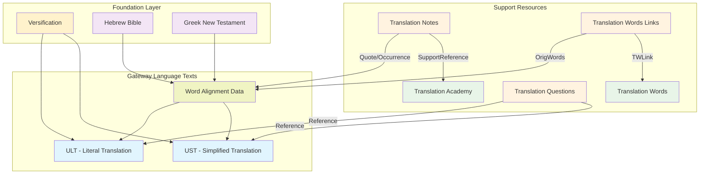
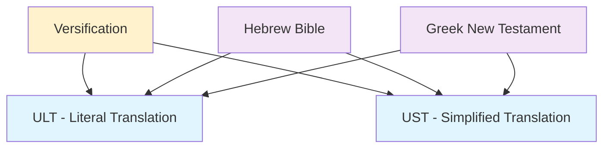
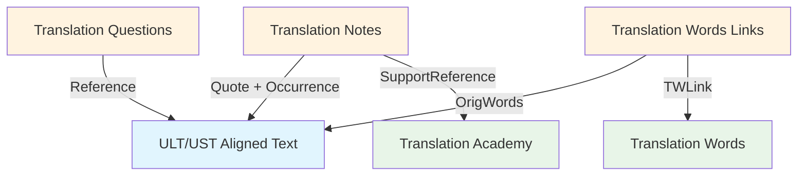

# unfoldingWord Translation Resources: Comprehensive Developer Guide

This document provides comprehensive technical documentation for developers building translation review tools that work with unfoldingWord's Bible translation resources. These resources form an interconnected ecosystem designed to support accurate, clear, and natural Bible translation worldwide.

## Executive Summary

### What This Document Covers

This guide provides complete technical specifications for the unfoldingWord translation resource ecosystem, including:

- **Core Translation Resources**: ULT, UST, and word alignment data
- **Supporting Resources**: Translation Notes, Words, Questions, and Academy
- **Technical Architecture**: Resource Container specifications and linking systems
- **Integration Patterns**: How resources interconnect and work together
- **Implementation Guidelines**: Practical guidance for developers
- **Extensibility Framework**: How to create new compatible resources

### Target Audience

- **Software Developers** building Bible translation tools
- **Technical Architects** designing translation platforms
- **Gateway Language Organizations** creating new resources
- **Translation Tool Maintainers** integrating unfoldingWord resources

### Key Benefits

- **Comprehensive Coverage**: Complete ecosystem documentation in one place
- **Technical Precision**: Exact specifications for all formats and linking mechanisms
- **Implementation Ready**: Code examples and practical guidance
- **Standards Compliant**: Full Resource Container and Dublin Core compliance
- **Extensible Design**: Framework for creating new compatible resources

## Table of Contents

1. [Overview](#overview)
2. [Core Translation Resources](#core-translation-resources)
3. [Supporting Resources](#supporting-resources)
4. [Resource Container Architecture](#resource-container-architecture)
5. [Resource Linking System](#resource-linking-system)
6. [Integration Patterns](#integration-patterns)
7. [Extensibility Framework](#extensibility-framework)
8. [Implementation Guidelines](#implementation-guidelines)

## Overview

### Mission and Philosophy

unfoldingWord translation resources are developed under Creative Commons Attribution-ShareAlike 4.0 licenses to provide the global church with high-quality, interconnected Bible translation tools. The ecosystem serves **Mother Tongue Translators (MTTs)** who use gateway languages as their bridge to translate Scripture into their heart languages.

### Resource Ecosystem Architecture

The translation resource ecosystem consists of three foundational layers:

1. **Source Texts**: Original language texts (Hebrew, Greek, Aramaic) with modern gateway language translations
2. **Alignment Layer**: Precise word-level connections between original and gateway languages
3. **Support Resources**: Contextual guidance, definitions, methodology, and quality assurance tools

### Key Design Principles

- **Interconnectedness**: All resources link together through standardized reference systems
- **Precision**: Word-level alignment enables exact targeting of translation guidance
- **Extensibility**: Resource Container specification allows new resource creation
- **Multilingual**: Gateway language organizations can create parallel resource sets
- **Open Access**: Creative Commons licensing ensures global accessibility

### Resource Relationship Overview



## Core Translation Resources

The core translation resources form the foundation of the unfoldingWord ecosystem, providing source texts and alignment data that enable precise translation work.

### 1. Literal Translation (ULT)

**unfoldingWord® Literal Text** - A form-centric translation that maintains close adherence to original language structures while remaining understandable in the gateway language.

#### Technical Specifications
- **Format**: USFM 3.0 with embedded word alignment data
- **Base**: Derived from 1901 American Standard Version with modern updates
- **Philosophy**: Form-centric, preserving original word order and grammatical structures
- **Alignment**: Every word aligned to Hebrew (UHB) and Greek (UGNT) sources
- **Repository**: [unfoldingWord Literal Text](https://git.door43.org/unfoldingWord/en_ult)
- **License**: Creative Commons Attribution-ShareAlike 4.0

#### File Structure
```
en_ult/
├── manifest.yaml               # Resource Container manifest
├── LICENSE.md                 # CC BY-SA 4.0 license
├── 01-GEN.usfm               # Genesis with alignment data
├── 02-EXO.usfm               # Exodus with alignment data
├── 40-MAT.usfm               # Matthew with alignment data
└── 66-REV.usfm               # Revelation with alignment data
```

#### USFM Structure Elements
- **Book Headers**: `\id`, `\usfm`, `\ide`, `\h`, `\toc1-3`, `\mt` markers
- **Chapter/Verse**: `\c` and `\v` markers for scripture structure
- **Alignment Data**: `\zaln-s`/`\zaln-e` and `\w` markers for word-level connections
- **Formatting**: `\p`, `\m`, `\q1-4` for text layout and poetry
- **Cross-References**: `\x` markers for scripture cross-references

#### Purpose and Integration
- **Translation Foundation**: Provides literal rendering for understanding original meaning
- **Structural Reference**: Shows original language grammatical patterns
- **Alignment Anchor**: Serves as gateway language connection to Hebrew/Greek
- **Quality Standard**: Maintains high accuracy to original language texts

### 2. Simplified Translation (UST)

**unfoldingWord® Simplified Text** - A meaning-focused translation that prioritizes clear communication of biblical concepts using dynamic equivalence principles.

#### Technical Specifications
- **Format**: USFM 3.0 with embedded word alignment data
- **Philosophy**: Meaning-focused, prioritizing clarity and natural expression
- **Approach**: Dynamic equivalence rendering thoughts and concepts
- **Alignment**: Every word aligned to Hebrew (UHB) and Greek (UGNT) sources
- **Repository**: [unfoldingWord Simplified Text](https://git.door43.org/unfoldingWord/en_ust)
- **License**: Creative Commons Attribution-ShareAlike 4.0

#### Purpose and Integration
- **Meaning Clarity**: Provides clear, natural rendering of biblical concepts
- **Cultural Bridge**: Explains ancient concepts in modern, understandable terms
- **Complementary Translation**: Works alongside ULT for comprehensive understanding
- **Translation Model**: Demonstrates dynamic equivalence principles

### 3. Word Alignment Data

**USFM 3.0 Embedded Alignment** - Precise word-level connections between gateway language translations and original Hebrew, Greek, and Aramaic texts.

#### Alignment Syntax Structure
```usfm
\zaln-s |x-strong="G35880" x-lemma="ὁ" x-morph="Gr,EA,,,,NMS," x-occurrence="1" x-occurrences="1" x-content="ὁ"\*\w The|x-occurrence="1" x-occurrences="1"\w*\zaln-e\*
```

#### Alignment Attributes
- **x-strong**: Strong's concordance number (G35880, H01234)
- **x-lemma**: Dictionary form of the original word (ὁ, אֱלֹהִים)
- **x-morph**: Morphological parsing (Gr,EA,,,,NMS,)
- **x-occurrence**: Which occurrence in the verse (1, 2, 3...)
- **x-occurrences**: Total occurrences in the verse
- **x-content**: Actual original language text being aligned

#### Alignment Relationship Types

**1. One-to-One**: Single original word ↔ single gateway word
```usfm
\zaln-s |x-strong="G2316" x-content="θεὸς"\*\w God\w*\zaln-e\*
```

**2. One-to-Many**: Single original word ↔ multiple gateway words
```usfm
\zaln-s |x-strong="G2980" x-content="λαλήσομεν"\*\w we\w* \w will\w* \w speak\w*\zaln-e\*
```

**3. Many-to-One**: Multiple original words ↔ single gateway word
```usfm
\zaln-s |x-strong="G1223" x-content="διὰ"\*\zaln-s |x-strong="G5124" x-content="τοῦτο"\*\w therefore\w*\zaln-e\*\zaln-e\*
```

**4. Many-to-Many**: Multiple original words ↔ multiple gateway words
```usfm
\zaln-s |x-strong="G2570" x-content="καλῶς"\*\zaln-s |x-strong="G4160" x-content="ποιεῖς"\*\w do\w* \w good\w*\zaln-e\*\zaln-e\*
```

#### Translation Note Highlighting Implementation

**Example: Romans 1:1 Translation Note**
```tsv
Reference	ID	Quote	Occurrence	Note
1:1	abc1	δοῦλος	1	Paul calls himself a servant of Jesus Christ...
```

**Alignment Data**:
```usfm
\zaln-s |x-strong="G14010" x-lemma="δοῦλος" x-occurrence="1" x-content="δοῦλος"\*\w a servant\w*\zaln-e\*
```

**Highlighting Process**:
1. Parse Translation Note: Quote = "δοῦλος", Occurrence = 1
2. Search alignment for `x-content="δοῦλος"` with `x-occurrence="1"`
3. Extract gateway text: "a servant"
4. Highlight "a servant" in displayed ULT text

**Visual Result**:
```
ULT Romans 1:1: Paul **[a servant]** of Jesus Christ...
                      ↑ highlighted because it aligns to δοῦλος
```

### 4. Versification

**Chapter and Verse Structure** - Standardized reference framework defining canonical structure for precise resource coordination.

#### Purpose
- **Reference Framework**: Enables consistent scripture references across all resources
- **Context Loading**: Tools know which resources to load for current verse
- **Navigation**: Uniform reference system for user interface coordination
- **Validation**: Ensures all resource references point to valid scripture locations

#### Technical Implementation
- **Format**: JSON or structured data defining chapter/verse boundaries
- **Scope**: Covers all 66 books of the Protestant canon
- **Standards**: Follows established versification systems (KJV, etc.)
- **Integration**: Referenced by all other resources for coordinate validation

## Supporting Resources

The supporting resources provide contextual guidance, definitions, methodology, and quality assurance tools that work together with the core translation texts.

### 5. Translation Notes (TN)

**unfoldingWord® Translation Notes** - Comprehensive verse-by-verse guidance providing specific help for translating difficult, complex, or ambiguous passages.

#### Technical Specifications
- **Format**: TSV (Tab-Separated Values) files, one per book
- **Naming**: `tn_[BOOK].tsv` (e.g., `tn_GEN.tsv`, `tn_MAT.tsv`)
- **Repository**: [unfoldingWord Translation Notes](https://git.door43.org/unfoldingWord/en_tn)
- **License**: Creative Commons Attribution-ShareAlike 4.0

#### TSV Column Structure
```tsv
Reference	ID	Tags	SupportReference	Quote	Occurrence	Note
1:3	abc1	grammar	rc://en/ta/man/translate/figs-metaphor	בְּרֵאשִׁית	1	The Hebrew word for "beginning"...
```

**Column Definitions**:
- **Reference**: Chapter:verse (e.g., "1:3") or range ("1:3-5")
- **ID**: Four-character unique identifier (e.g., "abc1")
- **Tags**: Categorization (grammar, culture, translate)
- **SupportReference**: Links to Translation Academy (`rc://*/ta/man/translate/...`)
- **Quote**: Original language text the note addresses
- **Occurrence**: Which occurrence (-1=all, 0=none, 1,2,3...=specific)
- **Note**: Markdown-formatted explanation and guidance

#### Note Categories
- **Translation Alternatives**: Different ways to render difficult terms
- **Cultural Context**: Background for understanding ancient customs
- **Grammatical Guidance**: Complex syntactic structure explanations
- **Theological Clarification**: Doctrinal or conceptual explanations
- **Figures of Speech**: Metaphors, idioms, and rhetorical devices

#### Integration Points
- **Quote + Occurrence**: Links to ULT/UST alignment data for highlighting
- **SupportReference**: Links to Translation Academy methodology
- **Reference**: Coordinates with versification system

### 6. Translation Words (TW)

**unfoldingWord® Translation Words** - Comprehensive definitions of key biblical, theological, and cultural terms throughout Scripture.

#### Technical Specifications
- **Format**: Markdown articles in hierarchical directories
- **Organization**: `/bible/kt/`, `/bible/names/`, `/bible/other/`
- **Repository**: [unfoldingWord Translation Words](https://git.door43.org/unfoldingWord/en_tw)
- **License**: Creative Commons Attribution-ShareAlike 4.0

#### Content Categories
- **Key Terms (`/kt/`)**: Central theological concepts (God, salvation, covenant)
- **Names (`/names/`)**: People, places, and proper nouns
- **Other Terms (`/other/`)**: Cultural, historical, and general concepts

#### Article Structure
```markdown
# Aaron

## Word Data:
* Strongs: H0175
* Part of speech: Proper Noun

## Facts:
Aaron was Moses' older brother. God chose Aaron to be the first high priest...

## Bible References:
* [1 Chronicles 23:12-14](rc://en/tn/help/1ch/23/12)
* [Acts 07:38-40](rc://en/tn/help/act/07/38)

## Examples from Bible Stories:
* [09:15](rc://en/obs/help/obs/09/15) God warned Moses and Aaron...
```

### 7. Translation Words Links (TWL)

**unfoldingWord® Translation Words Links** - Precise mapping connecting specific original language word occurrences to Translation Words definitions.

#### Technical Specifications
- **Format**: TSV files, one per book
- **Naming**: `twl_[BOOK].tsv` (e.g., `twl_GEN.tsv`)
- **Repository**: [unfoldingWord Translation Words Links](https://git.door43.org/unfoldingWord/en_twl)
- **License**: Creative Commons Attribution-ShareAlike 4.0

#### TSV Column Structure
```tsv
Reference	ID	Tags	OrigWords	Occurrence	TWLink
1:3	xyz9	kt	אֱלֹהִים	1	rc://en/tw/dict/bible/kt/god
```

**Column Definitions**:
- **Reference**: Chapter:verse where term occurs
- **ID**: Four-character unique identifier
- **Tags**: Term category (kt, names, other)
- **OrigWords**: Original language word(s)
- **Occurrence**: Which occurrence of the original word
- **TWLink**: Link to Translation Words article

### 8. Translation Questions (TQ)

**unfoldingWord® Translation Questions** - Comprehensive questions enabling translators to verify their translation communicates intended meaning clearly.

#### Technical Specifications
- **Format**: TSV files, one per book
- **Naming**: `tq_[BOOK].tsv` (e.g., `tq_GEN.tsv`)
- **Repository**: [unfoldingWord Translation Questions](https://git.door43.org/unfoldingword/en_tq)
- **License**: Creative Commons Attribution-ShareAlike 4.0

#### TSV Column Structure
```tsv
Reference	ID	Tags	Quote	Occurrence	Question	Response
1:3	swi9		δοῦλος	1	What does Paul call himself?	Paul calls himself a servant
```

#### Purpose and Usage
- **Translation Verification**: Confirm translated meaning matches original intent
- **Comprehension Testing**: Verify target language speakers understand translation
- **Quality Assurance**: Systematic checking of translation accuracy
- **Training Tool**: Help translators understand key concepts

### 9. Translation Academy (TA)

**unfoldingWord® Translation Academy** - Comprehensive training materials providing theoretical foundation and practical guidance for Bible translation.

#### Technical Specifications
- **Format**: Markdown articles in hierarchical structure
- **Organization**: `/translate/`, `/checking/`, `/process/` categories
- **Repository**: [unfoldingWord Translation Academy](https://git.door43.org/unfoldingWord/en_ta)
- **License**: Creative Commons Attribution-ShareAlike 4.0

#### Content Categories
- **Translation Principles**: Fundamental translation theory concepts
- **Translation Methods**: Specific techniques for different text types
- **Cultural Issues**: Cross-cultural communication guidance
- **Quality Assurance**: Standards and checking processes

#### Article Structure
```markdown
# Translate Unknowns

## Description
This page answers the question: How do I translate words that I don't understand?

## Translation Principles
When translators encounter unknown words...

## Examples
Here are examples of how to handle unknown words...

## Translation Strategies
If the word is not known, here are strategies...
```

## Resource Container Architecture

### Technical Foundation

All unfoldingWord resources follow the [Resource Container (RC) specification](https://resource-container.readthedocs.io/en/latest/index.html), providing standardized structure, metadata, and linking mechanisms.

### RC Directory Structure
```
en_resource_name/
├── .apps/                      # Application metadata
├── LICENSE.md                  # License information
├── manifest.yaml              # RC manifest file
├── media.yaml                 # Media definitions (optional)
└── content/                   # Project content directory
    ├── config.yaml            # Project configuration
    ├── 01-GEN.usfm           # Genesis content
    └── 40-MAT.usfm           # Matthew content
```

### RC Container Types

#### 1. Bundle (`bundle`)
Flat directory structure for USFM collections:
```
en_ult/
├── manifest.yaml
├── 01-GEN.usfm               # Direct file access
└── 40-MAT.usfm
```

#### 2. Help (`help`)
Supplemental content like Translation Notes:
```
en_tn/
├── manifest.yaml
└── content/
    ├── 01-GEN.tsv
    └── 40-MAT.tsv
```

#### 3. Dictionary (`dict`)
Term definitions like Translation Words:
```
en_tw/
├── manifest.yaml
└── content/
    ├── aaron.md
    ├── god.md
    └── moses.md
```

#### 4. Manual (`man`)
Instructional content like Translation Academy:
```
en_ta/
├── manifest.yaml
└── content/
    ├── translate-unknowns/
    │   └── 01.md
    └── checking-level-one/
        └── 01.md
```

#### 5. Book (`book`)
Chapter/chunk structured content:
```
en_obs/
├── manifest.yaml
└── content/
    ├── 01/                   # Chapter directories
    │   ├── 01.md            # Chunk files
    │   └── 02.md
    └── 02/
        └── 01.md
```

### Manifest File Structure

Every RC includes a `manifest.yaml` following [Dublin Core standards](https://www.dublincore.org/specifications/dublin-core/dcmi-terms/):

```yaml
dublin_core:
  conformsto: 'rc0.2'
  contributor: []
  creator: 'unfoldingWord'
  description: 'Literal translation for Bible translators'
  format: 'text/usfm'
  identifier: 'ult'
  issued: '2024-01-01'
  language:
    identifier: 'en'
    title: 'English'
    direction: 'ltr'
  modified: '2024-01-01T12:00:00-00:00'
  publisher: 'unfoldingWord'
  relation: 
    - 'en/tn'
    - 'en/tw'
    - 'hbo/uhb'
    - 'el-x-koine/ugnt'
  rights: 'CC BY-SA 4.0'
  source:
    - identifier: 'uhb'
      language: 'hbo'
      version: '2.1.30'
  subject: 'Bible'
  title: 'unfoldingWord Literal Text'
  type: 'bundle'
  version: '85'

checking:
  checking_entity: ['unfoldingWord']
  checking_level: '3'

projects:
  - categories: ['bible-ot']
    identifier: 'gen'
    path: './01-GEN.usfm'
    sort: 1
    title: 'Genesis'
    versification: 'kjv'
```

## Resource Linking System

### RC Link Structure

The [RC Linking specification](https://resource-container.readthedocs.io/en/latest/linking.html) defines standardized URIs for cross-resource navigation:

```
rc://language/resource/type/project/chapter/chunk
```

### Link Examples by Resource Type

```
# Translation texts
rc://en/ult/book/gen/01/02        # ULT Genesis 1:2
rc://en/ust/book/mat/05/01        # UST Matthew 5:1

# Translation Notes
rc://en/tn/help/gen/01/02         # Translation Note for Genesis 1:2

# Translation Words
rc://en/tw/dict/bible/kt/god      # Translation Words entry for "god"

# Translation Academy
rc://en/ta/man/translate/translate-unknowns    # TA module
```

### Wildcard Support
```
rc://en/ult/book/*                # Any book in English ULT
rc://*/ult/book/gen               # Genesis in ULT in any language
rc://en/*/book/gen/01/01          # Genesis 1:1 in any English translation
```

### Link Resolution Process

1. **Locate Resource Container**: Find RC directory matching language/resource
2. **Navigate to Project**: Use manifest to locate project content
3. **Resolve Chapter/Chunk**: Navigate to specific content location

### Practical Usage Examples

#### Translation Notes TSV
```tsv
Reference	ID	SupportReference	Quote	Note
1:1	tn001	rc://en/ta/man/translate/translate-names	Παῦλος	See how to translate names
1:1	tn002	rc://en/tw/dict/bible/other/servant	δοῦλος	Paul calls himself a servant
```

#### Translation Academy Cross-References
```markdown
For more information, see [Translate Names](rc://en/ta/man/translate/translate-names).
```

## Integration Patterns

### Hosting Infrastructure: Door43 Content Service (DCS)

All resources are hosted on **Door43 Content Service (DCS)**, a Git-based platform using Gitea:

- **Platform**: `https://git.door43.org/`
- **Organization**: `unfoldingWord` for English resources
- **API Access**: REST API for programmatic access
- **Version Control**: Full Git history and branching

### Repository Organization
```
https://git.door43.org/unfoldingWord/en_ult     # ULT
https://git.door43.org/unfoldingWord/en_ust     # UST
https://git.door43.org/unfoldingWord/en_tn      # Translation Notes
https://git.door43.org/unfoldingWord/en_tw      # Translation Words
https://git.door43.org/unfoldingWord/en_twl     # Translation Words Links
https://git.door43.org/unfoldingWord/en_ta      # Translation Academy
```

### Multilingual Gateway Language Ecosystem

#### Gateway Language Strategy
unfoldingWord created English resources for Mother Tongue Translators. Other organizations have created parallel ecosystems for different strategic languages:

- **Spanish**: `https://git.door43.org/es-419_gl/`
- **French**: `https://git.door43.org/fr_gl/`
- **Hindi**: `https://git.door43.org/hi_gl/`
- **Portuguese**: `https://git.door43.org/pt-br_gl/`

#### Naming Conventions
- **unfoldingWord (English)**: Uses ULT/UST codes
- **Other Gateway Languages**: Use GLT/GST codes (Gateway Language Literal/Simplified Text)

#### Consistent Linking Strategy
All gateway language organizations maintain the same internal linking patterns:

```yaml
# Spanish GLT manifest
relation:
  - es-419/tw          # Spanish Translation Words
  - es-419/tn          # Spanish Translation Notes
  - hbo/uhb?v=2.1.30   # Same Hebrew Bible reference
  - el-x-koine/ugnt?v=0.34  # Same Greek New Testament reference
```

### Quality Assurance Integration

#### Alignment-Based Validation
- **Coverage**: Every original word has gateway language alignment
- **Accuracy**: Aligned words appropriately represent original meaning
- **Consistency**: Same original words consistently aligned across contexts

#### Cross-Resource Coherence
- **Note Accuracy**: Translation Notes reference actually aligned words
- **Link Validity**: TWL points to words present in alignments
- **Methodology**: Alignment decisions follow Translation Academy principles

## Extensibility Framework

### Creating New Resources

Gateway language organizations can create additional resources following RC specifications:

#### Required Components
1. **RC Directory Structure**: Follow standard layout with manifest
2. **Manifest Compliance**: Use Dublin Core metadata standards
3. **Linking Compatibility**: Support RC link resolution
4. **Format Standards**: Use established file formats (USFM, TSV, Markdown)

#### Example: New Commentary Resource

**Directory Structure**:
```
en_biblical-commentary/
├── .apps/
├── LICENSE.md
├── manifest.yaml
└── content/
    ├── 01-GEN.tsv
    ├── 02-EXO.tsv
    └── 40-MAT.tsv
```

**Manifest**:
```yaml
dublin_core:
  conformsto: 'rc0.2'
  creator: 'Gateway Language Organization'
  description: 'Biblical commentary for translation teams'
  format: 'text/tab-separated-values'
  identifier: 'biblical-commentary'
  language:
    identifier: 'en'
    title: 'English'
  relation:
    - 'en/ult'
    - 'en/ust'
  title: 'Biblical Commentary'
  type: 'help'
  version: '1'

projects:
  - identifier: 'gen'
    path: './content/01-GEN.tsv'
    title: 'Genesis'
```

**TSV Content**:
```tsv
Reference	ID	Tags	Quote	Occurrence	Note
1:1	bc001	creation	בְּרֵאשִׁית	1	The Hebrew word for "beginning" implies...
1:2	bc002	spirit	רוּחַ	1	The Spirit of God hovering suggests...
```

### Integration Requirements

#### For Translation Tools
1. **Resource Discovery**: Scan for RC manifest files
2. **Type Recognition**: Handle all RC container types
3. **Format Processing**: Parse USFM, TSV, and Markdown content
4. **Link Resolution**: Support RC link navigation

#### For Resource Creators
1. **Reference Format**: Use standard chapter:verse format
2. **Quote Matching**: Include exact original language text for alignment
3. **Occurrence Tracking**: Number multiple instances correctly
4. **Cross-References**: Use RC link format for references

## Implementation Guidelines

### Resource Loading Strategy

#### Dependency Resolution
```javascript
async function loadResourcePackage(language, bookId) {
  // Load core resources first
  const ult = await loadResource(language, 'ult', bookId);
  const ust = await loadResource(language, 'ust', bookId);
  
  // Load dependent resources
  const tn = await loadResource(language, 'tn', bookId);
  const tw = await loadResource(language, 'tw');
  const twl = await loadResource(language, 'twl', bookId);
  const ta = await loadResource(language, 'ta');
  
  // Build cross-resource connections
  return buildResourceConnections(ult, ust, tn, tw, twl, ta);
}
```

#### Link Resolution Implementation
```javascript
function resolveRCLink(link) {
  const parsed = parseRCLink(link);
  const rc = findResourceContainer(parsed.language, parsed.resource);
  const project = findProject(rc, parsed.project);
  return navigateToContent(project, parsed.chapter, parsed.chunk);
}
```

### User Interface Integration

#### Unified Navigation
- **Context Preservation**: Maintain reference when switching resources
- **Visual Connections**: Highlight relationships between aligned words and notes
- **Seamless Movement**: Enable jumping between interconnected resources

#### Translation Note Highlighting
```javascript
function highlightAlignedWords(note, alignmentData) {
  const quote = note.Quote;
  const occurrence = note.Occurrence;
  
  // Find alignment for the quote
  const alignment = findAlignment(alignmentData, quote, occurrence);
  if (alignment) {
    const gatewayWords = extractGatewayWords(alignment);
    highlightInText(gatewayWords);
  }
}
```

### Quality Checking Features

#### Automated Validation
- **Link Validation**: Check RC links resolve correctly
- **Reference Validation**: Verify scripture references are valid
- **Alignment Completeness**: Ensure all original words are aligned
- **Cross-Resource Consistency**: Validate resource interconnections

#### Error Handling
```javascript
function handleMissingResource(link) {
  const alternatives = ['ult', 'ust', 'glt', 'gst'];
  for (const alt of alternatives) {
    const altLink = link.replace(/\/\w+\//, `/${alt}/`);
    if (resourceExists(altLink)) return altLink;
  }
  return null; // No fallback available
}
```

### Performance Optimization

#### Caching Strategy
- **Resource Caching**: Cache parsed RC manifests and content
- **Link Resolution**: Cache resolved RC links
- **Alignment Data**: Pre-process alignment for fast highlighting

#### Lazy Loading
- **On-Demand**: Load resources only when needed
- **Progressive**: Load core resources first, then supporting materials
- **Background**: Pre-load likely-needed resources

## Conclusion

The unfoldingWord translation resource ecosystem provides a comprehensive, interconnected foundation for building sophisticated Bible translation tools. By following the Resource Container specification and implementing proper linking mechanisms, developers can create applications that leverage the full power of this integrated resource system.

### Key Success Factors

1. **Understand the Ecosystem**: Grasp how resources interconnect and depend on each other
2. **Follow Standards**: Implement RC specifications and linking protocols correctly
3. **Leverage Alignment**: Use word-level alignment for precise resource targeting
4. **Plan for Extensibility**: Design systems that can accommodate new resources
5. **Optimize Performance**: Implement efficient loading and caching strategies

### Benefits for Translation Teams

- **Precision**: Word-level alignment enables exact targeting of translation guidance
- **Comprehensiveness**: Complete ecosystem covers all aspects of translation work
- **Quality Assurance**: Multiple validation layers ensure translation accuracy
- **Efficiency**: Interconnected resources reduce lookup time and improve workflow
- **Extensibility**: Framework supports creation of specialized resources

### Benefits for Developers

- **Standards-Based**: RC specification provides clear implementation guidelines
- **Well-Documented**: Complete technical specifications with code examples
- **Proven Architecture**: Battle-tested by multiple translation organizations
- **Open Source**: Creative Commons licensing enables broad adoption
- **Community Support**: Active developer community and ongoing maintenance

This documentation provides the foundation for building translation tools that serve the global church's mission of making Scripture accessible in every language. The unfoldingWord ecosystem represents years of collaborative development by translation experts, linguists, and software developers working together to create the most comprehensive Bible translation resource system available today.
└── content/
    ├── 01-GEN.usfm           # Genesis with alignment data
    ├── 02-EXO.usfm           # Exodus with alignment data
    └── 40-MAT.usfm           # Matthew with alignment data
```

#### USFM Structure Elements
- **Book Headers**: `\id`, `\usfm`, `\ide`, `\h`, `\toc1-3`, `\mt` markers
- **Chapter/Verse**: `\c` and `\v` markers for scripture structure
- **Alignment Data**: `\zaln-s`/`\zaln-e` and `\w` markers for word-level connections
- **Formatting**: `\p`, `\m`, `\q1-4` for text layout and poetry
- **Cross-References**: `\x` markers for scripture cross-references

#### Purpose and Integration
- **Translation Foundation**: Provides literal rendering for understanding original meaning
- **Structural Reference**: Shows original language grammatical patterns
- **Alignment Anchor**: Serves as gateway language connection to Hebrew/Greek
- **Quality Standard**: Maintains high accuracy to original language texts

### 2. Simplified Translation (UST)

**unfoldingWord® Simplified Text** - A meaning-focused translation that prioritizes clear communication of biblical concepts using dynamic equivalence principles.

#### Technical Specifications
- **Format**: USFM 3.0 with embedded word alignment data
- **Philosophy**: Meaning-focused, prioritizing clarity and natural expression
- **Approach**: Dynamic equivalence rendering thoughts and concepts
- **Alignment**: Every word aligned to Hebrew (UHB) and Greek (UGNT) sources
- **Repository**: [unfoldingWord Simplified Text](https://git.door43.org/unfoldingWord/en_ust)

#### Purpose and Integration
- **Meaning Clarity**: Provides clear, natural rendering of biblical concepts
- **Cultural Bridge**: Explains ancient concepts in modern, understandable terms
- **Complementary Translation**: Works alongside ULT for comprehensive understanding
- **Translation Model**: Demonstrates dynamic equivalence principles

### 3. Word Alignment Data

**USFM 3.0 Embedded Alignment** - Precise word-level connections between gateway language translations and original Hebrew, Greek, and Aramaic texts.

#### Alignment Syntax Structure
```usfm
\zaln-s |x-strong="G35880" x-lemma="ὁ" x-morph="Gr,EA,,,,NMS," x-occurrence="1" x-occurrences="1" x-content="ὁ"\*\w The|x-occurrence="1" x-occurrences="1"\w*\zaln-e\*
```

#### Alignment Attributes
- **x-strong**: Strong's concordance number (G35880, H01234)
- **x-lemma**: Dictionary form of the original word (ὁ, אֱלֹהִים)
- **x-morph**: Morphological parsing (Gr,EA,,,,NMS,)
- **x-occurrence**: Which occurrence in the verse (1, 2, 3...)
- **x-occurrences**: Total occurrences in the verse
- **x-content**: Actual original language text being aligned

#### Alignment Relationship Types

**1. One-to-One**: Single original word ↔ single gateway word
```usfm
\zaln-s |x-strong="G2316" x-content="θεὸς"\*\w God\w*\zaln-e\*
```

**2. One-to-Many**: Single original word ↔ multiple gateway words
```usfm
\zaln-s |x-strong="G2980" x-content="λαλήσομεν"\*\w we\w* \w will\w* \w speak\w*\zaln-e\*
```

**3. Many-to-One**: Multiple original words ↔ single gateway word
```usfm
\zaln-s |x-strong="G1223" x-content="διὰ"\*\zaln-s |x-strong="G5124" x-content="τοῦτο"\*\w therefore\w*\zaln-e\*\zaln-e\*
```

**4. Many-to-Many**: Multiple original words ↔ multiple gateway words
```usfm
\zaln-s |x-strong="G2570" x-content="καλῶς"\*\zaln-s |x-strong="G4160" x-content="ποιεῖς"\*\w do\w* \w good\w*\zaln-e\*\zaln-e\*
```

#### Translation Note Highlighting Implementation

**Example: Romans 1:1 Translation Note**
```tsv
Reference	ID	Quote	Occurrence	Note
1:1	abc1	δοῦλος	1	Paul calls himself a servant of Jesus Christ...
```

**Alignment Data**:
```usfm
\zaln-s |x-strong="G14010" x-lemma="δοῦλος" x-occurrence="1" x-content="δοῦλος"\*\w a servant\w*\zaln-e\*
```

**Highlighting Process**:
1. Parse Translation Note: Quote = "δοῦλος", Occurrence = 1
2. Search alignment for `x-content="δοῦλος"` with `x-occurrence="1"`
3. Extract gateway text: "a servant"
4. Highlight "a servant" in displayed ULT text

**Visual Result**:
```
ULT Romans 1:1: Paul **[a servant]** of Jesus Christ...
                      ↑ highlighted because it aligns to δοῦλος
```

## Supporting Resources

### 4. Translation Notes (TN)

**unfoldingWord® Translation Notes** - Comprehensive verse-by-verse guidance providing specific help for translating difficult, complex, or ambiguous passages.

#### File Structure
- **Format**: TSV (Tab-Separated Values) files, one per book
- **Naming**: `tn_[BOOK].tsv` (e.g., `tn_GEN.tsv`, `tn_MAT.tsv`)
- **Repository**: [unfoldingWord Translation Notes](https://git.door43.org/unfoldingWord/en_tn)

#### TSV Column Structure
```tsv
Reference	ID	Tags	SupportReference	Quote	Occurrence	Note
1:3	abc1	grammar	rc://en/ta/man/translate/figs-metaphor	בְּרֵאשִׁית	1	The Hebrew word for "beginning"...
```

**Column Definitions**:
- **Reference**: Chapter:verse (e.g., "1:3") or range ("1:3-5")
- **ID**: Four-character unique identifier (e.g., "abc1")
- **Tags**: Categorization (grammar, culture, translate)
- **SupportReference**: Links to Translation Academy (`rc://*/ta/man/translate/...`)
- **Quote**: Original language text the note addresses
- **Occurrence**: Which occurrence (-1=all, 0=none, 1,2,3...=specific)
- **Note**: Markdown-formatted explanation and guidance

#### Integration Points
- **Quote + Occurrence**: Links to ULT/UST alignment data for highlighting
- **SupportReference**: Links to Translation Academy methodology
- **Reference**: Coordinates with versification system

### 5. Translation Words (TW)

**unfoldingWord® Translation Words** - Comprehensive definitions of key biblical, theological, and cultural terms throughout Scripture.

#### File Structure
- **Format**: Markdown articles in hierarchical directories
- **Organization**: `/bible/kt/`, `/bible/names/`, `/bible/other/`
- **Repository**: [unfoldingWord Translation Words](https://git.door43.org/unfoldingWord/en_tw)

#### Content Categories
- **Key Terms (`/kt/`)**: Central theological concepts (God, salvation, covenant)
- **Names (`/names/`)**: People, places, and proper nouns
- **Other Terms (`/other/`)**: Cultural, historical, and general concepts

#### Article Structure
```markdown
# Aaron

## Word Data:
* Strongs: H0175
* Part of speech: Proper Noun

## Facts:
Aaron was Moses' older brother. God chose Aaron to be the first high priest...

## Bible References:
* [1 Chronicles 23:12-14](rc://en/tn/help/1ch/23/12)
* [Acts 07:38-40](rc://en/tn/help/act/07/38)
```

### 6. Translation Words Links (TWL)

**unfoldingWord® Translation Words Links** - Precise mapping connecting specific original language word occurrences to Translation Words definitions.

#### File Structure
- **Format**: TSV files, one per book
- **Naming**: `twl_[BOOK].tsv` (e.g., `twl_GEN.tsv`)
- **Repository**: [unfoldingWord Translation Words Links](https://git.door43.org/unfoldingWord/en_twl)

#### TSV Column Structure
```tsv
Reference	ID	Tags	OrigWords	Occurrence	TWLink
1:3	xyz9	kt	אֱלֹהִים	1	rc://en/tw/dict/bible/kt/god
```

**Column Definitions**:
- **Reference**: Chapter:verse where term occurs
- **ID**: Four-character unique identifier
- **Tags**: Term category (kt, names, other)
- **OrigWords**: Original language word(s)
- **Occurrence**: Which occurrence of the original word
- **TWLink**: Link to Translation Words article

### 7. Translation Questions (TQ)

**unfoldingWord® Translation Questions** - Comprehensive questions enabling translators to verify their translation communicates intended meaning clearly.

#### File Structure
- **Format**: TSV files, one per book
- **Naming**: `tq_[BOOK].tsv` (e.g., `tq_GEN.tsv`)
- **Repository**: [unfoldingWord Translation Questions](https://git.door43.org/unfoldingword/en_tq)

#### TSV Column Structure
```tsv
Reference	ID	Tags	Quote	Occurrence	Question	Response
1:3	swi9		δοῦλος	1	What does Paul call himself?	Paul calls himself a servant
```

### 8. Translation Academy (TA)

**unfoldingWord® Translation Academy** - Comprehensive training materials providing theoretical foundation and practical guidance for Bible translation.

#### File Structure
- **Format**: Markdown articles in hierarchical structure
- **Organization**: `/translate/`, `/checking/`, `/process/` categories
- **Repository**: [unfoldingWord Translation Academy](https://git.door43.org/unfoldingWord/en_ta)

#### Content Categories
- **Translation Principles**: Fundamental translation theory concepts
- **Translation Methods**: Specific techniques for different text types
- **Cultural Issues**: Cross-cultural communication guidance
- **Quality Assurance**: Standards and checking processes

### 9. Versification

**Chapter and Verse Structure** - Standardized reference framework defining canonical structure for precise resource coordination.

#### Purpose
- **Reference Framework**: Enables consistent scripture references across all resources
- **Context Loading**: Tools know which resources to load for current verse
- **Navigation**: Uniform reference system for user interface coordination
- **Validation**: Ensures all resource references point to valid scripture locations

## Resource Container Architecture

### Technical Foundation

All unfoldingWord resources follow the [Resource Container (RC) specification](https://resource-container.readthedocs.io/en/latest/index.html), providing standardized structure, metadata, and linking mechanisms.

### RC Directory Structure
```
en_resource_name/
├── .apps/                      # Application metadata
├── LICENSE.md                  # License information
├── manifest.yaml              # RC manifest file
├── media.yaml                 # Media definitions (optional)
└── content/                   # Project content directory
    ├── config.yaml            # Project configuration
    ├── 01-GEN.usfm           # Genesis content
    └── 40-MAT.usfm           # Matthew content
```

### RC Container Types

#### 1. Bundle (`bundle`)
Flat directory structure for USFM collections:
```
en_ult/
├── manifest.yaml
├── 01-GEN.usfm               # Direct file access
└── 40-MAT.usfm
```

#### 2. Help (`help`)
Supplemental content like Translation Notes:
```
en_tn/
├── manifest.yaml
└── content/
    ├── 01-GEN.tsv
    └── 40-MAT.tsv
```

#### 3. Dictionary (`dict`)
Term definitions like Translation Words:
```
en_tw/
├── manifest.yaml
└── content/
    ├── aaron.md
    ├── god.md
    └── moses.md
```

#### 4. Manual (`man`)
Instructional content like Translation Academy:
```
en_ta/
├── manifest.yaml
└── content/
    ├── translate-unknowns/
    │   └── 01.md
    └── checking-level-one/
        └── 01.md
```

#### 5. Book (`book`)
Chapter/chunk structured content:
```
en_obs/
├── manifest.yaml
└── content/
    ├── 01/                   # Chapter directories
    │   ├── 01.md            # Chunk files
    │   └── 02.md
    └── 02/
        └── 01.md
```

### Manifest File Structure

Every RC includes a `manifest.yaml` following [Dublin Core standards](https://www.dublincore.org/specifications/dublin-core/dcmi-terms/):

```yaml
dublin_core:
  conformsto: 'rc0.2'
  contributor: []
  creator: 'unfoldingWord'
  description: 'Literal translation for Bible translators'
  format: 'text/usfm'
  identifier: 'ult'
  issued: '2024-01-01'
  language:
    identifier: 'en'
    title: 'English'
    direction: 'ltr'
  modified: '2024-01-01T12:00:00-00:00'
  publisher: 'unfoldingWord'
  relation: 
    - 'en/tn'
    - 'en/tw'
    - 'hbo/uhb'
    - 'el-x-koine/ugnt'
  rights: 'CC BY-SA 4.0'
  source:
    - identifier: 'uhb'
      language: 'hbo'
      version: '2.1.30'
  subject: 'Bible'
  title: 'unfoldingWord Literal Text'
  type: 'bundle'
  version: '85'

checking:
  checking_entity: ['unfoldingWord']
  checking_level: '3'

projects:
  - categories: ['bible-ot']
    identifier: 'gen'
    path: './01-GEN.usfm'
    sort: 1
    title: 'Genesis'
    versification: 'kjv'
```

## Resource Linking System

### RC Link Structure

The [RC Linking specification](https://resource-container.readthedocs.io/en/latest/linking.html) defines standardized URIs for cross-resource navigation:

```
rc://language/resource/type/project/chapter/chunk
```

### Link Examples by Resource Type

```
# Translation texts
rc://en/ult/book/gen/01/02        # ULT Genesis 1:2
rc://en/ust/book/mat/05/01        # UST Matthew 5:1

# Translation Notes
rc://en/tn/help/gen/01/02         # Translation Note for Genesis 1:2

# Translation Words
rc://en/tw/dict/bible/kt/god      # Translation Words entry for "god"

# Translation Academy
rc://en/ta/man/translate/translate-unknowns    # TA module
```

### Wildcard Support
```
rc://en/ult/book/*                # Any book in English ULT
rc://*/ult/book/gen               # Genesis in ULT in any language
rc://en/*/book/gen/01/01          # Genesis 1:1 in any English translation
```

### Link Resolution Process

1. **Locate Resource Container**: Find RC directory matching language/resource
2. **Navigate to Project**: Use manifest to locate project content
3. **Resolve Chapter/Chunk**: Navigate to specific content location

### Practical Usage Examples

#### Translation Notes TSV
```tsv
Reference	ID	SupportReference	Quote	Note
1:1	tn001	rc://en/ta/man/translate/translate-names	Παῦλος	See how to translate names
1:1	tn002	rc://en/tw/dict/bible/other/servant	δοῦλος	Paul calls himself a servant
```

#### Translation Academy Cross-References
```markdown
For more information, see [Translate Names](rc://en/ta/man/translate/translate-names).
```

## Integration Patterns

### Hosting Infrastructure: Door43 Content Service (DCS)

All resources are hosted on **Door43 Content Service (DCS)**, a Git-based platform using Gitea:

- **Platform**: `https://git.door43.org/`
- **Organization**: `unfoldingWord` for English resources
- **API Access**: REST API for programmatic access
- **Version Control**: Full Git history and branching

### Repository Organization
```
https://git.door43.org/unfoldingWord/en_ult     # ULT
https://git.door43.org/unfoldingWord/en_ust     # UST
https://git.door43.org/unfoldingWord/en_tn      # Translation Notes
https://git.door43.org/unfoldingWord/en_tw      # Translation Words
https://git.door43.org/unfoldingWord/en_twl     # Translation Words Links
https://git.door43.org/unfoldingWord/en_ta      # Translation Academy
```

### Multilingual Gateway Language Ecosystem

#### Gateway Language Strategy
unfoldingWord created English resources for Mother Tongue Translators. Other organizations have created parallel ecosystems for different strategic languages:

- **Spanish**: `https://git.door43.org/es-419_gl/`
- **French**: `https://git.door43.org/fr_gl/`
- **Hindi**: `https://git.door43.org/hi_gl/`
- **Portuguese**: `https://git.door43.org/pt-br_gl/`

#### Naming Conventions
- **unfoldingWord (English)**: Uses ULT/UST codes
- **Other Gateway Languages**: Use GLT/GST codes (Gateway Language Literal/Simplified Text)

#### Consistent Linking Strategy
All gateway language organizations maintain the same internal linking patterns:

```yaml
# Spanish GLT manifest
relation:
  - es-419/tw          # Spanish Translation Words
  - es-419/tn          # Spanish Translation Notes
  - hbo/uhb?v=2.1.30   # Same Hebrew Bible reference
  - el-x-koine/ugnt?v=0.34  # Same Greek New Testament reference
```

### Resource Relationship Diagrams

#### Core Translation Foundation


#### Linking Resources


### Quality Assurance Integration

#### Alignment-Based Validation
- **Coverage**: Every original word has gateway language alignment
- **Accuracy**: Aligned words appropriately represent original meaning
- **Consistency**: Same original words consistently aligned across contexts

#### Cross-Resource Coherence
- **Note Accuracy**: Translation Notes reference actually aligned words
- **Link Validity**: TWL points to words present in alignments
- **Methodology**: Alignment decisions follow Translation Academy principles

## Extensibility Framework

### Creating New Resources

Gateway language organizations can create additional resources following RC specifications:

#### Required Components
1. **RC Directory Structure**: Follow standard layout with manifest
2. **Manifest Compliance**: Use Dublin Core metadata standards
3. **Linking Compatibility**: Support RC link resolution
4. **Format Standards**: Use established file formats (USFM, TSV, Markdown)

#### Example: New Commentary Resource

**Directory Structure**:
```
en_biblical-commentary/
├── .apps/
├── LICENSE.md
├── manifest.yaml
└── content/
    ├── 01-GEN.tsv
    ├── 02-EXO.tsv
    └── 40-MAT.tsv
```

**Manifest**:
```yaml
dublin_core:
  conformsto: 'rc0.2'
  creator: 'Gateway Language Organization'
  description: 'Biblical commentary for translation teams'
  format: 'text/tab-separated-values'
  identifier: 'biblical-commentary'
  language:
    identifier: 'en'
    title: 'English'
  relation:
    - 'en/ult'
    - 'en/ust'
  title: 'Biblical Commentary'
  type: 'help'
  version: '1'

projects:
  - identifier: 'gen'
    path: './content/01-GEN.tsv'
    title: 'Genesis'
```

**TSV Content**:
```tsv
Reference	ID	Tags	Quote	Occurrence	Note
1:1	bc001	creation	בְּרֵאשִׁית	1	The Hebrew word for "beginning" implies...
1:2	bc002	spirit	רוּחַ	1	The Spirit of God hovering suggests...
```

### Integration Requirements

#### For Translation Tools
1. **Resource Discovery**: Scan for RC manifest files
2. **Type Recognition**: Handle all RC container types
3. **Format Processing**: Parse USFM, TSV, and Markdown content
4. **Link Resolution**: Support RC link navigation

#### For Resource Creators
1. **Reference Format**: Use standard chapter:verse format
2. **Quote Matching**: Include exact original language text for alignment
3. **Occurrence Tracking**: Number multiple instances correctly
4. **Cross-References**: Use RC link format for references

## Implementation Guidelines

### Resource Loading Strategy

#### Dependency Resolution
```javascript
async function loadResourcePackage(language, bookId) {
  // Load core resources first
  const ult = await loadResource(language, 'ult', bookId);
  const ust = await loadResource(language, 'ust', bookId);
  
  // Load dependent resources
  const tn = await loadResource(language, 'tn', bookId);
  const tw = await loadResource(language, 'tw');
  const twl = await loadResource(language, 'twl', bookId);
  const ta = await loadResource(language, 'ta');
  
  // Build cross-resource connections
  return buildResourceConnections(ult, ust, tn, tw, twl, ta);
}
```

#### Link Resolution Implementation
```javascript
function resolveRCLink(link) {
  const parsed = parseRCLink(link);
  const rc = findResourceContainer(parsed.language, parsed.resource);
  const project = findProject(rc, parsed.project);
  return navigateToContent(project, parsed.chapter, parsed.chunk);
}
```

### User Interface Integration

#### Unified Navigation
- **Context Preservation**: Maintain reference when switching resources
- **Visual Connections**: Highlight relationships between aligned words and notes
- **Seamless Movement**: Enable jumping between interconnected resources

#### Translation Note Highlighting
```javascript
function highlightAlignedWords(note, alignmentData) {
  const quote = note.Quote;
  const occurrence = note.Occurrence;
  
  // Find alignment for the quote
  const alignment = findAlignment(alignmentData, quote, occurrence);
  if (alignment) {
    const gatewayWords = extractGatewayWords(alignment);
    highlightInText(gatewayWords);
  }
}
```

### Quality Checking Features

#### Automated Validation
- **Link Validation**: Check RC links resolve correctly
- **Reference Validation**: Verify scripture references are valid
- **Alignment Completeness**: Ensure all original words are aligned
- **Cross-Resource Consistency**: Validate resource interconnections

#### Error Handling
```javascript
function handleMissingResource(link) {
  const alternatives = ['ult', 'ust', 'glt', 'gst'];
  for (const alt of alternatives) {
    const altLink = link.replace(/\/\w+\//, `/${alt}/`);
    if (resourceExists(altLink)) return altLink;
  }
  return null; // No fallback available
}
```

### Performance Optimization

#### Caching Strategy
- **Resource Caching**: Cache parsed RC manifests and content
- **Link Resolution**: Cache resolved RC links
- **Alignment Data**: Pre-process alignment for fast highlighting

#### Lazy Loading
- **On-Demand**: Load resources only when needed
- **Progressive**: Load core resources first, then supporting materials
- **Background**: Pre-load likely-needed resources

## Conclusion

The unfoldingWord translation resource ecosystem provides a comprehensive, interconnected foundation for building sophisticated Bible translation tools. By following the Resource Container specification and implementing proper linking mechanisms, developers can create applications that leverage the full power of this integrated resource system.

Key success factors for implementation:

1. **Understand the Ecosystem**: Grasp how resources interconnect and depend on each other
2. **Follow Standards**: Implement RC specifications and linking protocols correctly
3. **Leverage Alignment**: Use word-level alignment for precise resource targeting
4. **Plan for Extensibility**: Design systems that can accommodate new resources
5. **Optimize Performance**: Implement efficient loading and caching strategies

This documentation provides the foundation for building translation tools that serve the global church's mission of making Scripture accessible in every language. 