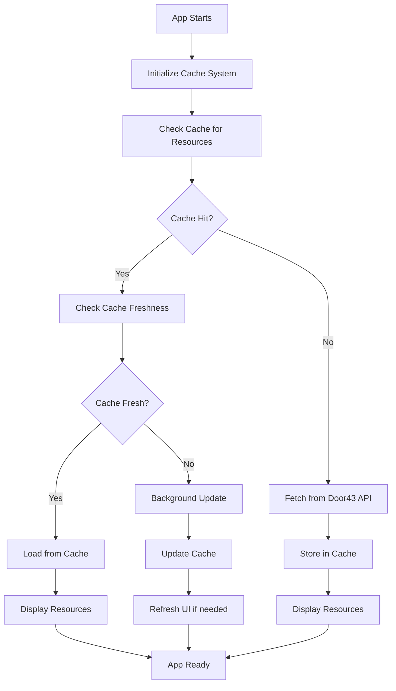

# 🔄 **Translation Studio Web - Iteration 1 Cache Strategy**

## 🎯 **Cache-First Loading Strategy**

### **📋 App Startup Flow**



### **🏗️ Cache System Integration**

#### **1. Cache Initialization**
```typescript
// On app startup
const cacheService = new Door43CacheService({
  storageBackend: new WebStorageBackend(), // IndexedDB + localStorage
  maxCacheSize: 100 * 1024 * 1024, // 100MB
  defaultTTL: 24 * 60 * 60 * 1000, // 24 hours
});

await cacheService.initialize();
```

#### **2. Resource Loading Logic**
```typescript
async function loadInitialResources() {
  const targetResources = {
    scripture: { org: 'unfoldingWord', repo: 'en_ult', book: 'jon' },
    notes: { org: 'unfoldingWord', repo: 'en_tn', book: 'jon' }
  };

  // Step 1: Check cache first
  const cacheResults = await Promise.all([
    cacheService.getResource('unfoldingWord/en_ult/jon'),
    cacheService.getResource('unfoldingWord/en_tn/jon')
  ]);

  // Step 2: Determine what needs fetching
  const needsFetch = cacheResults.map((result, index) => ({
    resource: Object.values(targetResources)[index],
    cached: result.success,
    fresh: result.success && isCacheFresh(result.data),
    data: result.success ? result.data : null
  }));

  // Step 3: Display cached data immediately
  const cachedResources = needsFetch
    .filter(item => item.cached && item.fresh)
    .map(item => item.data);
  
  if (cachedResources.length > 0) {
    displayResources(cachedResources);
    showCacheStatus('loaded-from-cache');
  }

  // Step 4: Fetch missing or stale resources
  const toFetch = needsFetch.filter(item => !item.cached || !item.fresh);
  
  if (toFetch.length > 0) {
    showLoadingIndicator(toFetch.map(item => item.resource));
    
    const freshResources = await Promise.all(
      toFetch.map(item => fetchAndCacheResource(item.resource))
    );
    
    displayResources(freshResources);
    showCacheStatus('updated-from-api');
  }
}
```

### **🔍 Cache Freshness Strategy**

#### **Cache Freshness Rules**
```typescript
interface CacheFreshnessConfig {
  // Scripture text - rarely changes, long TTL
  scripture: {
    ttl: 7 * 24 * 60 * 60 * 1000, // 7 days
    staleWhileRevalidate: true
  },
  
  // Translation notes - may update, shorter TTL
  translationNotes: {
    ttl: 24 * 60 * 60 * 1000, // 24 hours
    staleWhileRevalidate: true
  },
  
  // Metadata - changes frequently, short TTL
  metadata: {
    ttl: 60 * 60 * 1000, // 1 hour
    staleWhileRevalidate: false
  }
}

function isCacheFresh(cachedResource: CachedResource): boolean {
  const now = Date.now();
  const age = now - cachedResource.timestamp;
  const config = CacheFreshnessConfig[cachedResource.type];
  
  return age < config.ttl;
}
```

### **📊 Cache Status Indicators**

#### **Visual Cache Status**
```typescript
type CacheStatus = 
  | 'loading-from-cache'    // Reading from cache
  | 'loaded-from-cache'     // Successfully loaded from cache
  | 'fetching-from-api'     // Fetching from Door43 API
  | 'updating-cache'        // Background cache update
  | 'cache-error'           // Cache operation failed
  | 'offline-mode';         // Using cached data offline

// Display cache status to user
function showCacheStatus(status: CacheStatus) {
  const statusMessages = {
    'loading-from-cache': '📦 Loading from cache...',
    'loaded-from-cache': '⚡ Loaded from cache',
    'fetching-from-api': '🌐 Fetching latest resources...',
    'updating-cache': '🔄 Updating cache in background...',
    'cache-error': '⚠️ Cache error, loading from API...',
    'offline-mode': '📴 Offline - using cached resources'
  };
  
  updateStatusBar(statusMessages[status]);
}
```

### **🎯 Iteration 1 Specific Implementation**

#### **Target Resources for Initial Load**
```typescript
const ITERATION_1_RESOURCES = {
  // Primary test book - small and complete
  primaryBook: {
    scripture: {
      org: 'unfoldingWord',
      repo: 'en_ult',
      book: 'jon', // Jonah - 4 chapters, good for testing
      format: 'usfm'
    },
    notes: {
      org: 'unfoldingWord', 
      repo: 'en_tn',
      book: 'jon',
      format: 'tsv'
    }
  },
  
  // Secondary test book - for navigation testing
  secondaryBook: {
    scripture: {
      org: 'unfoldingWord',
      repo: 'en_ult', 
      book: 'phm', // Philemon - 1 chapter, very small
      format: 'usfm'
    },
    notes: {
      org: 'unfoldingWord',
      repo: 'en_tn',
      book: 'phm', 
      format: 'tsv'
    }
  }
};
```

#### **Cache Performance Monitoring**
```typescript
interface CacheMetrics {
  hitRate: number;           // Percentage of cache hits
  missRate: number;          // Percentage of cache misses
  avgLoadTime: number;       // Average resource load time
  cacheSize: number;         // Current cache size in bytes
  lastUpdated: Date;         // Last cache update timestamp
}

function trackCachePerformance() {
  const metrics = cacheService.getMetrics();
  
  // Log to console for Iteration 1 testing
  console.log('📊 Cache Performance:', {
    hitRate: `${(metrics.hitRate * 100).toFixed(1)}%`,
    avgLoadTime: `${metrics.avgLoadTime}ms`,
    cacheSize: `${(metrics.cacheSize / 1024 / 1024).toFixed(1)}MB`
  });
  
  // Update UI indicators
  updateCacheIndicators(metrics);
}
```

### **🧪 Testing Cache Behavior**

#### **Cache Testing Scenarios**
1. **Cold Start** - No cache, fetch everything from API
2. **Warm Cache** - Resources in cache, load immediately
3. **Stale Cache** - Cached resources need updating
4. **Partial Cache** - Some resources cached, others need fetching
5. **Offline Mode** - No network, rely entirely on cache
6. **Cache Corruption** - Handle corrupted cache gracefully

#### **Developer Tools Integration**
```typescript
// Add cache inspection to browser dev tools
if (process.env.NODE_ENV === 'development') {
  (window as any).cacheService = cacheService;
  (window as any).inspectCache = () => cacheService.inspect();
  (window as any).clearCache = () => cacheService.clear();
  (window as any).cacheMetrics = () => cacheService.getMetrics();
}
```

### **⚡ Performance Expectations**

#### **Target Performance Metrics**
```typescript
const PERFORMANCE_TARGETS = {
  // Initial app load
  coldStart: {
    timeToFirstResource: 2000,    // 2 seconds max
    timeToAllResources: 5000      // 5 seconds max
  },
  
  // Subsequent loads (cache hits)
  warmStart: {
    timeToFirstResource: 200,     // 200ms max
    timeToAllResources: 500       // 500ms max
  },
  
  // Cache operations
  cacheRead: 50,                  // 50ms max
  cacheWrite: 100,                // 100ms max
  
  // Network requests
  apiResponse: 1500,              // 1.5 seconds max
  
  // Cache efficiency
  targetHitRate: 0.8              // 80% cache hit rate after warmup
};
```

### **🔧 Cache Configuration for Iteration 1**

#### **Storage Backend Configuration**
```typescript
const webStorageConfig = {
  // Primary storage: IndexedDB for large resources
  primary: {
    type: 'indexeddb',
    dbName: 'TranslationStudioWeb',
    version: 1,
    maxSize: 50 * 1024 * 1024 // 50MB
  },
  
  // Secondary storage: localStorage for metadata
  secondary: {
    type: 'localstorage',
    prefix: 'tsw_',
    maxSize: 5 * 1024 * 1024 // 5MB
  },
  
  // Memory cache for frequently accessed items
  memory: {
    maxItems: 100,
    maxSize: 10 * 1024 * 1024 // 10MB
  }
};
```

### **📱 User Experience During Cache Operations**

#### **Loading States**
```typescript
interface LoadingState {
  phase: 'initializing' | 'checking-cache' | 'loading-cached' | 'fetching-api' | 'ready';
  progress: number; // 0-100
  message: string;
  resources: {
    scripture: 'pending' | 'cached' | 'fetching' | 'ready' | 'error';
    notes: 'pending' | 'cached' | 'fetching' | 'ready' | 'error';
  };
}

// Progressive loading with clear feedback
function updateLoadingState(state: LoadingState) {
  // Update progress bar
  setProgress(state.progress);
  
  // Update status message
  setStatusMessage(state.message);
  
  // Update individual resource indicators
  updateResourceIndicators(state.resources);
  
  // Show cache hit/miss information
  if (state.phase === 'loading-cached') {
    showCacheHitIndicator();
  }
}
```

### **🎯 Success Criteria for Cache Integration**

#### **Functional Requirements**
- [ ] App checks cache before making API requests
- [ ] Cached resources display immediately when available
- [ ] Stale resources update in background
- [ ] Cache metrics are visible in dev tools
- [ ] Offline mode works with cached resources

#### **Performance Requirements**
- [ ] Cache hits load resources in < 200ms
- [ ] Cache misses complete in < 2 seconds
- [ ] Cache hit rate > 60% after 5 minutes of usage
- [ ] Memory usage remains stable during cache operations

#### **User Experience Requirements**
- [ ] Loading states clearly indicate cache vs API loading
- [ ] Users can see cache status and metrics
- [ ] Offline functionality is transparent
- [ ] Cache errors don't break the app

---

## 🚀 **Implementation Priority**

### **Phase 1: Basic Cache Integration**
1. Initialize cache system on app startup
2. Implement cache-first resource loading
3. Add basic cache status indicators
4. Test with Jonah scripture and notes

### **Phase 2: Cache Optimization**
1. Add cache freshness checking
2. Implement background updates
3. Add cache performance monitoring
4. Test cache behavior across scenarios

### **Phase 3: User Experience Polish**
1. Improve loading state feedback
2. Add cache management UI
3. Implement offline mode indicators
4. Add cache debugging tools

**This cache-first approach will demonstrate the power of our unified cache system while providing an excellent user experience from day one!**
