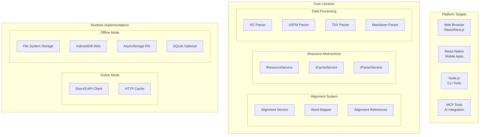

# Product Requirements Document: Door43 Foundations Architecture

## Table of Contents
1. [Executive Summary](#executive-summary)
2. [Core Vision & Interaction Pattern](#core-vision--interaction-pattern)
3. [Architecture Overview](#architecture-overview)
4. [Platform Requirements](#platform-requirements)
5. [Library Structure](#library-structure)
6. [Core Algorithms](#core-algorithms)
7. [API Endpoints & Data Flow](#api-endpoints--data-flow)
8. [Implementation Roadmap](#implementation-roadmap)
9. [Testing Strategy](#testing-strategy)
10. [Critical Design Decisions](#critical-design-decisions)

## Executive Summary

The Door43 Foundations project creates a comprehensive, multi-platform ecosystem for Bible translation resources. The core innovation is **alignment-layer-centered word interaction** where tapping any word in scripture automatically filters and displays related content across all translation helps resources.

### Key Goals
- **Universal Platform Support**: Web, React Native, Node.js CLI, MCP tools
- **Runtime Flexibility**: Online (Door43 API) and offline (local storage) modes
- **Word-Level Interaction**: Tap a word → see related notes, words, questions, academy articles
- **Reusable Libraries**: Modular design for use across multiple projects
- **Alignment-Centric**: All resources connect through the alignment layer

## Core Vision & Interaction Pattern

### The Central Interaction
**User taps a word in scripture** → System uses alignment layer to find related content → Other panels automatically filter to show relevant translation helps.

```
Word Tap → Alignment Data → Cross-Resource References → Filtered Panels
```

### Resource Relationships Through Alignment
1. **Bible Text (ULT/UST)**: Contains alignment markers connecting to original language
2. **Translation Notes**: Reference specific words via alignment occurrences
3. **Translation Words Links**: Point to original words via alignment
4. **Translation Questions**: Reference verse context and specific words
5. **Translation Academy**: Linked from Translation Notes support references
6. **Translation Words**: Linked from Translation Words Links

## Architecture Overview

### Multi-Platform, Multi-Runtime Design



## Platform Requirements

### Runtime Modes
1. **Online Mode**: Live Door43 API access with HTTP caching
2. **Offline Mode**: Pre-downloaded/bundled resources with local storage

### Platform Targets
1. **Web (React/Next.js)**: IndexedDB storage, DOM rendering
2. **React Native**: AsyncStorage, native components
3. **Node.js CLI**: File system storage, terminal output
4. **MCP Tools**: Memory/file storage, AI integration APIs

### Storage Backends
- **Web**: IndexedDB (primary), Memory (fallback)
- **React Native**: AsyncStorage (primary), SQLite (optional)
- **Node.js**: File System (primary), SQLite (optional)
- **MCP**: Memory (primary), File System (optional)

## Library Structure

### Core Libraries (Platform Agnostic)

#### 1. `@bt-toolkit/door43-core`
**Purpose**: Fundamental types, interfaces, and abstractions
**Location**: `packages/core/door43-core/`

**Key Components**:
- Core Types (`types.ts`): All TypeScript interfaces for Door43 resources
- Service Interfaces (`interfaces.ts`): Platform-agnostic service contracts
- Error Types: Standardized error handling across platforms

#### 2. `@bt-toolkit/door43-alignment`
**Purpose**: Alignment layer system for word-level cross-resource communication
**Location**: `packages/core/door43-alignment/`

**Key Components**:
- `AlignmentService`: Core word interaction logic
- `WordMapper`: Maps words to alignment data
- `CrossReferenceEngine`: Finds related resources

#### 3. `@bt-toolkit/door43-resources`
**Purpose**: Resource management and processing
**Location**: `packages/services/door43-resources/`

**Key Components**:
- Resource Service implementations (online/offline)
- Book Package Service
- Cache management
- Parser implementations

#### 4. `@bt-toolkit/door43-cli`
**Purpose**: CLI tools for testing and automation
**Location**: `packages/tools/door43-cli/`

**Key Components**:
- Testing utilities
- Data validation tools
- Resource downloading scripts

### Integration Libraries

#### 5. `@bt-toolkit/door43-bp` (Existing)
**Purpose**: Book Package fetching and processing
**Location**: `packages/door43-bp/`
**Status**: Already implemented, will be refactored to use new core libraries

## Core Algorithms

### 1. Word Tap Interaction Algorithm

```
ALGORITHM: HandleWordTap
INPUT: book, chapter, verse, wordIndex, wordText
OUTPUT: FilteredResources

STEP 1: Get Alignment Data
  - Query scripture text at [book, chapter, verse]
  - Find alignment group containing wordIndex
  - Extract AlignmentData (strong's, lemma, occurrence)

STEP 2: Build Alignment Reference
  - Create AlignmentReference object
  - Include original word data and gateway word text

STEP 3: Find Related Resources
  - Query Translation Notes by occurrence pattern
  - Query Translation Words Links by original words
  - Query Translation Questions by verse context
  - Follow support references to Translation Academy

STEP 4: Filter and Rank Results
  - Score relevance based on word occurrence match
  - Prioritize exact word matches over verse context
  - Group by resource type

STEP 5: Return Filtered Resources
  - Return structured object with filtered resources
  - Include metadata for UI rendering
```

### 2. Alignment Index Building Algorithm

```
ALGORITHM: BuildAlignmentIndex
INPUT: ProcessedScripture with alignment data
OUTPUT: Word-to-alignment lookup indexes

STEP 1: Parse Scripture Structure
  FOR each chapter in scripture:
    FOR each verse in chapter:
      FOR each alignment group in verse:

STEP 2: Extract Word Alignments
        FOR each gateway word in group:
          IF word has alignment data:
            CREATE alignment entry
            MAP word position to alignment data

STEP 3: Build Lookup Indexes
          CREATE key: book:chapter:verse:wordIndex
          STORE: AlignmentData object
          
STEP 4: Build Reverse Indexes
          CREATE key: strong's number
          STORE: array of scripture references
          
          CREATE key: lemma
          STORE: array of scripture references
```

### 3. Cross-Resource Reference Algorithm

```
ALGORITHM: FindCrossReferences
INPUT: AlignmentReference
OUTPUT: Array of CrossReference objects

STEP 1: Query Translation Notes
  - Search notes by verse reference
  - Filter by quote matching word text
  - Filter by occurrence number
  - Extract support references for TA articles

STEP 2: Query Translation Words Links
  - Search links by verse reference
  - Filter by original words matching alignment
  - Extract twLink references for TW articles

STEP 3: Query Translation Questions
  - Search questions by verse reference
  - Include questions that reference the word

STEP 4: Follow External References
  - Parse support references to get TA paths
  - Parse twLink references to get TW identifiers
  - Fetch referenced articles (cache if not available)

STEP 5: Rank and Return
  - Sort by relevance (exact word match > verse context)
  - Return structured cross-references
```

### 4. Resource Loading Algorithm

```
ALGORITHM: LoadBookPackage
INPUT: book, language, organization
OUTPUT: BookTranslationPackage

STEP 1: Resolve Resource Repositories
  - Query Door43 catalog for language_resourceId pattern
  - Try primary resource IDs (ult, ust, tn, twl, tq)
  - Fall back to alternate IDs (glt, gst)

STEP 2: Fetch and Parse Manifests
  - GET manifest.yaml from each repository
  - Parse project definitions
  - Find book-specific file paths

STEP 3: Fetch Resource Files
  - GET book files (e.g., 01-GEN.usfm, tn_GEN.tsv)
  - Process content based on resource type
  - Extract alignment data from USFM

STEP 4: Build Processed Resources
  - Parse USFM to ProcessedScripture
  - Parse TSV to TranslationNote/TWL/TQ arrays
  - Cross-reference and validate data

STEP 5: Cache and Return
  - Store processed resources in cache
  - Return BookTranslationPackage object
```

## API Endpoints & Data Flow

### Door43 API Endpoints (v1)

#### 1. Catalog Search
```
GET /api/v1/catalog/search
Parameters:
  - lang: Language code (e.g., 'en', 'es-419')
  - subject: Resource subject (e.g., 'Bible', 'Translation Notes')
  - owner: Organization (optional)
  - stage: 'prod' | 'preprod' | 'draft'

Response: Array of CatalogEntry objects
```

#### 2. Repository Contents
```
GET /api/v1/repos/{owner}/{repo}/contents/{path}
Parameters:
  - ref: Branch or tag reference (e.g., 'master', 'v86')

Response: ContentItem with base64-encoded content
```

#### 3. Repository Information
```
GET /api/v1/repos/{owner}/{repo}

Response: RepositoryInfo object
```

### Data Flow Patterns

#### Pattern 1: Online Resource Loading
```
User Action → Service Request → API Call → Cache Check → 
Parse Response → Process Content → Store in Cache → 
Return to UI
```

#### Pattern 2: Offline Resource Access
```
User Action → Service Request → Cache Lookup → 
Local Storage Query → Return Cached Data → UI Render
```

#### Pattern 3: Word Interaction Flow
```
Word Tap → Alignment Service → Resource Filtering → 
Panel Updates → UI Re-render
```

## Implementation Roadmap

### Phase 1: Core Foundation (Current)
- [x] Create core library structure
- [x] Define all TypeScript interfaces
- [x] Implement basic alignment service
- [ ] Create service factory pattern
- [ ] Implement basic parsers

### Phase 2: Resource Services
- [ ] Implement online resource service
- [ ] Implement offline resource service
- [ ] Create cache service implementations
- [ ] Build parser services (USFM, TSV, MD)

### Phase 3: Platform Implementations
- [ ] Web storage backend (IndexedDB)
- [ ] React Native storage backend (AsyncStorage)
- [ ] Node.js storage backend (File System)
- [ ] MCP storage backend (Memory/File)

### Phase 4: CLI Tools & Testing
- [ ] Create comprehensive CLI testing suite
- [ ] Build resource validation tools
- [ ] Implement automated testing pipeline
- [ ] Create performance benchmarks

### Phase 5: Integration & UI
- [ ] Integrate with foundations-bt app
- [ ] Implement word interaction UI
- [ ] Create panel filtering system
- [ ] Add offline sync capabilities

## Testing Strategy

### Unit Testing
- **Core Types**: Validate all TypeScript interfaces
- **Service Implementations**: Test each service method
- **Parsers**: Test with real Door43 data samples
- **Alignment Logic**: Test word-to-resource mapping

### Integration Testing
- **API Integration**: Test against live Door43 APIs
- **Storage Backends**: Test on all platform targets
- **Cache Performance**: Measure cache hit rates
- **Cross-Platform**: Test same code on web/RN/Node

### CLI Testing Tools
```bash
# Resource fetching tests
nx run door43-cli:test-fetch --book=GEN --lang=en

# Alignment validation tests  
nx run door43-cli:test-alignment --book=JON --verify-links

# Performance benchmarks
nx run door43-cli:benchmark --test=all
```

### Manual Testing Scenarios
1. **Word Tap Flow**: Tap word → verify filtered resources
2. **Offline Mode**: Disconnect → verify cached content
3. **Cross-Platform**: Same data on web and mobile
4. **Resource Loading**: Test all book/language combinations

## Critical Design Decisions

### 1. Alignment-Centric Architecture
**Decision**: Make alignment layer the central hub for all resource interactions
**Rationale**: This mirrors the Door43 specification and enables powerful word-level filtering
**Impact**: All resources must be processed with alignment awareness

### 2. Interface-Based Abstraction
**Decision**: Use TypeScript interfaces for all service contracts
**Rationale**: Enables dependency injection and platform switching
**Impact**: Consistent API across all platforms and runtime modes

### 3. Multi-Runtime Support
**Decision**: Support both online and offline modes from day one
**Rationale**: Mobile apps need offline capability, while web can leverage live APIs
**Impact**: All services must implement both modes

### 4. Monorepo with Nx
**Decision**: Use Nx monorepo for all libraries and applications
**Rationale**: Enables code sharing and consistent build processes
**Impact**: All libraries can be independently versioned and tested

### 5. Door43 API v1 Standard
**Decision**: Use Door43 API v1 with specific endpoint patterns
**Rationale**: This is the documented, stable API version
**Impact**: All API calls must use `/api/v1/` endpoints with `ref` parameters

### 6. Book Package Loading Strategy
**Decision**: Load complete book packages on book selection
**Rationale**: Provides immediate access to all related resources
**Impact**: Higher initial load time but better user experience

### 7. TypeScript-First Development
**Decision**: Write all code in TypeScript with comprehensive typing
**Rationale**: Prevents runtime errors and improves developer experience
**Impact**: Strict typing requirements across all libraries

## Resource Processing Specifications

### USFM Processing
- Extract chapter/verse structure
- Parse alignment markers (`\zaln-s`, `\zaln-e`)
- Extract Strong's numbers, lemmas, morphology
- Build alignment groups for word mapping

### TSV Processing  
- Parse tab-separated values with headers
- Handle quote escaping and special characters
- Extract reference patterns (e.g., "1:1", "1:1-2")
- Parse support references (rc:// links)

### Markdown Processing
- Extract frontmatter metadata
- Parse section headings and content
- Handle cross-references and links
- Process examples and code blocks

## Error Handling Strategy

### Error Categories
1. **Network Errors**: API timeouts, connection failures
2. **Authentication Errors**: Invalid tokens, permission issues  
3. **Resource Errors**: Missing files, invalid formats
4. **Parse Errors**: Malformed USFM, TSV, or YAML
5. **Cache Errors**: Storage failures, quota exceeded

### Recovery Patterns
- **Retry with backoff**: For network errors
- **Fallback to cache**: When API unavailable
- **Graceful degradation**: Show partial data when possible
- **User notification**: Clear error messages for end users

## Performance Requirements

### Load Time Targets
- **Book Package Loading**: < 3 seconds for online, < 500ms for cached
- **Word Tap Response**: < 100ms for alignment lookup and filtering
- **UI Panel Updates**: < 50ms for resource filtering and display

### Memory Usage
- **Web**: < 50MB for complete book package in memory
- **React Native**: < 30MB for efficient mobile performance
- **Node.js**: < 100MB for CLI operations

### Cache Efficiency
- **Target Hit Rate**: > 90% for frequently accessed resources
- **Storage Quota**: Respect platform limits (IndexedDB, AsyncStorage)
- **Eviction Strategy**: LRU with manual cache management options

---

**Last Updated**: January 2025
**Version**: 1.0
**Status**: Living Document - Updated as implementation progresses
